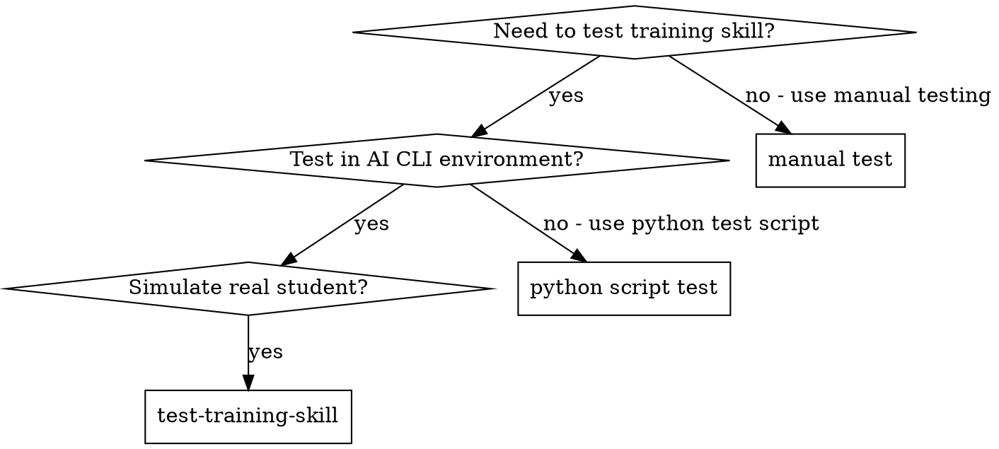

# Test Training Skill - Agent 模拟真实用户交互测试

## Overview

Use AI CLI's subagent mechanism to simulate real student interaction with training skills. This validates:
1. Skill can be loaded in AI CLI
2. LLM guidance works correctly
3. Student capability development is achieved
4. Real business scenario alignment

## When to Use



## The Process

### 1. Setup Test Environment

**Check AI CLI is available:**
```bash
# Check Qwen CLI
qwen --version

# Check Stigmergy
stigmergy --version

# Check Skills are registered
stigmergy skill list | findstr "train-"
```

### 2. Dispatch Subagent as Student

**Dispatch subagent with student persona:**
```
You are a vocational college student majoring in e-commerce.
You are using the training system to complete a product listing task.
You will interact naturally with the training skill as a real student would.

Your background:
- Age: 20 years old
- Major: E-commerce Operations
- Skill level: Beginner
- Goal: Learn how to list products on e-commerce platform

You will:
1. Start the training: `stigmergy skill call eb-edu-train-product-listing`
2. Follow the LLM guidance step by step
3. Provide natural responses as a student would
4. Complete all steps of the training
5. Provide feedback on the experience
```

### 3. Monitor Interaction

**Watch for:**
- ✅ Skill loads successfully in AI CLI
- ✅ LLM provides effective guidance
- ✅ Student can understand each step
- ✅ Capability development is achieved
- ✅ Real business scenario alignment

**Red flags:**
- ❌ Skill fails to load
- ❌ LLM guidance is unclear
- ❌ Student gets confused
- ❌ No capability development
- ❌ Not aligned with real scenarios

### 4. Validate Results

**Check after test:**
```bash
# Check skill execution logs
# Review conversation transcript
# Validate capability assessment
# Collect student feedback
```

## Test Cases

### Test Case 1: Product Listing Training

**Student persona:**
- Name: 张三
- Age: 20
- Major: E-commerce Operations
- Skill level: Beginner

**Test steps:**
1. Start training: `stigmergy skill call eb-edu-train-product-listing`
2. Complete market research (LLM guided)
3. Complete product entry
4. Complete pricing strategy (LLM guided)
5. Confirm listing
6. Complete review (LLM feedback)

**Expected outcome:**
- ✅ Student completes full process
- ✅ LLM provides effective guidance at each step
- ✅ Student learns market research, pricing strategy
- ✅ Training feels like real work scenario

### Test Case 2: Order Processing Training

**Student persona:**
- Name: 李四
- Age: 21
- Major: E-commerce Operations
- Skill level: Intermediate

**Test steps:**
1. Start training: `stigmergy skill call eb-edu-train-order-processing`
2. Complete order confirmation (LLM guided)
3. Complete picking and packing
4. Complete shipping
5. Handle exception (LLM guided)
6. Complete review (LLM feedback)

**Expected outcome:**
- ✅ Student completes full process
- ✅ LLM provides effective guidance
- ✅ Student learns order processing, exception handling
- ✅ Training aligns with real job tasks

### Test Case 3: Customer Service Training

**Student persona:**
- Name: 王五
- Age: 19
- Major: E-commerce Operations
- Skill level: Beginner

**Test steps:**
1. Start training: `stigmergy skill call eb-edu-train-customer-service`
2. Handle customer inquiry (LLM guided)
3. Handle customer complaint (LLM guided)
4. Complete customer retention
5. Complete review (LLM feedback)

**Expected outcome:**
- ✅ Student completes full process
- ✅ LLM provides effective guidance
- ✅ Student learns communication, complaint handling
- ✅ Training develops real capability

## Validation Checklist

### Skill Loading
- [ ] Skill can be loaded in AI CLI
- [ ] Skill metadata is valid
- [ ] Skill triggers work correctly

### LLM Guidance
- [ ] LLM understands training context
- [ ] LLM provides clear guidance at each step
- [ ] LLM feedback is helpful and actionable
- [ ] LLM adapts to student responses

### Capability Development
- [ ] Training develops real capabilities
- [ ] Learning objectives are clear
- [ ] Assessment criteria are defined
- [ ] Student can demonstrate learned skills

### Scenario Alignment
- [ ] Training aligns with real business scenarios
- [ ] Tasks match real job tasks
- [ ] Data is realistic
- [ ] Process matches industry standards

## After the Test

**Documentation:**
- Write test results to `docs/tests/YYYY-MM-DD-<skill-name>-test-report.md`
- Include conversation transcript
- Include capability assessment
- Include student feedback
- Include recommendations for improvement

**Improvement:**
- Fix any issues found
- Improve LLM guidance
- Enhance capability development
- Better align with real scenarios

## Key Principles

- **Real student simulation** - Subagent acts as real student, not script
- **Natural interaction** - Conversation flows naturally, not robotic
- **Capability focused** - Focus on what student learns, not just completion
- **Real scenario alignment** - Training must match real work scenarios
- **Continuous improvement** - Use test results to improve training skills

## Red Flags

**Never:**
- Skip the subagent dispatch (must use AI CLI subagent mechanism)
- Script the interaction (must be natural conversation)
- Ignore student confusion (must address immediately)
- Focus only on completion (must validate capability development)
- Test in isolation (must validate against real scenarios)

**If issues found:**
- Document the issue clearly
- Identify root cause
- Fix the training skill
- Re-test to validate fix
- Update documentation

## Integration

**Required skills:**
- **superpowers:using-superpowers** - Load and use skills in AI CLI
- **superpowers:subagent-driven-development** - Dispatch subagents for testing

**Test workflow:**
1. Load test-training-skill in AI CLI
2. Dispatch subagent as student
3. Monitor interaction
4. Validate results
5. Document findings
6. Improve training skills

## Example Test Session

```
Tester: I'm using Test Training Skill to validate eb-edu-train-product-listing.

[Dispatch subagent as student 张三]

Subagent (张三): 
你好！我是电商专业学生张三。
我要完成商品上架实训。
启动实训：stigmergy skill call eb-edu-train-product-listing

[System loads skill, shows introduction]

Subagent (张三):
我看到情境导入了，我是一家电商公司的运营专员。
老板让我上架一款"夏季连衣裙"，成本 80 元。
接下来我该做什么？

[LLM guides through market research]

Subagent (张三):
我在分析竞品数据...
竞品 A: 159 元，月销 3000+
竞品 B: 259 元，月销 1000+
竞品 C: 189 元，月销 2000+
我觉得价格带是 159-259 元，销量最高的竞品优势是价格低。

[LLM provides feedback, guides to next step]

... (continue through all steps)

[After completion]

Tester: 
✅ Test completed successfully!
- Skill loaded successfully
- LLM guidance was effective
- Student learned market research, pricing strategy
- Training aligned with real work scenario

[Write test report]
```
