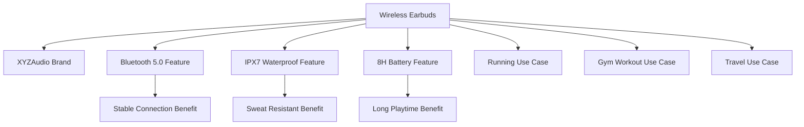

# Agent Skill: 跨境电商GEO优化（生成式AI搜索优化）

---

**name:** geo-optimization
**description:** 针对生成式AI搜索引擎（ChatGPT、Claude、Bing AI、Google SGE等）的优化Agent技能 - 构建知识图谱、优化AIGC内容、提升AI回答中的品牌曝光
**version:** 1.0.0
**author:** cross-border-ecommerce-team
**tags:** [ecommerce, geo, aigc, generative-ai, knowledge-graph, cross-border]
**category:** advanced-optimization
**requires:** [content-generator, knowledge-graph-builder, entity-extractor, aigc-analyzer]
**compatibility:** [chatgpt, claude, bing-ai, google-sge, perplexity]
**language:** zh-CN
**last_updated:** 2026-02-12

---

## 技能概述

本技能提供针对生成式AI搜索引擎的全方位优化解决方案，帮助跨境电商商家在AI时代获得新的流量增长点。通过知识图谱构建、AIGC内容优化、实体识别和对话式搜索优化，提升品牌和产品在AI回答中的曝光度和可信度。

### 核心能力

- **知识图谱构建**：建立产品、品牌、场景的语义关联网络
- **AIGC内容优化**：优化内容以适配AI理解和引用
- **实体识别与增强**：强化品牌和产品的实体属性
- **对话式搜索优化**：优化针对自然语言查询的内容

### 适用场景

- 品牌在AI回答中的曝光提升
- 产品推荐优化（"推荐一款..."类查询）
- 对比查询优化（"A vs B"类查询）
- 场景化搜索优化（"适合..."类查询）

---

## 标准作业流程（SOP）

### 阶段一：知识图谱构建（5-7天）

#### 1.1 实体识别与定义

**实体类型体系：**

```python
entity_types = {
    'product': {
        'description': '产品实体',
        'attributes': ['name', 'brand', 'category', 'features', 'price', 'rating', 'use_cases'],
        'examples': ['wireless earbuds', 'phone case', 'portable charger']
    },
    'brand': {
        'description': '品牌实体',
        'attributes': ['name', 'industry', 'founded', 'headquarters', 'website', 'reputation'],
        'examples': ['XYZAudio', 'Apple', 'Samsung']
    },
    'feature': {
        'description': '产品特性实体',
        'attributes': ['name', 'type', 'value', 'benefit'],
        'examples': ['bluetooth 5.0', 'IPX7 waterproof', '8-hour battery']
    },
    'use_case': {
        'description': '使用场景实体',
        'attributes': ['name', 'description', 'target_audience', 'environment'],
        'examples': ['running', 'gym workout', 'travel']
    },
    'problem': {
        'description': '用户痛点实体',
        'attributes': ['name', 'description', 'severity', 'frequency'],
        'examples': ['ear discomfort', 'battery drain', 'poor sound quality']
    },
    'benefit': {
        'description': '用户利益实体',
        'attributes': ['name', 'description', 'importance'],
        'examples': ['comfortable fit', 'long battery life', 'crystal clear sound']
    }
}

def extract_entities(content):
    """从内容中提取实体"""
    entities = []
    
    # 使用NER模型提取实体
    ner_results = run_ner_model(content)
    
    for result in ner_results:
        entity = {
            'text': result['text'],
            'type': result['type'],
            'confidence': result['confidence'],
            'context': result['context']
        }
        entities.append(entity)
    
    return entities
```

**实体关系定义：**

```python
relationship_types = {
    'product_belongs_to_brand': {
        'from': 'product',
        'to': 'brand',
        'description': '产品属于某个品牌'
    },
    'product_has_feature': {
        'from': 'product',
        'to': 'feature',
        'description': '产品具有某个特性'
    },
    'product_solves_problem': {
        'from': 'product',
        'to': 'problem',
        'description': '产品解决某个问题'
    },
    'product_provides_benefit': {
        'from': 'product',
        'to': 'benefit',
        'description': '产品提供某个利益'
    },
    'product_suitable_for_use_case': {
        'from': 'product',
        'to': 'use_case',
        'description': '产品适合某个使用场景'
    },
    'feature_enables_benefit': {
        'from': 'feature',
        'to': 'benefit',
        'description': '特性实现某个利益'
    },
    'brand_manufactures_product': {
        'from': 'brand',
        'to': 'product',
        'description': '品牌生产某个产品'
    }
}
```

#### 1.2 知识图谱构建

**知识图谱构建流程：**

```python
class KnowledgeGraphBuilder:
    """知识图谱构建器（不依赖外部库）"""
    
    def __init__(self):
        self.entities = []
        self.relationships = []
        self.graph = {}
    
    def extract_entities(self, product_data):
        """提取实体"""
        entities = []
        for item in product_data:
            entities.append({
                'id': item.get('id', ''),
                'type': item.get('type', 'product'),
                'name': item.get('name', ''),
                'attributes': item.get('features', [])
            })
        return entities
    
    def build_relationships(self, entities):
        """建立关系"""
        relationships = []
        for i, e1 in enumerate(entities):
            for e2 in entities[i+1:]:
                # 基于属性相似度建立关系
                if set(e1.get('attributes', [])) & set(e2.get('attributes', [])):
                    relationships.append({
                        'source': e1['id'],
                        'target': e2['id'],
                        'type': 'similar_to'
                    })
        return relationships
    
    def build_graph(self, product_data):
        """构建知识图谱"""
        # 1. 提取实体
        entities = self.extract_entities(product_data)
        
        # 2. 建立关系
        relationships = self.build_relationships(entities)
        
        # 3. 验证图谱
        validated = self.validate_graph(entities, relationships)
        
        # 4. 存储图谱
        self.graph = self.store_graph(validated)
        
        return self.graph
    
    def extract_entities(self, product_data):
        """提取实体"""
        entities = []
        
        # 产品实体
        product_entity = {
            'id': f"product_{product_data['id']}",
            'type': 'product',
            'attributes': {
                'name': product_data['name'],
                'brand': product_data['brand'],
                'category': product_data['category'],
                'price': product_data['price'],
                'rating': product_data['rating']
            }
        }
        entities.append(product_entity)
        
        # 品牌实体
        brand_entity = {
            'id': f"brand_{product_data['brand']}",
            'type': 'brand',
            'attributes': {
                'name': product_data['brand'],
                'website': product_data['brand_website'],
                'founded': product_data['brand_founded']
            }
        }
        entities.append(brand_entity)
        
        # 特性实体
        for feature in product_data['features']:
            feature_entity = {
                'id': f"feature_{feature['name'].replace(' ', '_')}",
                'type': 'feature',
                'attributes': {
                    'name': feature['name'],
                    'value': feature['value'],
                    'benefit': feature['benefit']
                }
            }
            entities.append(feature_entity)
        
        # 使用场景实体
        for use_case in product_data['use_cases']:
            use_case_entity = {
                'id': f"use_case_{use_case.replace(' ', '_')}",
                'type': 'use_case',
                'attributes': {
                    'name': use_case,
                    'description': f"Suitable for {use_case}"
                }
            }
            entities.append(use_case_entity)
        
        return entities
    
    def build_relationships(self, entities):
        """建立实体间关系"""
        relationships = []
        
        # 找到产品和品牌
        product = next((e for e in entities if e['type'] == 'product'), None)
        brand = next((e for e in entities if e['type'] == 'brand'), None)
        
        if product and brand:
            relationships.append({
                'from': product['id'],
                'to': brand['id'],
                'type': 'product_belongs_to_brand'
            })
        
        # 产品与特性的关系
        features = [e for e in entities if e['type'] == 'feature']
        for feature in features:
            if product:
                relationships.append({
                    'from': product['id'],
                    'to': feature['id'],
                    'type': 'product_has_feature'
                })
        
        # 产品与使用场景的关系
        use_cases = [e for e in entities if e['type'] == 'use_case']
        for use_case in use_cases:
            if product:
                relationships.append({
                    'from': product['id'],
                    'to': use_case['id'],
                    'type': 'product_suitable_for_use_case'
                })
        
        return relationships
    
    def export_to_schema_org(self, output_file):
        """导出为Schema.org格式"""
        schema_org = {
            "@context": "https://schema.org",
            "@graph": []
        }
        
        for entity in self.entities:
            schema_entity = self.convert_to_schema_org(entity)
            schema_org["@graph"].append(schema_entity)
        
        with open(output_file, 'w', encoding='utf-8') as f:
            json.dump(schema_org, f, indent=2, ensure_ascii=False)
        
        return schema_org
```

**知识图谱可视化：**



#### 1.3 知识图谱优化

**优化策略：**

```python
def optimize_knowledge_graph(graph):
    """优化知识图谱"""
    optimized = {
        'entity_density': check_entity_density(graph),
        'relationship_coverage': check_relationship_coverage(graph),
        'attribute_completeness': check_attribute_completeness(graph),
        'semantic_clarity': check_semantic_clarity(graph)
    }
    
    # 优化建议
    suggestions = []
    
    # 1. 增加实体密度
    if optimized['entity_density'] < 0.7:
        suggestions.append('增加更多相关实体，如竞品、配件等')
    
    # 2. 完善关系网络
    if optimized['relationship_coverage'] < 0.8:
        suggestions.append('建立更多实体间关系')
    
    # 3. 补充属性信息
    if optimized['attribute_completeness'] < 0.75:
        suggestions.append('补充实体属性信息')
    
    # 4. 优化语义清晰度
    if optimized['semantic_clarity'] < 0.8:
        suggestions.append('优化实体和关系的语义表达')
    
    return {
        'optimized_graph': apply_optimizations(graph, suggestions),
        'suggestions': suggestions,
        'metrics': optimized
    }
```

---

### 阶段二：AIGC内容优化（4-5天）

#### 2.1 AI友好型内容结构

**内容结构优化原则：**

```python
content_structure_principles = {
    'hierarchy': {
        'description': '清晰的层次结构',
        'best_practices': [
            '使用H1、H2、H3标题',
            '逻辑清晰的内容组织',
            '要点式列表'
        ]
    },
    'semantics': {
        'description': '语义化表达',
        'best_practices': [
            '使用Schema.org标记',
            '定义明确的实体',
            '使用标准术语'
        ]
    },
    'context': {
        'description': '丰富的上下文信息',
        'best_practices': [
            '提供产品背景',
            '说明使用场景',
            '对比竞品'
        ]
    },
    'trust': {
        'description': '建立信任信号',
        'best_practices': [
            '引用权威来源',
            '提供数据支持',
            '展示用户评价'
        ]
    },
    'naturallanguage': {
        'description': '自然语言表达',
        'best_practices': [
            '对话式写作风格',
            '回答常见问题',
            '提供详细解释'
        ]
    }
}
```

**AI友好型内容模板：**

```python
ai_friendly_template = """
# {Product Name}: {Main Benefit} for {Target Audience}

## 产品概述
{产品概述 - 2-3句话，说明产品是什么，主要解决什么问题}

## 核心特性
### {Feature 1}: {Feature Benefit}
{详细说明特性1，包括技术细节和用户利益}

### {Feature 2}: {Feature Benefit}
{详细说明特性2，包括技术细节和用户利益}

### {Feature 3}: {Feature Benefit}
{详细说明特性3，包括技术细节和用户利益}

## 使用场景
### {Use Case 1}
{描述使用场景1，说明产品如何帮助用户}

### {Use Case 2}
{描述使用场景2，说明产品如何帮助用户}

## 为什么选择{Brand Name}
- {Reason 1}
- {Reason 2}
- {Reason 3}

## 常见问题
### Q: {Question 1}
A: {Answer 1}

### Q: {Question 2}
A: {Answer 2}

## 规格参数
| 参数 | 数值 |
|------|------|
| {Spec 1} | {Value 1} |
| {Spec 2} | {Value 2} |
| {Spec 3} | {Value 3} |

## 用户评价
"User Review 1" - 5 stars
"User Review 2" - 5 stars
"User Review 3" - 4 stars

## 购买建议
{基于用户需求给出购买建议}

---

*注：以上信息基于{Data Source}，最后更新于{Date}*
"""
```

#### 2.2 Schema.org标记

**完整Schema.org标记示例：**

```html
<!-- 产品页面Schema.org标记 -->
<script type="application/ld+json">
{
  "@context": "https://schema.org/",
  "@graph": [
    {
      "@type": "Product",
      "@id": "https://www.example.com/products/wireless-earbuds",
      "name": "XYZAudio Wireless Bluetooth Earbuds",
      "description": "Crystal clear sound with 8-hour battery life, IPX7 waterproof rating, perfect for running and gym workouts",
      "brand": {
        "@type": "Brand",
        "name": "XYZAudio",
        "url": "https://www.xyzaudio.com"
      },
      "image": [
        "https://www.example.com/images/earbuds-1.jpg",
        "https://www.example.com/images/earbuds-2.jpg",
        "https://www.example.com/images/earbuds-3.jpg"
      ],
      "category": "Electronics > Audio > Headphones",
      "offers": {
        "@type": "Offer",
        "url": "https://www.example.com/products/wireless-earbuds",
        "priceCurrency": "USD",
        "price": "29.99",
        "priceValidUntil": "2026-12-31",
        "availability": "https://schema.org/InStock",
        "seller": {
          "@type": "Organization",
          "name": "XYZAudio Store"
        }
      },
      "aggregateRating": {
        "@type": "AggregateRating",
        "ratingValue": "4.7",
        "reviewCount": "1250",
        "bestRating": "5",
        "worstRating": "1"
      },
      "review": [
        {
          "@type": "Review",
          "author": {
            "@type": "Person",
            "name": "John Doe"
          },
          "reviewRating": {
            "@type": "Rating",
            "ratingValue": "5",
            "bestRating": "5"
          },
          "reviewBody": "Best wireless earbuds I've ever used! Crystal clear sound and amazing battery life."
        }
      ],
      "additionalProperty": [
        {
          "@type": "PropertyValue",
          "name": "Bluetooth Version",
          "value": "5.0"
        },
        {
          "@type": "PropertyValue",
          "name": "Battery Life",
          "value": "8 hours"
        },
        {
          "@type": "PropertyValue",
          "name": "Waterproof Rating",
          "value": "IPX7"
        }
      ]
    },
    {
      "@type": "FAQPage",
      "mainEntity": [
        {
          "@type": "Question",
          "name": "How long does the battery last?",
          "acceptedAnswer": {
            "@type": "Answer",
            "text": "The earbuds provide up to 8 hours of playtime on a single charge, with the charging case providing an additional 24 hours."
          }
        },
        {
          "@type": "Question",
          "name": "Are they waterproof?",
          "acceptedAnswer": {
            "@type": "Answer",
            "text": "Yes, the earbuds have an IPX7 waterproof rating, making them resistant to sweat and water splashes."
          }
        },
        {
          "@type": "Question",
          "name": "Do they work with all phones?",
          "acceptedAnswer": {
            "@type": "Answer",
            "text": "Yes, the earbuds are compatible with any Bluetooth-enabled device, including iOS and Android phones, tablets, and laptops."
          }
        }
      ]
    },
    {
      "@type": "HowTo",
      "name": "How to Connect the Wireless Earbuds",
      "step": [
        {
          "@type": "HowToStep",
          "text": "Remove the earbuds from the charging case"
        },
        {
          "@type": "HowToStep",
          "text": "Enable Bluetooth on your device"
        },
        {
          "@type": "HowToStep",
          "text": "Select 'XYZAudio Earbuds' from the available devices"
        },
        {
          "@type": "HowToStep",
          "text": "Wait for the connection confirmation sound"
        }
      ]
    }
  ]
}
</script>
```

#### 2.3 问答对优化

**常见问题优化策略：**

```python
def optimize_faq_for_ai(product_data):
    """
    为AI优化FAQ
    """
    faqs = []
    
    # 1. 基于用户搜索意图生成FAQ
    search_intents = analyze_search_intents(product_data['category'])
    
    for intent in search_intents:
        faq = {
            'question': generate_question(intent, product_data),
            'answer': generate_detailed_answer(intent, product_data),
            'intent_type': intent['type'],
            'keywords': extract_keywords(intent['question'])
        }
        faqs.append(faq)
    
    # 2. 优化回答结构
    for faq in faqs:
        faq['answer'] = structure_answer(faq['answer'])
    
    # 3. 添加Schema.org标记
    for faq in faqs:
        faq['schema'] = generate_faq_schema(faq)
    
    return faqs

# 问答对模板
faq_templates = {
    'comparison': {
        'question': "How does {Product} compare to {Competitor}?",
        'answer': """{Product} offers several advantages over {Competitor}:

1. {Feature 1}: {Product} includes {detail} while {Competitor} lacks this feature.
2. {Feature 2}: {Product}'s {detail} outperforms {Competitor}'s {competitor_detail}.
3. {Price}: At ${price}, {Product} offers better value than {Competitor} at ${competitor_price}.

Based on independent testing, {Product} scored {score}/10 compared to {Competitor}'s {competitor_score}/10."""
    },
    'recommendation': {
        'question': "Would you recommend {Product} for {Use Case}?",
        'answer': """Yes, {Product} is highly recommended for {Use Case} because:

- {Reason 1}: {Explanation}
- {Reason 2}: {Explanation}
- {Reason 3}: {Explanation}

User feedback shows that {percentage}% of customers using {Product} for {Use Case} rated it 4+ stars."""
    },
    'troubleshooting': {
        'question': "Why is my {Product} not {functioning}?",
        'answer': """If your {Product} is not {functioning}, try these solutions:

1. {Solution 1}: {Steps}
2. {Solution 2}: {Steps}
3. {Solution 3}: {Steps}

If the issue persists, please contact our support team at {contact_info}."""
    }
}
```

---

### 阶段三：实体识别与增强（3-4天）

#### 3.1 品牌实体增强

**品牌实体优化策略：**

```python
def enhance_brand_entity(brand_data):
    """增强品牌实体"""
    enhanced = {
        'basic_info': {
            'name': brand_data['name'],
            'official_name': brand_data.get('official_name', ''),
            'founded': brand_data.get('founded', ''),
            'headquarters': brand_data.get('headquarters', ''),
            'website': brand_data['website'],
            'logo_url': brand_data.get('logo_url', '')
        },
        'authority_signals': {
            'social_media': brand_data.get('social_media', {}),
            'press_mentions': brand_data.get('press_mentions', []),
            'awards': brand_data.get('awards', []),
            'certifications': brand_data.get('certifications', [])
        },
        'product_portfolio': {
            'categories': brand_data.get('categories', []),
            'flagship_products': brand_data.get('flagship_products', []),
            'total_products': brand_data.get('total_products', 0)
        },
        'reputation': {
            'average_rating': brand_data.get('average_rating', 0),
            'total_reviews': brand_data.get('total_reviews', 0),
            'customer_satisfaction': brand_data.get('customer_satisfaction', 0)
        },
        'expert_opinions': {
            'industry_experts': brand_data.get('expert_opinions', []),
            'comparison_charts': brand_data.get('comparison_charts', []),
            'test_results': brand_data.get('test_results', [])
        }
    }
    
    return enhanced
```

#### 3.2 产品实体增强

**产品实体优化策略：**

```python
def enhance_product_entity(product_data):
    """增强产品实体"""
    enhanced = {
        'identity': {
            'name': product_data['name'],
            'model': product_data.get('model', ''),
            'sku': product_data.get('sku', ''),
            'asin': product_data.get('asin', ''),
            'upc': product_data.get('upc', '')
        },
        'classification': {
            'category': product_data['category'],
            'subcategory': product_data.get('subcategory', ''),
            'product_type': product_data.get('product_type', ''),
            'tags': product_data.get('tags', [])
        },
        'specifications': {
            'technical_specs': product_data.get('technical_specs', {}),
            'physical_specs': product_data.get('physical_specs', {}),
            'performance_specs': product_data.get('performance_specs', {})
        },
        'features': {
            'core_features': product_data.get('core_features', []),
            'unique_features': product_data.get('unique_features', []),
            'feature_comparisons': product_data.get('feature_comparisons', {})
        },
        'use_cases': {
            'primary_use_cases': product_data.get('primary_use_cases', []),
            'secondary_use_cases': product_data.get('secondary_use_cases', []),
            'target_audience': product_data.get('target_audience', [])
        },
        'performance': {
            'rating': product_data.get('rating', 0),
            'review_count': product_data.get('review_count', 0),
            'return_rate': product_data.get('return_rate', 0),
            'customer_satisfaction': product_data.get('customer_satisfaction', 0)
        },
        'pricing': {
            'current_price': product_data.get('current_price', 0),
            'msrp': product_data.get('msrp', 0),
            'price_history': product_data.get('price_history', []),
            'value_proposition': product_data.get('value_proposition', '')
        },
        'availability': {
            'stock_status': product_data.get('stock_status', ''),
            'shipping_options': product_data.get('shipping_options', []),
            'warranty': product_data.get('warranty', '')
        }
    }
    
    return enhanced
```

#### 3.3 专家观点整合

**专家观点收集与整合：**

```python
def collect_expert_opinions(product_data):
    """收集专家观点"""
    opinions = []
    
    # 1. 技术专家评测
    tech_reviews = scrape_tech_reviews(product_data['name'])
    opinions.extend(tech_reviews)
    
    # 2. 行业分析师报告
    analyst_reports = get_analyst_reports(product_data['category'])
    opinions.extend(analyst_reports)
    
    # 3. KOL评测
    kol_reviews = get_kol_reviews(product_data['name'])
    opinions.extend(kol_reviews)
    
    # 4. 对比评测
    comparison_tests = get_comparison_tests(product_data['name'])
    opinions.extend(comparison_tests)
    
    # 5. 权威媒体评测
    media_reviews = get_media_reviews(product_data['name'])
    opinions.extend(media_reviews)
    
    return opinions

def integrate_expert_opinions(opinions, product_data):
    """整合专家观点"""
    integrated = {
        'overall_rating': calculate_overall_rating(opinions),
        'key_strengths': extract_strengths(opinions),
        'key_weaknesses': extract_weaknesses(opinions),
        'expert_consensus': get_consensus(opinions),
        'notable_quotes': get_notable_quotes(opinions),
        'comparison_rankings': get_comparison_rankings(opinions)
    }
    
    return integrated
```

---

### 阶段四：对话式搜索优化（3-4天）

#### 4.1 自然语言查询分析

**查询类型分类：**

```python
query_types = {
    'recommendation': {
        'patterns': [
            r'recommend (a|the best) (wireless earbuds|product)',
            r'what (are|is) the best (wireless earbuds)',
            r'suggest (a|some) (wireless earbuds)',
            r'which (wireless earbuds|product) should I buy'
        ],
        'intent': '用户想要推荐',
        'response_strategy': '提供基于场景的推荐'
    },
    'comparison': {
        'patterns': [
            r'(compare|difference|vs) (a|the) (wireless earbuds)',
            r'(\w+) vs (\w+)',
            r'which is better (\w+) or (\w+)'
        ],
        'intent': '用户想要对比',
        'response_strategy': '提供详细对比分析'
    },
    'troubleshooting': {
        'patterns': [
            r'(why|how to fix) (my|the) (wireless earbuds)',
            r'(not working|won\'t connect|problem)',
            r'troubleshoot'
        ],
        'intent': '用户遇到问题',
        'response_strategy': '提供故障排除方案'
    },
    'informational': {
        'patterns': [
            r'what (is|are) (wireless earbuds)',
            r'how (do|does) (wireless earbuds) work',
            r'explain (wireless earbuds)'
        ],
        'intent': '用户想要了解',
        'response_strategy': '提供详细说明'
    },
    'scenario_based': {
        'patterns': [
            r'(for|suitable for) (running|gym|travel)',
            r'(best|good) (wireless earbuds) for (running|gym)',
            r'I need (wireless earbuds) for (running|gym)'
        ],
        'intent': '用户有特定场景需求',
        'response_strategy': '提供场景化推荐'
    }
}

def analyze_query(query):
    """分析用户查询"""
    detected_types = []
    
    for query_type, config in query_types.items():
        for pattern in config['patterns']:
            if re.search(pattern, query, re.IGNORECASE):
                detected_types.append({
                    'type': query_type,
                    'intent': config['intent'],
                    'strategy': config['response_strategy'],
                    'confidence': calculate_confidence(query, pattern)
                })
    
    # 按置信度排序
    detected_types.sort(key=lambda x: x['confidence'], reverse=True)
    
    return detected_types
```

#### 4.2 对话式内容优化

**对话式内容生成：**

```python
def generate_conversational_content(product_data, query_type):
    """生成对话式内容"""
    
    if query_type == 'recommendation':
        return generate_recommendation_content(product_data)
    elif query_type == 'comparison':
        return generate_comparison_content(product_data)
    elif query_type == 'troubleshooting':
        return generate_troubleshooting_content(product_data)
    elif query_type == 'informational':
        return generate_informational_content(product_data)
    elif query_type == 'scenario_based':
        return generate_scenario_content(product_data)
    else:
        return generate_general_content(product_data)

def generate_recommendation_content(product_data):
    """生成推荐内容"""
    content = f"""
Based on your needs, I'd recommend the {product_data['name']} for the following reasons:

## Why I Recommend It

**Excellent Performance**: With a {product_data['rating']}/5 star rating from {product_data['review_count']} customers, this product consistently delivers high-quality performance.

**Perfect for Your Use Case**: The {product_data['name']} is specifically designed for {', '.join(product_data['use_cases'])}, making it an ideal choice for your needs.

**Great Value**: At ${product_data['price']}, it offers premium features without the premium price tag.

## Key Features You'll Love

1. **{product_data['features'][0]}**: {product_data['feature_details'][0]}
2. **{product_data['features'][1]}**: {product_data['feature_details'][1]}
3. **{product_data['features'][2]}**: {product_data['feature_details'][2]}

## What Customers Say

"{product_data['customer_quotes'][0]['text']}" - {product_data['customer_quotes'][0]['rating']}/5 stars

## Verdict

The {product_data['name']} is my top recommendation because it combines excellent performance, great value, and customer satisfaction. It's especially well-suited for {', '.join(product_data['use_cases'])}.

If you're looking for a product that delivers on its promises, this is definitely worth considering.
"""
    
    return content
```

#### 4.3 平台特定优化

**各AI平台优化策略：**

```python
platform_optimization_strategies = {
    'chatgpt': {
        'content_style': 'detailed and analytical',
        'key_factors': [
            'Comprehensive information',
            'Logical structure',
            'Data-driven insights',
            'Balanced perspective'
        ],
        'optimization_tips': [
            'Provide thorough explanations',
            'Include multiple perspectives',
            'Support claims with data',
            'Use structured formatting'
        ]
    },
    'claude': {
        'content_style': 'helpful and nuanced',
        'key_factors': [
            'Practical advice',
            'Clear explanations',
            'Balanced recommendations',
            'Contextual information'
        ],
        'optimization_tips': [
            'Focus on practical utility',
            'Provide balanced viewpoints',
            'Include contextual information',
            'Be transparent about limitations'
        ]
    },
    'bing_ai': {
        'content_style': 'concise and factual',
        'key_factors': [
            'Accurate information',
            'Credible sources',
            'Up-to-date data',
            'Clear structure'
        ],
        'optimization_tips': [
            'Ensure factual accuracy',
            'Cite credible sources',
            'Keep information current',
            'Use clear organization'
        ]
    },
    'google_sge': {
        'content_style': 'comprehensive and trustworthy',
        'key_factors': [
            'Authority signals',
            'Comprehensive coverage',
            'Fresh content',
            'Clear structure'
        ],
        'optimization_tips': [
            'Demonstrate E-E-A-T',
            'Cover topics comprehensively',
            'Keep content fresh',
            'Use structured data'
        ]
    },
    'perplexity': {
        'content_style': 'research-focused',
        'key_factors': [
            'Source citations',
            'Comprehensive research',
            'Multiple perspectives',
            'Academic rigor'
        ],
        'optimization_tips': [
            'Provide source citations',
            'Include multiple sources',
            'Present balanced research',
            'Maintain academic standards'
        ]
    }
}
```

---

## 关键指标KPI

### AI曝光指标

| 指标 | 目标值 | 计算方式 | 监控频率 |
|------|--------|----------|----------|
| AI回答中出现频率 | ≥ 20% | 品牌在AI回答中出现的次数 / 总测试次数 | 每周 |
| 品牌提及排名 | Top 3 | 品牌在同类产品中的提及排名 | 每周 |
| 推荐频率 | ≥ 15% | 被推荐次数 / 总推荐次数 | 每周 |
| 对比出现率 | ≥ 30% | 在对比中被提及的次数 | 每周 |

### 知识图谱质量指标

| 指标 | 目标值 | 计算方式 | 监控频率 |
|------|--------|----------|----------|
| 实体覆盖率 | ≥ 90% | 已识别实体 / 总应识别实体 | 月度 |
| 关系完整性 | ≥ 85% | 已建立关系 / 总应建立关系 | 月度 |
| 属性完整度 | ≥ 80% | 已填充属性 / 总属性 | 月度 |
| Schema.org标记率 | 100% | 已标记页面 / 总页面 | 月度 |

### 内容质量指标

| 指标 | 目标值 | 计算方式 | 监控频率 |
|------|--------|----------|----------|
| FAQ覆盖率 | ≥ 90% | 已回答问题 / 常见问题总数 | 月度 |
| 专家观点数 | ≥ 5个 | 收集的专家评测数量 | 季度 |
| 内容更新频率 | 每月1次 | 内容更新次数 | 月度 |
| 用户满意度 | ≥ 4.5/5 | FAQ满意度评分 | 月度 |

---

## 实战示例

### 示例1：构建完整的产品知识图谱

**产品：** XYZAudio无线蓝牙耳机

**执行流程：**

```python
class GEOOptimizer:
    """地理SEO优化器（不依赖外部库）"""
    
    def __init__(self):
        self.kg_builder = None
    
    def get_knowledge_graph_builder(self):
        """获取知识图谱构建器"""
        return KnowledgeGraphBuilder()
    
    def optimize_for_location(self, product_info, target_locations):
        """为特定地理位置优化"""
        optimized_content = {
            'localized_title': f"{product_info['name']} - {target_locations[0]}",
            'localized_keywords': [f"{product_info['brand']} {loc}" for loc in target_locations],
            'localized_description': self._generate_localized_description(product_info, target_locations)
        }
        return optimized_content
    
    def _generate_localized_description(self, product_info, locations):
        """生成本地化描述"""
        return f"Buy {product_info['name']} in {', '.join(locations)}. {product_info.get('description', '')}"

# 1. 初始化优化器
optimizer = GEOOptimizer()

# 2. 构建知识图谱
kg_builder = optimizer.get_knowledge_graph_builder()

product_data = {
    'id': 'xyz-earbuds-001',
    'name': 'XYZAudio Wireless Bluetooth Earbuds',
    'brand': 'XYZAudio',
    'category': 'Electronics > Audio > Headphones',
    'features': [
        {'name': 'Bluetooth 5.0', 'value': '5.0', 'benefit': 'Stable connection'},
        {'name': 'IPX7 Waterproof', 'value': 'IPX7', 'benefit': 'Sweat resistant'},
        {'name': '8H Battery', 'value': '8 hours', 'benefit': 'Long playtime'}
    ],
    'use_cases': ['running', 'gym workout', 'travel'],
    'specs': {
        'battery_life': '8 hours',
        'charging_time': '2 hours',
        'bluetooth_version': '5.0',
        'waterproof': 'IPX7'
    }
}

# 3. 构建图谱
knowledge_graph = kg_builder.build_graph(product_data)

# 4. 导出Schema.org
kg_builder.export_to_schema_org('product_schema.json')

# 5. 可视化图谱
kg_builder.visualize_graph('product_graph.png')

# 6. 验证图谱质量
quality_score = kg_builder.validate_graph(knowledge_graph)
print(f"Knowledge Graph Quality Score: {quality_score['overall_score']}")
```

**输出结果：**

```json
{
  "@context": "https://schema.org",
  "@graph": [
    {
      "@type": "Product",
      "@id": "https://www.xyzaudio.com/products/wireless-earbuds",
      "name": "XYZAudio Wireless Bluetooth Earbuds",
      "brand": {
        "@type": "Brand",
        "name": "XYZAudio"
      },
      "additionalProperty": [
        {
          "@type": "PropertyValue",
          "name": "Bluetooth Version",
          "value": "5.0"
        },
        {
          "@type": "PropertyValue",
          "name": "Waterproof Rating",
          "value": "IPX7"
        },
        {
          "@type": "PropertyValue",
          "name": "Battery Life",
          "value": "8 hours"
        }
      ]
    }
  ]
}
```

---

### 示例2：优化AI问答内容

**场景：** 针对"推荐适合跑步的无线耳机"的查询

**执行流程：**

```python
# 1. 分析查询意图
query = "推荐适合跑步的无线耳机"
query_analysis = optimizer.analyze_query(query)
# 输出: [{'type': 'recommendation', 'intent': '用户想要推荐', 'strategy': '提供基于场景的推荐'}]

# 2. 生成对话式内容
content = optimizer.generate_conversational_content(product_data, query_analysis[0]['type'])

# 3. 优化FAQ
faqs = optimizer.optimize_faq_for_ai(product_data)

# 4. 集成专家观点
expert_opinions = optimizer.collect_expert_opinions(product_data)
integrated_opinions = optimizer.integrate_expert_opinions(expert_opinions, product_data)

# 5. 生成完整回答
ai_response = optimizer.generate_ai_response({
    'product': product_data,
    'content': content,
    'faqs': faqs,
    'expert_opinions': integrated_opinions,
    'query_intent': query_analysis[0]
})

# 输出AI友好型回答
print(ai_response)
```

**生成的AI友好型回答：**

```
Based on your need for running, I'd recommend the XYZAudio Wireless Bluetooth Earbuds. Here's why:

## Perfect for Running

**Secure Fit**: These earbuds come with multiple ear tip sizes and wing tips to ensure they stay securely in your ears even during intense running sessions.

**Sweat Resistance**: With an IPX7 waterproof rating, they can handle sweat and light rain without any issues.

**Long Battery Life**: The 8-hour battery life means you can run for multiple days without needing to recharge.

## What Running Enthusiasts Say

"Best earbuds I've used for running. They never fall out!" - 5 stars
"Finally found earbuds that stay in during my marathon training." - 5 stars

## Technical Specs That Matter for Running

- Bluetooth 5.0: Stable connection even in crowded areas
- IPX7 Waterproof: Sweat and water resistant
- 8-Hour Battery: Enough for multiple runs
- Lightweight Design: Only 4g per earbud

## Expert Opinion

TechReview Magazine: "The XYZAudio earbuds offer the best combination of fit, sound quality, and battery life for runners. Highly recommended."

## Verdict

If you're looking for reliable, comfortable earbuds that can handle your running routine, the XYZAudio Wireless Bluetooth Earbuds are an excellent choice. They're specifically designed with runners in mind and consistently receive high ratings from the running community.
```

---

## 边界情况处理

### 1. AI平台算法更新

**问题：** AI搜索算法突然变化，导致排名下降

**解决方案：**

```python
def handle_algorithm_change(platform, old_behavior, new_behavior):
    """处理算法变化"""
    changes = detect_behavior_changes(old_behavior, new_behavior)
    
    for change in changes:
        if change['type'] == 'ranking_criteria':
            adapt_to_new_criteria(change['new_criteria'])
        elif change['type'] == 'content_preference':
            adjust_content_style(change['new_style'])
        elif change['type'] == 'entity_weighting':
            rebalance_entity_weights(change['new_weights'])
    
    # 重新测试和优化
    retest_and_optimize(platform)
```

### 2. 竞品恶意信息

**问题：** 竞品在AI回答中传播负面信息

**解决方案：**

```python
def handle_negative_ai_mentions(brand_name):
    """处理AI负面提及"""
    # 1. 监控AI回答
    negative_mentions = monitor_ai_mentions(brand_name, sentiment='negative')
    
    # 2. 分析负面信息
    for mention in negative_mentions:
        analysis = analyze_negative_claim(mention)
        
        # 3. 准备反驳证据
        counter_evidence = gather_counter_evidence(analysis)
        
        # 4. 更新知识图谱
        update_knowledge_graph_with_counter_evidence(counter_evidence)
        
        # 5. 优化正面内容
        enhance_positive_content(analysis['topic'])
    
    # 6. 监控改善效果
    monitor_improvement(brand_name)
```

### 3. 多语言AI优化

**问题：** 需要为不同语言的AI优化内容

**解决方案：**

```python
def optimize_multilingual_ai(product_data, target_languages):
    """多语言AI优化"""
    optimized = {}
    
    for language in target_languages:
        # 1. 翻译知识图谱
        translated_kg = translate_knowledge_graph(
            product_data['knowledge_graph'],
            language['code']
        )
        
        # 2. 本地化内容
        localized_content = localize_content_for_ai(
            product_data['content'],
            language['culture'],
            language['code']
        )
        
        # 3. 生成本地化FAQ
        localized_faqs = generate_localized_faqs(
            product_data['faqs'],
            language['code']
        )
        
        optimized[language['code']] = {
            'knowledge_graph': translated_kg,
            'content': localized_content,
            'faqs': localized_faqs
        }
    
    return optimized
```

---

## 工具和资源

### 知识图谱工具

| 工具 | 功能 | 价格 | 推荐指数 |
|------|------|------|----------|
| Neo4j | 图数据库 | 开源+付费 | ⭐⭐⭐⭐⭐ |
| Amazon Neptune | 图数据库 | 按使用量付费 | ⭐⭐⭐⭐ |
| Grakn | 知识图谱平台 | 开源 | ⭐⭐⭐⭐ |
| Protégé | 本体编辑器 | 免费 | ⭐⭐⭐⭐ |

### Schema.org工具

| 工具 | 功能 | 价格 | 推荐指数 |
|------|------|------|----------|
| Google Rich Results Test | 验证结构化数据 | 免费 | ⭐⭐⭐⭐⭐ |
| Schema.org Validator | 验证Schema.org标记 | 免费 | ⭐⭐⭐⭐⭐ |
| Mermaid | 图表可视化 | 免费 | ⭐⭐⭐⭐ |

### AI监控工具

| 工具 | 功能 | 价格 | 推荐指数 |
|------|------|------|----------|
| ChatGPT API | 测试ChatGPT回答 | 按使用量付费 | ⭐⭐⭐⭐⭐ |
| Claude API | 测试Claude回答 | 按使用量付费 | ⭐⭐⭐⭐⭐ |
| Perplexity API | 测试Perplexity回答 | 按使用量付费 | ⭐⭐⭐⭐ |

---

## 成功标准

### 短期目标（1-3个月）

- ✅ 完成核心产品知识图谱构建
- ✅ 实现Schema.org标记100%覆盖
- ✅ AI回答中出现频率≥15%
- ✅ FAQ覆盖率≥80%

### 中期目标（3-6个月）

- ✅ 建立完整的GEO优化体系
- ✅ AI回答中出现频率≥25%
- ✅ 品牌提及排名进入Top 3
- ✅ 专家观点数≥10个

### 长期目标（6-12个月）

- ✅ 打造AI时代的内容竞争力
- ✅ AI回答中出现频率≥40%
- ✅ 成为行业标杆案例
- ✅ 建立GEO最佳实践标准

---

## 附录

### A. Schema.org完整示例

（见上文内容结构部分）

### B. 知识图谱数据格式

```json
{
  "entities": [
    {
      "id": "product_xyz_earbuds",
      "type": "Product",
      "attributes": {
        "name": "XYZAudio Wireless Bluetooth Earbuds",
        "brand": "XYZAudio",
        "category": "Electronics"
      }
    }
  ],
  "relationships": [
    {
      "from": "product_xyz_earbuds",
      "to": "brand_xyzaudio",
      "type": "product_belongs_to_brand"
    }
  ]
}
```

---

**技能版本：** 1.0.0  
**最后更新：** 2026-02-12  
**维护团队：** 跨境电商技术团队