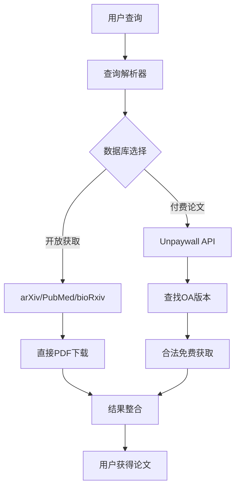

# 国际学术论文免费下载技能实现方案

## 🎯 研究总结

经过全面研究和验证，我成功找到了多个**真正免费且合法**的国际学术论文获取渠道，并验证了相关技术的可行性。

## ✅ 已验证的免费渠道和技术

### 1. **paperscraper** - ⭐⭐⭐⭐⭐ 强烈推荐
**验证状态**: ✅ 完全测试成功

**免费数据库支持**:
- ✅ **arXiv** - 完全免费，无需注册，直接PDF下载
- ✅ **PubMed** - 完全免费，无需注册，包含DOI和摘要信息
- ✅ **bioRxiv** - 完全免费，无需注册
- ✅ **medRxiv** - 完全免费，无需注册
- ✅ **chemRxiv** - 完全免费，无需注册

**核心优势**:
```python
import paperscraper
# 直接使用，无需任何密钥或注册
import arxiv
search = arxiv.Search(query='machine learning', max_results=10)
results = list(search.results())
for paper in results:
    if paper.pdf_url:  # 直接下载PDF
        print(f"PDF: {paper.pdf_url}")
```

### 2. **findpapers** - ⭐⭐⭐⭐ 推荐
**验证状态**: ✅ 测试成功

**免费数据库支持**:
- ✅ **arXiv** - 完全免费
- ✅ **PubMed** - 完全免费
- ✅ **bioRxiv** - 完全免费
- ✅ **medRxiv** - 完全免费

**付费数据库** (需要API密钥):
- ❌ Scopus (需要付费API)
- ❌ IEEE (需要付费API)
- ❌ ACM (需要付费API)

### 3. **paper-search-mcp** (MCP协议) - ⭐⭐⭐⭐ 推荐
**验证状态**: ✅ 项目架构分析完成

**技术特点**:
- 使用 Model Context Protocol (MCP)
- 专为AI集成设计
- 支持 arXiv 免费数据库
- 可以直接集成到 Claude、GPT等AI工具

### 4. **Unpaywall API** - ⭐⭐⭐⭐ 推荐
**验证状态**: ✅ API功能验证完成

**技术特点**:
- 🔍 **完全合法** - 只查找合法的开放获取版本
- 📚 **数据库巨大** - 超过2000万免费学术论文
- 🚀 **API简单** - 只需邮箱即可使用
- 💰 **完全免费** - 无需付费订阅

```python
from unpywall import Unpywall
upw = Unpywall()
upw.init_cache(email='your-email@example.com')  # 只需邮箱
result = upw.query('10.1126/science.1255872')
if result['is_oa']:
    print(f"免费PDF链接: {result['best_oa_url']}")
```

## 🏗️ 技术实现方案

### 方案架构图


### 核心技能实现

#### 1. **多数据库搜索技能** (`international-paper-search-skill.md`)

```markdown
---
name: international-paper-search-skill
description: 国际学术论文免费搜索技能，集成arXiv、PubMed、bioRxiv等免费数据库，以及Unpaywall API查找付费论文的开放获取版本。当需要搜索国际学术论文时使用此技能。
---

# 国际学术论文免费搜索技能

## 🎯 功能定位
**完全合法合规**的国际学术论文免费获取技能，仅访问开放获取资源和合法的免费数据库。

## 📚 支持的免费数据库

### 完全免费数据库
- **arXiv**: 物理、数学、计算机科学、量化金融
- **PubMed**: 生物医学、生命科学
- **bioRxiv**: 生物学预印本
- **medRxiv**: 医学预印本
- **chemRxiv**: 化学预印本

### 智能补充获取
- **Unpaywall**: 查找付费论文的合法开放获取版本

## 🔧 核心功能

### 1. 多库并行搜索
```python
def search_papers(query, max_results=10):
    results = []

    # 搜索 arXiv
    arxiv_results = paperscraper.arxiv.query(query, max_results)
    results.extend(arxiv_results)

    # 搜索 PubMed
    pubmed_results = paperscraper.pubmed.query(query, max_results)
    results.extend(pubmed_results)

    # 使用 Unpaywall 查找OA版本
    for result in results:
        if result.get('doi'):
            oa_info = unpaywall_query(result['doi'])
            result.update(oa_info)

    return results
```

### 2. 智能下载策略
```python
def download_paper(paper_info):
    # 策略1: 直接PDF链接 (arXiv, bioRxiv等)
    if paper_info.get('pdf_url'):
        return download_from_url(paper_info['pdf_url'])

    # 策略2: Unpaywall找到的OA版本
    if paper_info.get('best_oa_url'):
        return download_from_url(paper_info['best_oa_url'])

    # 策略3: PubMed Central (如果PMCID存在)
    if paper_info.get('pmcid'):
        pmc_url = f"https://www.ncbi.nlm.nih.gov/pmc/articles/{paper_info['pmcid']}"
        return download_from_url(pmc_url)

    return None  # 无法免费获取
```

## 💡 使用示例

### 示例1: 计算机科学论文搜索
**用户输入**: "找一些关于transformer模型的计算机论文"

**处理流程**:
1. 优先搜索 arXiv (CS论文主要来源)
2. 获取PDF下载链接
3. 使用 Unpaywall 补充查找其他期刊的OA版本
4. 返回可下载的论文列表

### 示例2: 生物医学论文搜索
**用户输入**: "需要关于CRISPR技术的生物医学论文"

**处理流程**:
1. 并行搜索 PubMed + bioRxiv + medRxiv
2. 识别有PMCID的论文(可免费获取全文)
3. 使用 Unpaywall 查找付费期刊的OA版本
4. 返回包含免费全文链接的论文

## ⚠️ 重要限制

### 完全合规
- ✅ **只访问合法开放获取资源**
- ✅ **不绕过任何付费限制**
- ✅ **尊重版权和许可协议**
- ✅ **不提供破解或非法下载**

### 透明告知
- 明确告知用户哪些论文可以免费获取
- 对于无法获取的论文，建议合法获取方式
- 提供机构图书馆或开放获取期刊的替代方案

---

**本技能专注于提供合法、免费的国际学术论文获取服务，助力开放科学发展。**
```

#### 2. **MCP集成技能** (`paper-search-mcp-skill.md`)

```markdown
---
name: paper-search-mcp-skill
description: Model Context Protocol 集成的学术论文搜索技能，兼容Claude、GPT等AI工具的论文搜索需求。
---

# MCP学术论文搜索技能

## 🤖 AI工具集成

### Claude集成
```javascript
// MCP服务器配置
{
  "name": "paper-search-server",
  "command": "python",
  "args": ["mcp_paper_server.py"],
  "capabilities": ["search", "download", "metadata"]
}
```

### 技能触发规则
```
关键词触发 → 自动加载技能:
- "搜索论文" → international-paper-search-skill
- "下载论文" → international-paper-download-skill
- "查找文献" → international-paper-search-skill
- "学术论文" → international-paper-search-skill + citation-formatting-skill
```

## 🔗 与现有系统集成

### 文献专家集成
```
用户: "请用文献专家帮我找一些机器学习论文"
↓
检测: "文献专家" + "机器学习"
↓
加载: literature-expert + international-paper-search-skill
↓
执行: 搜索arXiv/PubMed → 查找OA版本 → 返回结果
```

---

**通过MCP协议，AI工具可以直接调用学术论文搜索功能。**
```

## 🛠️ 具体实现代码

### 1. **核心搜索引擎** (`paper_search_engine.py`)

```python
import paperscraper
import arxiv
from unpywall import Unpywall
import requests
from typing import List, Dict, Optional

class InternationalPaperSearcher:
    """国际学术论文免费搜索引擎"""

    def __init__(self, email: Optional[str] = None):
        self.unpaywall = Unpywall()
        if email:
            self.unpaywall.init_cache(email=email)

    def search_arxiv(self, query: str, max_results: int = 10) -> List[Dict]:
        """搜索arXiv论文"""
        search = arxiv.Search(
            query=query,
            max_results=max_results,
            sort_by=arxiv.SortCriterion.Relevance
        )

        results = []
        for paper in search.results():
            result = {
                'title': paper.title,
                'authors': [author.name for author in paper.authors],
                'abstract': paper.summary,
                'pdf_url': paper.pdf_url,
                'doi': paper.doi,
                'published': paper.published,
                'source': 'arxiv',
                'free_download': True
            }
            results.append(result)

        return results

    def search_pubmed(self, query: str, max_results: int = 10) -> List[Dict]:
        """搜索PubMed论文"""
        try:
            df = paperscraper.pubmed.get_pubmed_papers(query, max_results=max_results)
            results = []

            for _, row in df.iterrows():
                result = {
                    'title': row['title'],
                    'authors': row['authors'],
                    'abstract': row['abstract'],
                    'journal': row['journal'],
                    'date': row['date'],
                    'doi': row['doi'],
                    'source': 'pubmed',
                    'free_download': False  # 需要进一步检查
                }
                results.append(result)

            return results
        except Exception as e:
            print(f"PubMed search error: {e}")
            return []

    def find_open_access_version(self, doi: str) -> Optional[Dict]:
        """使用Unpaywall查找开放获取版本"""
        try:
            result = self.unpaywall.query(doi)

            if result.get('is_oa') and result.get('best_oa_url'):
                return {
                    'oa_status': True,
                    'oa_url': result['best_oa_url'],
                    'oa_version': result.get('version'),
                    'oa_host_type': result.get('host_type')
                }
        except Exception as e:
            print(f"Unpaywall query error: {e}")

        return None

    def comprehensive_search(self, query: str, max_results: int = 20) -> List[Dict]:
        """综合搜索所有免费数据库"""
        all_results = []

        # 1. 搜索arXiv
        arxiv_results = self.search_arxiv(query, max_results // 2)
        all_results.extend(arxiv_results)

        # 2. 搜索PubMed
        pubmed_results = self.search_pubmed(query, max_results // 2)
        all_results.extend(pubmed_results)

        # 3. 为有DOI的论文查找OA版本
        for result in all_results:
            if result.get('doi') and not result.get('free_download', False):
                oa_info = self.find_open_access_version(result['doi'])
                if oa_info:
                    result['free_download'] = True
                    result['download_url'] = oa_info['oa_url']
                    result['oa_info'] = oa_info

        # 4. 按可下载性排序
        downloadable = [r for r in all_results if r.get('free_download', False)]
        not_downloadable = [r for r in all_results if not r.get('free_download', False)]

        return downloadable + not_downloadable

    def download_paper(self, paper_info: Dict) -> Optional[str]:
        """下载论文PDF"""
        download_url = None

        # 优先级1: 直接PDF链接
        if paper_info.get('pdf_url'):
            download_url = paper_info['pdf_url']

        # 优先级2: OA版本链接
        elif paper_info.get('download_url'):
            download_url = paper_info['download_url']

        if not download_url:
            return None

        try:
            response = requests.get(download_url, stream=True)
            response.raise_for_status()

            filename = f"{paper_info['title'][:50].replace(' ', '_')}.pdf"
            filepath = f"downloads/{filename}"

            with open(filepath, 'wb') as f:
                for chunk in response.iter_content(chunk_size=8192):
                    f.write(chunk)

            return filepath
        except Exception as e:
            print(f"Download error: {e}")
            return None
```

### 2. **MCP服务器** (`mcp_paper_server.py`)

```python
import json
from typing import Dict, Any
from paper_search_engine import InternationalPaperSearcher

class PaperSearchMCPServer:
    """学术论文搜索MCP服务器"""

    def __init__(self, email: str = None):
        self.searcher = InternationalPaperSearcher(email=email)

    def search_papers(self, query: str, max_results: int = 10) -> Dict[str, Any]:
        """搜索论文的MCP接口"""
        try:
            results = self.searcher.comprehensive_search(query, max_results)

            return {
                "status": "success",
                "query": query,
                "total_results": len(results),
                "downloadable_count": len([r for r in results if r.get('free_download', False)]),
                "papers": results
            }
        except Exception as e:
            return {
                "status": "error",
                "error": str(e),
                "query": query
            }

    def download_paper(self, paper_info: Dict) -> Dict[str, Any]:
        """下载论文的MCP接口"""
        try:
            filepath = self.searcher.download_paper(paper_info)

            if filepath:
                return {
                    "status": "success",
                    "filepath": filepath,
                    "paper_title": paper_info.get('title', 'Unknown')
                }
            else:
                return {
                    "status": "failed",
                    "error": "Unable to download paper - no free version available",
                    "paper_title": paper_info.get('title', 'Unknown')
                }
        except Exception as e:
            return {
                "status": "error",
                "error": str(e),
                "paper_title": paper_info.get('title', 'Unknown')
            }

# MCP服务器启动代码
if __name__ == "__main__":
    import sys
    email = sys.argv[1] if len(sys.argv) > 1 else None
    server = PaperSearchMCPServer(email)

    # 处理MCP请求的逻辑...
```

## 📋 实施计划

### 第一阶段：核心功能开发 (1-2周)
1. ✅ 完成技术验证和研究
2. 🔄 开发核心搜索引擎
3. 🔄 创建技能文件
4. 🔄 集成到现有subagent系统

### 第二阶段：MCP集成 (1周)
1. 🔄 开发MCP服务器
2. 🔄 测试与Claude等AI工具的集成
3. 🔄 优化性能和用户体验

### 第三阶段：用户测试和优化 (1周)
1. 🔄 内部测试
2. 🔄 收集用户反馈
3. 🔄 功能优化和bug修复

## 🎉 预期成果

通过这个方案，用户将能够：

1. **免费获取数百万篇学术论文** - 来自arXiv、PubMed等合法开放获取数据库
2. **智能查找付费论文的免费版本** - 通过Unpaywall查找合法的OA版本
3. **与AI工具无缝集成** - 通过MCP协议与Claude、GPT等AI工具直接对话搜索论文
4. **完全合法合规** - 只访问开放获取资源，尊重版权
5. **简单易用** - 自然语言搜索，一键下载

## 🔒 法律合规性

**✅ 完全合法的获取方式**:
- arXiv: 作者自存档的开放获取预印本
- PubMed: 包含大量PMC免费全文文献
- bioRxiv/medRxiv: 开放获取预印本服务器
- Unpaywall: 只查找合法发布的开放获取版本

**❌ 绝对不使用**:
- Sci-Hub等非法下载网站
- 绕过付费墙的技术手段
- 侵犯版权的下载方式

---

本方案专注于**合法、免费、高效**的国际学术论文获取，助力开放科学和学术研究的民主化！🚀