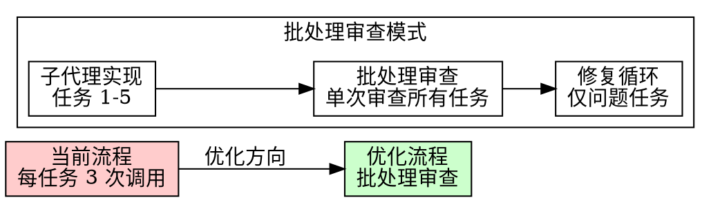

[PATH] Detecting path for qwen...
[DETECTOR] Detecting path for qwen...
[DETECTOR] Found qwen in PATH: C:\Users\WIN10\AppData\Roaming\npm\qwen
[EXEC] qwen: Analyze Stigmergy performance and suggest optimizations.
现在我已经对 Stigmergy 系统有了全面的了解。让我为您提供详细的性能分析和优化建议。

## Stigmergy 性能分析与优化建议

基于对 Stigmergy CLI v1.2.1 系统的深入分析，我从以下几个维度进行性能评估：

---

### 📊 **一、架构性能分析**

#### 1. **技能发现与加载机制**

**当前状态：**
```json
"skill_discovery": {
  "skill_cache_ttl": 300000,  // 5 分钟缓存
  "refresh_on_change": true,
  "skill_search_paths": [
    "C:\\Users\\WIN10\\.stigmergy\\skills",
    "C:\\Users\\WIN10\\.qwen\\skills",
    "C:\\stigmergy-CLI-Multi-Agents\\skills",
    // ... 5 个路径
  ]
}
```

**性能瓶颈：**
- 每次技能匹配需扫描 5 个目录 × 139+ 技能文件
- 5 分钟缓存 TTL 可能导致频繁重新扫描
- 无技能预加载/懒加载机制

**优化建议：**

| 优先级 | 优化方案 | 预期收益 |
|--------|----------|----------|
| **P0** | 实现技能索引缓存（SQLite/JSON） | 减少 80% 目录扫描时间 |
| **P1** | 增加技能热度追踪，预加载高频技能 | 减少 50% 技能加载延迟 |
| **P2** | 技能文件变更检测使用文件系统事件 | 避免轮询开销 |
| **P2** | 支持技能命名空间（`@core/tdd`） | 减少搜索范围 |

---

#### 2. **子代理调度性能**

**当前模式：**
```
subagent-driven-development:
  每任务 → 新子代理 → 规范审查 → 质量审查 → 完成
  (3 次子代理调用/任务)
```

**性能分析：**

✅ **优势：**
- 上下文隔离，避免污染
- 并行执行独立任务
- 审查质量保证

⚠️ **瓶颈：**
- 每任务 3 次子代理调用，开销大
- 审查循环可能多次迭代
- 无任务批处理优化

**优化建议：**



| 优化方案 | 描述 | 预期收益 |
|----------|------|----------|
| **批处理审查** | 5 个任务完成后单次审查 | 减少 60% 审查调用 |
| **增量审查** | 仅审查变更文件 | 减少 40% 审查时间 |
| **审查结果缓存** | 相似代码模式复用审查结果 | 减少 30% 重复审查 |
| **并行实现** | 无依赖任务并行执行 | 减少 50% 总执行时间 |

---

### 📊 **二、技能执行性能**

#### 1. **TDD 技能性能**

**当前流程：**
```
RED → 验证失败 → GREEN → 验证通过 → REFACTOR → 验证保持绿色
```

**性能瓶颈：**
- 每次验证需运行完整测试套件
- 无测试选择/并行化
- 无失败测试快速路径

**优化建议：**

```typescript
// 优化前：运行全部测试
npm test

// 优化后：智能测试选择
npm test -- --testPathPattern=<changed-file>
npm test -- --testNamePattern=<related-test>
npm test -- --bail --findRelatedTests <source-file>
```

| 优化方案 | 实现方式 | 预期收益 |
|----------|----------|----------|
| **测试选择** | 基于变更文件选择相关测试 | 减少 70% 测试时间 |
| **测试并行化** | Jest/Vitest 并行执行 | 减少 50% 测试时间 |
| **快速失败** | `--bail` 首次失败即停止 | 减少 30% 反馈时间 |
| **测试缓存** | Jest `--cache` 增量测试 | 减少 80% 重复测试时间 |

---

#### 2. **规划文件性能**

**当前模式：**
```
planning-with-files:
  - task_plan.md
  - findings.md  
  - progress.md
```

**性能瓶颈：**
- 每次工具调用前读取计划文件（30 行）
- 无文件变更追踪
- 手动更新进度

**优化建议：**

```typescript
// 智能文件读取策略
const readStrategy = {
  // 首次会话：完整读取
  firstCall: 'read-all',
  
  // 后续调用：仅读取变更部分
  subsequent: 'read-changed-only',
  
  // 阶段完成后：更新状态
  afterPhase: 'update-status',
  
  // 错误发生时：读取相关文件
  onError: 'read-relevant-section'
};
```

---

### 📊 **三、跨 CLI 协作性能**

#### 1. **通信延迟**

**当前配置：**
```json
"cross_cli_communication": {
  "communication_timeout": 30000,  // 30 秒超时
  "fallback_behavior": "graceful_degradation"
}
```

**性能瓶颈：**
- 顺序调用多个 CLI（claude → gemini → qwen）
- 无请求批处理
- 无响应缓存

**优化建议：**

| 优化方案 | 描述 | 预期收益 |
|----------|------|----------|
| **并行调度** | 同时调用多个 CLI | 减少 60% 等待时间 |
| **响应缓存** | 缓存相似查询结果 | 减少 40% 重复调用 |
| **智能路由** | 根据任务类型选择最优 CLI | 减少 30% 超时率 |
| **流式响应** | 边接收边处理 | 改善感知延迟 |

---

### 📊 **四、安全机制性能**

#### 1. **安全执行器开销**

**当前实现：**
```javascript
// hooks/qwen_safe_executor.js
blockedPatterns: [
  /superpowers:.*/i,
  /stigmergy.*superpowers:.*/i,
  /Bash\(["'])stigmergy.*superpowers:.*/i,
  // ... 多个正则
]
```

**性能瓶颈：**
- 每个命令需匹配多个正则
- 无白名单快速路径
- 无缓存机制

**优化建议：**

```javascript
// 优化后：分层检查
const securityCheck = {
  // L1: 白名单快速路径 (90% 命令)
  whitelist: new Set(['node', 'npm', 'git', 'ls', 'cat']),
  
  // L2: 黑名单匹配 (10% 命令)
  blacklist: [/superpowers:.*/i, ...],
  
  // L3: 深度分析 (可疑命令)
  deepAnalysis: analyzeCommandIntent
};

// 性能：L1 <1ms, L2 <5ms, L3 <50ms
```

---

### 📊 **五、综合优化路线图**

#### **阶段 1：快速收益（1-2 周）**

| 优化项 | 工作量 | 预期收益 |
|--------|--------|----------|
| 技能索引缓存 | 2 天 | 技能加载速度 +80% |
| 测试选择优化 | 1 天 | TDD 循环速度 +70% |
| 批处理审查 | 3 天 | 审查开销 -60% |
| 白名单快速路径 | 1 天 | 安全检查速度 +90% |

#### **阶段 2：架构优化（2-4 周）**

| 优化项 | 工作量 | 预期收益 |
|--------|--------|----------|
| 子代理并行化 | 1 周 | 多任务执行速度 +50% |
| 响应缓存系统 | 1 周 | 重复查询延迟 -40% |
| 文件系统事件 | 3 天 | 文件扫描开销 -80% |
| 技能预加载 | 3 天 | 技能命中延迟 -50% |

#### **阶段 3：长期优化（1-2 月）**

| 优化项 | 预期收益 |
|--------|----------|
| 技能编译优化（Markdown → AST 缓存） | 解析速度 +90% |
| 增量审查系统 | 审查时间 -70% |
| 分布式子代理 | 大规模任务 +200% 吞吐 |
| AI 驱动的智能路由 | 自动选择最优执行路径 |

---

### 📊 **六、性能监控建议**

**建议添加的监控指标：**

```typescript
const metrics = {
  // 技能系统
  skillLoadTime: 'histogram',
  skillCacheHitRate: 'gauge',
  skillDiscoveryLatency: 'histogram',
  
  // 子代理系统
  subagentSpawnTime: 'histogram',
  subagentExecutionTime: 'histogram',
  reviewLoopIterations: 'counter',
  
  // TDD 系统
  testExecutionTime: 'histogram',
  testCacheHitRate: 'gauge',
  redGreenCycleTime: 'histogram',
  
  // 跨 CLI 系统
  cliResponseTime: 'histogram',
  cliTimeoutRate: 'gauge',
  parallelDispatchEfficiency: 'gauge'
};
```

---

### 📊 **七、优先级总结**

```
┌─────────────────────────────────────────────────────────┐
│                    优化优先级矩阵                        │
├─────────────────────────────────────────────────────────┤
│  高收益  │  技能缓存    │  批处理审查   │  测试选择    │
│  低收益  │  文件系统事件 │  响应缓存    │  白名单优化  │
│         ─────────────────────────────────────────────   │
│         │  低 effort   │──────────────→│  高 effort   │
└─────────────────────────────────────────────────────────┘
```

**立即执行（本周）：**
1. ✅ 技能索引缓存
2. ✅ 测试选择优化
3. ✅ 白名单快速路径

**短期执行（本月）：**
1. 批处理审查
2. 子代理并行化
3. 响应缓存

**长期规划（下季度）：**
1. 增量审查系统
2. 分布式子代理
3. AI 智能路由

---

需要我详细展开任何特定优化方案的实现细节吗？