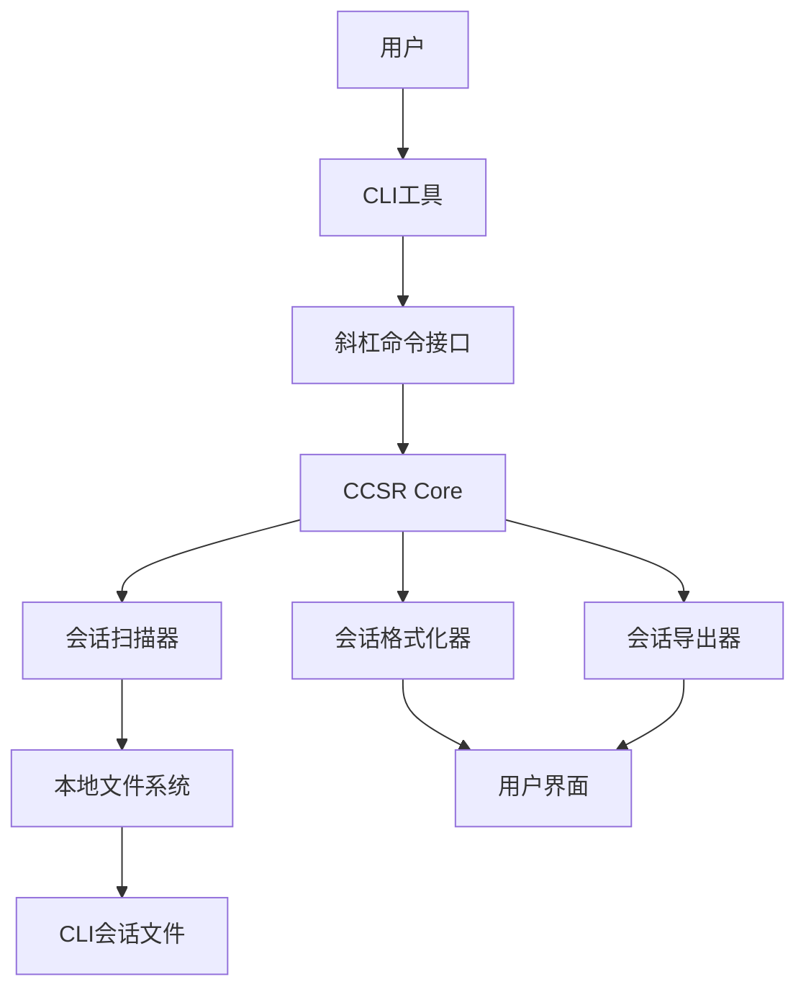
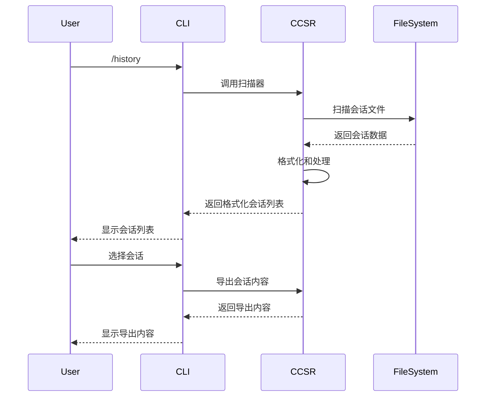

# 跨CLI会话恢复系统技术设计文档

## 文档信息

- **项目名称**: Cross-CLI Session Recovery (CCSR)
- **文档版本**: 1.0.0
- **创建日期**: 2025-12-12
- **文档类型**: 技术设计 (Technical Design)
- **目标读者**: 开发团队、架构师、技术负责人

## 1. 系统架构

### 1.1 整体架构



### 1.2 核心组件

#### 1.2.1 CCSR Core Engine
- **职责**: 核心业务逻辑协调
- **技术栈**: Node.js + TypeScript
- **关键功能**: 生命周期管理、组件协调、错误处理

#### 1.2.2 Session Scanner
- **职责**: 扫描和索引CLI会话文件
- **技术栈**: 文件系统API + JSON解析器
- **关键功能**: 多CLI支持、增量扫描、格式适配

#### 1.2.3 Session Formatter
- **职责**: 统一会话数据格式
- **技术栈**: 数据转换引擎
- **关键功能**: 格式标准化、元数据处理

#### 1.2.4 Session Exporter
- **职责**: 导出会话内容为不同格式
- **技术栈**: 模板引擎 + 格式转换器
- **关键功能**: 多格式导出、内容截断

#### 1.2.5 CLI Integration
- **职责**: 与各CLI工具的斜杠命令集成
- **技术栈**: 模板文件 + 脚本生成
- **关键功能**: 自动配置、部署脚本

### 1.3 数据流



## 2. 详细设计

### 2.1 项目结构

```
cross-cli-session-manager/
├── src/
│   ├── core/
│   │   ├── engine.ts              # 核心引擎
│   │   ├── config.ts              # 配置管理
│   │   └── types.ts               # 类型定义
│   ├── scanner/
│   │   ├── session-scanner.ts      # 会话扫描器
│   │   ├── cli-adapters/          # CLI适配器
│   │   │   ├── claude.adapter.ts
│   │   │   ├── gemini.adapter.ts
│   │   │   ├── qwen.adapter.ts
│   │   │   ├── iflow.adapter.ts
│   │   │   ├── codebuddy.adapter.ts
│   │   │   └── qoder.adapter.ts
│   │   └── project-matcher.ts      # 项目匹配器
│   ├── formatter/
│   │   ├── session-formatter.ts    # 会话格式化器
│   │   └── standard-formatter.ts   # 标准格式化
│   ├── exporter/
│   │   ├── session-exporter.ts     # 会话导出器
│   │   ├── markdown-exporter.ts    # Markdown导出
│   │   ├── context-exporter.ts     # 上下文导出
│   │   └── json-exporter.ts        # JSON导出
│   ├── integration/
│   │   ├── slash-command-manager.ts # 斜杠命令管理
│   │   ├── template-generator.ts   # 模板生成器
│   │   └── deployment/             # 部署脚本
│   │       ├── install.sh
│   │       ├── install.ps1
│   │       └── package.json
│   └── ui/
│       ├── cli-interface.ts       # CLI界面
│       └── web-interface.ts       # Web界面(可选)
├── templates/
│   └── commands/
│       ├── claude/
│       │   └── history.md
│       ├── gemini/
│       │   └── history.md
│       ├── qwen/
│       │   └── history.md
│       ├── iflow/
│       │   └── history.md
│       └── codebuddy/
│           └── history.md
├── tests/
│   ├── unit/
│   ├── integration/
│   └── e2e/
├── docs/
│   ├── api/
│   ├── user-guide/
│   └── troubleshooting/
├── package.json
├── tsconfig.json
├── jest.config.js
└── README.md
```

### 2.2 核心接口设计

#### 2.2.1 会话接口

```typescript
interface Session {
  id: string;
  sourceCLI: string;
  sessionId: string;
  title?: string;
  startTime: string;
  lastUpdated: string;
  messageCount: number;
  messages: Message[];
  metadata: SessionMetadata;
  filePath: string;
}

interface Message {
  id: string;
  timestamp: string;
  type: 'user' | 'assistant' | 'system';
  content: string;
  metadata?: MessageMetadata;
}

interface SessionMetadata {
  projectPath?: string;
  workingDir?: string;
  gitBranch?: string;
  cost?: number;
  tokens?: TokenInfo;
  parentSessionId?: string;
  [key: string]: any;
}
```

#### 2.2.2 CLI适配器接口

```typescript
interface CLIAdapter {
  name: string;
  version: string;
  scanSessions(projectPath: string): Promise<Session[]>;
  parseSession(filePath: string): Promise<Session>;
  formatSession(session: Session): Promise<string>;
  supportsExport(format: string): boolean;
}

interface CLIConfig {
  name: string;
  folder: string;
  baseDir: string;
  filePattern: RegExp;
  parser: (filePath: string) => Promise<Session>;
}
```

#### 2.2.3 项目匹配器接口

```typescript
interface ProjectMatcher {
  matchProject(session: Session, currentPath: string): boolean;
  generateProjectId(path: string): string;
  normalizePath(path: string): string;
}
```

### 2.3 CLI适配器实现

#### 2.3.1 Claude CLI适配器

```typescript
export class ClaudeAdapter implements CLIAdapter {
  name = 'claude';
  version = '2.0.65';

  private config: CLIConfig = {
    name: 'claude',
    folder: '.claude',
    baseDir: path.join(os.homedir(), '.claude', 'projects'),
    filePattern: /^.*\/.*\.jsonl$/,
    parser: this.parseClaudeJSONL.bind(this)
  };

  async scanSessions(projectPath: string): Promise<Session[]> {
    const sessions: Session[] = [];
    const projectDir = this.normalizePath(projectPath);

    if (!fs.existsSync(this.config.baseDir)) {
      return sessions;
    }

    const sessionDirs = fs.readdirSync(this.config.baseDir)
      .filter(dir => dir.includes(projectDir));

    for (const sessionDir of sessionDirs) {
      const sessionDirPath = path.join(this.config.baseDir, sessionDir);
      const sessionFiles = fs.readdirSync(sessionDirPath)
        .filter(file => this.config.filePattern.test(file));

      for (const sessionFile of sessionFiles) {
        try {
          const session = await this.parseSession(
            path.join(sessionDirPath, sessionFile)
          );
          sessions.push(session);
        } catch (error) {
          console.warn(`Failed to parse Claude session: ${sessionFile}`, error);
        }
      }
    }

    return sessions;
  }

  private async parseClaudeJSONL(filePath: string): Promise<Session> {
    const content = fs.readFileSync(filePath, 'utf8');
    const lines = content.split('\n').filter(line => line.trim());

    if (lines.length === 0) {
      throw new Error('Empty session file');
    }

    const messages: Message[] = [];
    let session: Session | null = null;

    for (const line of lines) {
      try {
        const data = JSON.parse(line);
        const message: Message = {
          id: data.uuid || data.id || generateId(),
          timestamp: data.timestamp || new Date().toISOString(),
          type: data.type || 'user',
          content: data.message?.content || '',
          metadata: {
            cwd: data.cwd,
            gitBranch: data.gitBranch,
            agentId: data.agentId,
            isSidechain: data.isSidechain
          }
        };

        messages.push(message);

        // 使用最后一行作为会话信息
        if (!session) {
          session = {
            id: data.sessionId || generateId(),
            sourceCLI: this.name,
            sessionId: data.sessionId || generateId(),
            title: data.title || 'Untitled Session',
            startTime: data.timestamp || new Date().toISOString(),
            lastUpdated: data.timestamp || new Date().toISOString(),
            messageCount: 1,
            messages: [],
            metadata: {
              workingDir: data.cwd,
              gitBranch: data.gitBranch,
              agentId: data.agentId
            },
            filePath: filePath
          };
        }
      } catch (error) {
        console.warn(`Failed to parse line: ${line}`, error);
      }
    }

    if (session) {
      session.messageCount = messages.length;
      session.messages = messages;
      session.lastUpdated = messages[messages.length - 1]?.timestamp || session.lastUpdated;
    }

    return session!;
  }
}
```

#### 2.3.2 Gemini CLI适配器

```typescript
export class GeminiAdapter implements CLIAdapter {
  name = 'gemini';
  version = '0.19.4';

  private config: CLIConfig = {
    name: 'gemini',
    folder: '.gemini',
    baseDir: path.join(os.homedir(), '.gemini', 'tmp'),
    filePattern: /^.*\/chats\/session-.*\.json$/,
    parser: this.parseGeminiJSON.bind(this)
  };

  async scanSessions(projectPath: string): Promise<Session[]> {
    const sessions: Session[] = [];
    const projectHash = this.createProjectHash(projectPath);
    const chatDir = path.join(this.config.baseDir, projectHash, 'chats');

    if (!fs.existsSync(chatDir)) {
      return sessions;
    }

    const sessionFiles = fs.readdirSync(chatDir)
      .filter(file => this.config.filePattern.test(file));

    for (const sessionFile of sessionFiles) {
      try {
        const session = await this.parseSession(path.join(chatDir, sessionFile));
        if (this.matchesProject(session, projectPath)) {
          sessions.push(session);
        }
      } catch (error) {
        console.warn(`Failed to parse Gemini session: ${sessionFile}`, error);
      }
    }

    return sessions;
  }

  private async parseGeminiJSON(filePath: string): Promise<Session> {
    const data = JSON.parse(fs.readFileSync(filePath, 'utf8'));

    return {
      id: data.sessionId || generateId(),
      sourceCLI: this.name,
      sessionId: data.sessionId,
      title: data.title || 'Untitled Session',
      startTime: data.startTime,
      lastUpdated: data.lastUpdated,
      messageCount: data.messages?.length || 0,
      messages: data.messages?.map(msg => ({
        id: msg.id || generateId(),
        timestamp: msg.timestamp,
        type: msg.type as 'user' | 'assistant',
        content: msg.content,
        metadata: {
          thoughts: msg.thoughts
        }
      })) || [],
      metadata: {
        projectHash: data.projectHash,
        startTime: data.startTime,
        lastUpdated: data.lastUpdated
      },
      filePath: filePath
    };
  }

  private createProjectHash(projectPath: string): string {
    const normalizedPath = this.normalizePath(projectPath);
    return crypto.createHash('sha256')
      .update(normalizedPath)
      .digest('hex');
  }

  private matchesProject(session: Session, currentPath: string): boolean {
    if (!session.metadata?.projectHash) {
      return false;
    }

    const currentHash = this.createProjectHash(currentPath);
    return session.metadata.projectHash.startsWith(currentHash.substring(0, 16));
  }
}
```

### 2.4 斜杠命令集成

#### 2.4.1 模板系统

```typescript
interface CommandTemplate {
  name: string;
  description: string;
  variables: TemplateVariable[];
  scripts: CommandScript[];
  content: string;
}

interface TemplateVariable {
  name: string;
  type: 'string' | 'number' | 'boolean';
  defaultValue?: any;
  required: boolean;
}

interface CommandScript {
  platform: 'sh' | 'ps1' | 'js';
  content: string;
  args?: string[];
}
```

#### 2.4.2 模板生成器

```typescript
export class TemplateGenerator {
  private templates: Map<string, CommandTemplate> = new Map();

  constructor() {
    this.loadTemplates();
  }

  async generateHistoryCommand(targetCLI: string): Promise<void> {
    const template = this.templates.get('history');
    const cliConfig = CLI_CONFIGS[targetCLI];

    if (!cliConfig) {
      throw new Error(`Unsupported CLI: ${targetCLI}`);
    }

    const commandsDir = path.join(cliConfig.baseDir, 'commands');
    await fs.ensureDir(commandsDir);

    const commandContent = this.renderTemplate(template, {
      CLI_NAME: targetCLI.toUpperCase(),
      PROJECT_DIR: process.cwd()
    });

    const commandFile = path.join(commandsDir, 'history.md');
    await fs.writeFile(commandFile, commandContent, 'utf8');
  }

  private renderTemplate(template: CommandTemplate, variables: Record<string, any>): string {
    let content = template.content;

    // 替换模板变量
    for (const variable of template.variables) {
      const value = variables[variable.name] || variable.defaultValue;
      content = content.replace(
        new RegExp(`\\$\\{${variable.name}\\}`, 'g'),
        String(value)
      );
    }

    return content;
  }

  private loadTemplates(): void {
    // 加载history命令模板
    this.templates.set('history', {
      name: 'history',
      description: '查看跨CLI历史会话并恢复选中的会话',
      variables: [
        {
          name: 'PROJECT_DIR',
          type: 'string',
          required: true
        }
      ],
      scripts: [
        {
          platform: 'sh',
          content: `.cross-cli/history-scanner.sh "$ARGUMENTS"`,
          args: []
        },
        {
          platform: 'ps1',
          content: `.cross-cli/history-scanner.ps1 "$ARGUMENTS"`,
          args: []
        }
      ],
      content: `---
description: 查看跨CLI历史会话并恢复选中的会话
scripts:
  sh: .cross-cli/history-scanner.sh "$ARGUMENTS"
  ps: .cross-cli/history-scanner.ps1 "$ARGUMENTS"
---

## 跨CLI历史会话

### 🔍 扫描当前项目的所有CLI会话

项目路径: \`$\{PROJECT_DIR\}\`

<!-- 动态生成的会话列表将在这里显示 -->

### 💡 使用说明
- 输入数字选择要恢复的会话
- 使用 \`/export <session-id>\` 导出会话内容
- 使用 \`/search <keyword>\` 搜索特定会话
- 使用 \`/filter <cli-name>\` 按CLI筛选
- 使用 \`/detail <session-id>\` 显示会话详情
`
    });
  }
}
```

### 2.5 部署系统

#### 2.5.1 一键部署脚本

```bash
#!/bin/bash
# install.sh

set -e

echo "🚀 安装Cross-CLI Session Recovery..."

# 检查Node.js版本
if ! command -v node &> /dev/null; then
    echo "❌ 需要安装Node.js 16+"
    exit 1
fi

# 安装CCSR
echo "📦 安装CCSR核心包..."
npm install -g cross-cli-session-manager

# 创建工具目录
echo "📁 创建工具目录..."
mkdir -p ~/.cross-cli

# 下载核心文件
echo "📥 下载核心文件..."
curl -o ~/.cross-cli/history-scanner.js \
  https://releases.cross-cli.com/v1.0.0/history-scanner.js
curl -o ~/.cross-cli/session-exporter.js \
  https://releases.cross-cli.com/v1.0.0/session-exporter.js

# 设置执行权限
chmod +x ~/.cross-cli/*.js

echo "✅ 安装完成！"

# 询问是否部署斜杠命令
read -p "是否部署斜杠命令到支持的CLI工具? (y/N): " -n 1 -r
echo
if [[ $REPLY =~ ^[Yy]$ ]]; then
    echo "🔧 部署斜杠命令..."

    # 检查已安装的CLI
    CLIS=("claude" "gemini" "qwen" "iflow" "codebuddy" "qoder")

    for cli in "${CLIS[@]}"; do
        if command -v $cli &> /dev/null; then
            echo "  为 $cli 部署 /history 命令..."
            cross-cli-cli deploy --cli $cli --command history
        else
            echo "  ⚠️  $cli 未安装，跳过"
        fi
    done

    echo "✅ 斜杠命令部署完成！"
fi

echo ""
echo "🎉 安装完成！现在可以在支持的CLI中使用 /history 命令"
echo "💡 使用 'cross-cli --help' 查看帮助"
```

## 3. 数据模型

### 3.1 会话数据模型

```typescript
interface StandardSession {
  // 标准化会话数据
  id: string;
  sourceCLI: string;
  sessionId: string;
  title: string;
  startTime: ISO8601String;
  lastUpdated: ISO8601String;
  messageCount: number;
  messages: StandardMessage[];
  metadata: StandardMetadata;
  filePath: string;
  projectPath: string;
}

interface StandardMessage {
  id: string;
  timestamp: ISO8601String;
  type: 'user' | 'assistant' | 'system';
  content: string;
  metadata?: StandardMessageMetadata;
}

interface StandardMetadata {
  projectPath?: string;
  workingDir?: string;
  gitBranch?: string;
  cost?: number;
  tokens?: TokenInfo;
  parentSessionId?: string;
  sessionType?: string;
  duration?: number;
  [key: string]: any;
}
```

### 3.2 配置数据模型

```typescript
interface CCSRConfig {
  version: string;
  cli: CLIClient[];
  scanning: ScanningConfig;
  exporting: ExportingConfig;
  ui: UIConfig;
}

interface CLIClient {
  name: string;
  enabled: boolean;
  config: CLIAdapterConfig;
}

interface ScanningConfig {
  maxSessions: number;
  scanInterval: number;
  enableCache: boolean;
  cacheDuration: number;
}

interface ExportingConfig {
  defaultFormat: 'markdown' | 'context' | 'json';
  maxLength: number;
  truncateStrategy: 'smart' | 'simple' | 'preserve';
}
```

## 4. 性能优化

### 4.1 扫描优化

#### 4.1.1 增量扫描
```typescript
class IncrementalScanner {
  private cache: Map<string, ScanResult> = new Map();

  async scanWithCache(projectPath: string): Promise<Session[]> {
    const cacheKey = this.generateCacheKey(projectPath);
    const lastScan = this.cache.get(cacheKey);

    if (lastScan && !this.shouldRescan(lastScan)) {
      return lastScan.sessions;
    }

    const sessions = await this.performScan(projectPath);
    this.cache.set(cacheKey, {
      sessions,
      timestamp: Date.now(),
      fileChecksums: this.calculateChecksums(sessions)
    });

    return sessions;
  }

  private shouldRescan(lastScan: ScanResult): boolean {
    const timeSinceScan = Date.now() - lastScan.timestamp;
    return timeSinceScan > 60000; // 1分钟
  }
}
```

#### 4.1.2 并行扫描
```typescript
class ParallelScanner {
  async scanAllCLIs(projectPath: string): Promise<Session[]> {
    const cliConfigs = Object.values(CLI_CONFIGS);
    const scanPromises = cliConfigs.map(config =>
      this.scanCLI(config, projectPath)
    );

    const results = await Promise.allSettled(scanPromises);

    return results
      .filter(result => result.status === 'fulfilled')
      .flatMap(result => result.value);
  }
}
```

### 4.2 内存优化

#### 4.2.1 流式处理
```typescript
class StreamingSessionProcessor {
  async processSessionFile(filePath: string, processor: (session: Session) => void): Promise<void> {
    const stream = fs.createReadStream(filePath);
    const rl = readline.createInterface({
      input: stream,
      crlfDelay: Infinity
    });

    let session: Session | null = null;

    for await (const line of rl) {
      try {
        const data = JSON.parse(line);

        if (!session) {
          session = this.createSessionFromData(data);
        }

        session.messages.push(this.parseMessage(data));
        session.lastUpdated = data.timestamp;
        session.messageCount = session.messages.length;

        // 定期处理以避免内存积累
        if (session.messages.length % 100 === 0) {
          processor({ ...session, messageCount: session.messages.length });
        }
      } catch (error) {
        console.warn(`Failed to parse line: ${line}`, error);
      }
    }

    if (session) {
      processor(session);
    }

    rl.close();
  }
}
```

## 5. 安全设计

### 5.1 数据安全

#### 5.1.1 敏感信息处理
```typescript
class SecurityProcessor {
  private sensitivePatterns = [
    /password/i,
    /api[_-]?key/i,
    /token/i,
    /secret/i,
    /credential/i
  ];

  sanitizeContent(content: string): string {
    let sanitized = content;

    for (const pattern of this.sensitivePatterns) {
      sanitized = sanitized.replace(pattern, '[REDACTED]');
    }

    return sanitized;
  }

  validateFilePath(filePath: string): boolean {
    const normalizedPath = path.normalize(filePath);
    const homeDir = os.homedir();

    // 只允许访问用户目录下的CLI会话文件
    return normalizedPath.startsWith(homeDir) &&
           normalizedPath.includes('.claude') ||
           normalizedPath.includes('.gemini') ||
           normalizedPath.includes('.qwen') ||
           normalizedPath.includes('.iflow');
  }
}
```

#### 5.1.2 权限控制
```typescript
class PermissionManager {
  async checkReadPermission(filePath: string): Promise<boolean> {
    try {
      await fs.access(filePath, fs.constants.R_OK);
      return true;
    } catch {
      return false;
    }
  }

  async checkWritePermission(filePath: string): Promise<boolean> {
    try {
      await fs.access(path.dirname(filePath), fs.constants.W_OK);
      return true;
    } catch {
      return false;
    }
  }
}
```

### 5.2 错误处理

#### 5.2.1 异常处理策略
```typescript
class ErrorHandler {
  handleParseError(error: Error, filePath: string): Session | null {
    console.warn(`Failed to parse session file: ${filePath}`, error);

    // 创建基本会话信息，避免完全失败
    return {
      id: generateId(),
      sourceCLI: 'unknown',
      sessionId: path.basename(filePath),
      title: 'Parse Error',
      startTime: new Date().toISOString(),
      lastUpdated: new Date().toISOString(),
      messageCount: 0,
      messages: [],
      metadata: {
        parseError: error.message,
        filePath: filePath
      },
      filePath: filePath,
      projectPath: ''
    };
  }

  handleIOError(error: Error, operation: string): void {
    console.error(`IO error during ${operation}:`, error);

    // 记录错误但不中断程序执行
    // 发送错误日志或通知
    this.logError(error, operation);
  }

  private logError(error: Error, operation: string): void {
    // 实现错误日志记录
  }
}
```

## 6. 测试策略

### 6.1 单元测试

#### 6.1.1 CLI适配器测试
```typescript
describe('ClaudeAdapter', () => {
  let adapter: ClaudeAdapter;

  beforeEach(() => {
    adapter = new ClaudeAdapter();
  });

  describe('parseClaudeJSONL', () => {
    it('should parse valid JSONL file', async () => {
      const mockFile = 'test-data/claude-session.jsonl';
      const session = await adapter.parseSession(mockFile);

      expect(session.sourceCLI).toBe('claude');
      expect(session.messages).toHaveLength(5);
    });

    it('should handle empty file', async () => {
      const mockFile = 'test-data/empty.jsonl';

      await expect(adapter.parseSession(mockFile))
        .rejects.toThrow('Empty session file');
    });
  });
});
```

#### 6.1.2 项目匹配器测试
```typescript
describe('ProjectMatcher', () => {
  let matcher: ProjectMatcher;

  beforeEach(() => {
    matcher = new ProjectMatcher();
  });

  describe('matchProject', () => {
    it('should match same project path', () => {
      const session: Session = {
        id: 'test',
        sourceCLI: 'claude',
        sessionId: 'abc123',
        title: 'Test',
        startTime: '2025-12-12T10:00:00Z',
        lastUpdated: '2025-12-12T10:30:00Z',
        messageCount: 5,
        messages: [],
        metadata: {
          workingDir: '/home/user/project'
        },
        filePath: '/home/user/.claude/projects/test/session.jsonl',
        projectPath: '/home/user/project'
      };

      expect(matcher.matchProject(session, '/home/user/project'))
        .toBe(true);
    });
  });
});
```

### 6.2 集成测试

#### 6.2.1 端到端会话扫描测试
```typescript
describe('End-to-End Session Scanning', () => {
  let scanner: SessionScanner;
  let testProjectDir: string;

  beforeEach(async () => {
    scanner = new SessionScanner();
    testProjectDir = await setupTestProject();
  });

  afterEach(async () => {
    await cleanupTestProject(testProjectDir);
  });

  it('should scan all CLI sessions in project', async () => {
    const sessions = await scanner.scanAllCLIs(testProjectDir);

    expect(sessions.length).toBeGreaterThan(0);
    expect(sessions.some(s => s.sourceCLI === 'claude')).toBe(true);
    expect(sessions.some(s => s.sourceCLI === 'gemini')).toBe(true);
    expect(sessions.some(s => s.sourceCLI === 'qwen')).toBe(true);
  });
});
```

### 6.3 性能测试

#### 6.3.1 扫描性能测试
```typescript
describe('Performance Tests', () => {
  let scanner: SessionScanner;

  beforeEach(() => {
    scanner = new SessionScanner();
  });

  describe('scanAllCLIs performance', () => {
    it('should complete scan within 5 seconds', async () => {
      const startTime = Date.now();

      await scanner.scanAllCLIs('/test/project');

      const endTime = Date.now();
      const duration = endTime - startTime;

      expect(duration).toBeLessThan(5000);
    });
  });
});
```

## 7. 部署与运维

### 7.1 安装配置

#### 7.1.1 环境要求
- Node.js 16.0+
- npm 7.0+
- 支持的CLI工具（可选）

#### 7.1.2 安装步骤
```bash
# 1. 安装CCSR
npm install -g cross-cli-session-manager

# 2. 验证安装
cross-cli --version

# 3. 部署斜杠命令（可选）
cross-cli deploy --all
```

### 7.2 配置管理

#### 7.2.1 配置文件结构
```json
{
  "version": "1.0.0",
  "cli": [
    {
      "name": "claude",
      "enabled": true,
      "config": {
        "baseDir": "~/.claude/projects",
        "filePattern": "*.jsonl"
      }
    },
    {
      "name": "gemini",
      "enabled": true,
      "config": {
        "baseDir": "~/.gemini/tmp",
        "filePattern": "*/chats/session-*.json"
      }
    }
  ],
  "scanning": {
    "maxSessions": 1000,
    "scanInterval": 60000,
    "enableCache": true,
    "cacheDuration": 3600000
  },
  "exporting": {
    "defaultFormat": "markdown",
    "maxLength": 50000,
    "truncateStrategy": "smart"
  }
}
```

### 7.3 监控与日志

#### 7.3.1 日志配置
```typescript
export class Logger {
  private logger: winston.Logger;

  constructor() {
    this.logger = winston.createLogger({
      level: process.env.LOG_LEVEL || 'info',
      format: winston.format.combine(
        winston.format.timestamp(),
        winston.format.printf('[%s] %s: %s',
          winston.format.colorize().level(),
          winston.format.timestamp(),
          'CCSR',
          winston.format.colorize().message()
        )
      ),
      transports: [
        new winston.transports.Console(),
        new winston.transports.File({
          filename: path.join(os.homedir(), '.cross-cli', 'logs', 'ccsr.log')
        })
      ]
    });
  }
}
```

---

**文档版本**: 1.0.0
**最后更新**: 2025-12-12
**审核状态**: 待审核
**技术负责人**: CCSR架构师团队