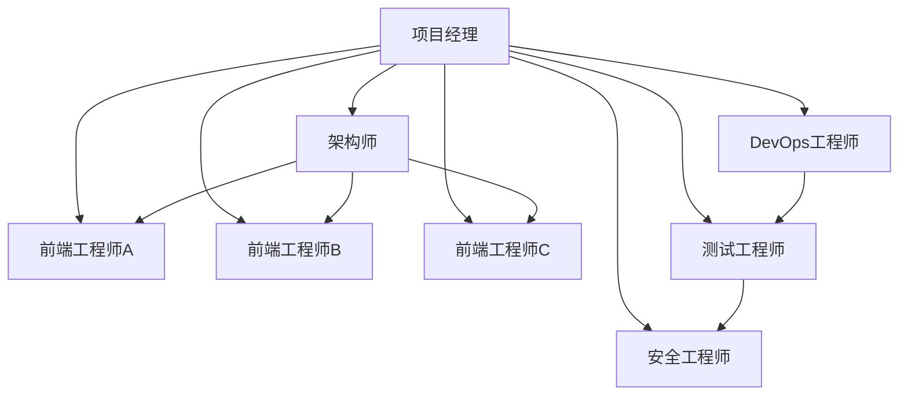

# 跨CLI会话恢复系统实施计划

## 项目信息

- **项目名称**: Cross-CLI Session Recovery (CCSR)
- **项目代号**: CCSR
- **版本**: 1.0.0
- **制定日期**: 2025-12-12
- **计划周期**: 5周 (2025-12-12 至 2025-01-16)
- **团队规模**: 3-5人

## 1. 项目概述

### 1.1 项目目标

开发一个独立部署的跨CLI会话恢复系统，支持用户在任何支持的AI CLI工具中查看和恢复所有CLI工具的历史会话。

### 1.2 核心功能

1. **统一会话查看**: 在任何支持的CLI中查看所有CLI的会话历史
2. **智能项目识别**: 自动识别属于同一项目的会话
3. **无缝会话恢复**: 将选中会话导出为新会话的上下文
4. **斜杠命令集成**: 在各CLI中通过`/history`命令使用

### 1.3 支持的CLI工具

- Claude CLI v2.0.65+
- Gemini CLI v0.19.4+
- Qwen CLI v0.4.0+
- IFlow CLI v0.4.6+
- CodeBuddy CLI v2.10.0+
- Qoder CLI v0.1.15+

## 2. 项目阶段规划

### 2.1 Phase 1: 核心功能开发 (MVP)
**时间**: 2025-12-12 至 2025-12-26 (2周)

#### 2.1.1 第一周：基础架构与CLI适配器
**目标**: 建立核心架构，实现基本的CLI适配器

**任务**:
- [ ] 项目初始化和基础架构搭建
- [ ] 实现核心接口定义 (`Session`, `CLIAdapter`, `ProjectMatcher`)
- [ ] 开发Claude CLI适配器
- [ ] 开发Gemini CLI适配器
- [ ] 开发Qwen CLI适配器
- [ ] 开发基础的项目匹配器

**交付物**:
- 核心架构代码
- 3个主要CLI适配器 (Claude, Gemini, Qwen)
- 单元测试套件

#### 2.1.2 第二周：会话扫描与格式化
**目标**: 实现会话扫描、索引和格式化功能

**任务**:
- [ ] 实现会话扫描引擎
- [ ] 实现会话格式化器
- [ ] 实现IFlow CLI适配器
- [ ] 实现CodeBuddy CLI适配器
- [ ] 实现Qoder CLI适配器
- [ ] 开发CLI集成测试

**交付物**:
- 完整的会话扫描系统
- 所有CLI适配器
- 集成测试套件
- CLI扫描性能报告

### 2.2 Phase 2: 斜杠命令集成
**时间**: 2025-12-27 至 2025-01-02 (1周)

#### 2.2.1 第三周：斜杠命令机制
**目标**: 实现基于Spec Kit机制的斜杠命令集成

**任务**:
- [ ] 研究并复现Spec Kit的斜杠命令机制
- [ ] 实现命令模板系统
- [ ] 实现模板生成器
- [ ] 创建history命令模板
- [ ] 开发自动部署脚本
- [ ] 测试各CLI的斜杠命令功能

**交付物**:
- 斜杠命令集成系统
- 命令模板生成器
- 自动部署脚本
- 斜杠命令测试报告

#### 2.2.2 第四周：用户界面
**目标**: 实现用户友好的交互界面

**任务**:
- [ ] 开发CLI界面模块
- [ ] 实现会话列表显示
- [ ] 实现搜索和过滤功能
- [ ] 实现会话详情查看
- [ ] 实现参数化命令支持
- [ ] 开发用户指南

**交付物**:
- 完整的用户界面
- 命令行界面
- 用户使用指南
- 界面测试报告

### 2.3 Phase 3: 高级功能与优化
**时间**: 2025-01-03 至 2025-01-16 (2周)

#### 2.3.3 第五周：导出器与优化
**目标**: 实现会话导出功能和系统优化

**任务**:
- [ ] 实现Markdown导出器
- [ ] 实现上下文导出器
- [ ] 实现JSON导出器
- [ ] 性能优化（增量扫描、缓存）
- [ ] 错误处理和异常恢复
- [ ] 安全性增强

**交付物**:
- 完整的导出系统
- 性能优化报告
- 安全性评估报告
- 完整的错误处理机制

#### 2.3.4 第六周：文档与发布
**目标**: 完成文档编写、测试和发布准备

**任务**:
- [ ] 编写API文档
- [ ] 编写开发者指南
- [ ] 编写故障排除指南
- [ ] 进行全面的端到端测试
- [ ] 准备发布包
- [ ] 发布部署

**交付物**:
- 完整的技术文档
- 发布包
- 部署指南
- 测试报告

## 3. 详细实施计划

### 3.1 Phase 1: 核心功能开发

#### 3.1.1 项目初始化 (Day 1-2)
**负责人**: 架构师
**任务清单**:
- [x] 创建项目仓库
- [ ] 设置开发环境
- [ ] 配置TypeScript和构建工具
- [ ] 设置代码规范和格式化工具
- [ ] 创建基础项目结构
- [ ] 设置CI/CD流程

**验收标准**:
- 项目可以成功构建
- 代码规范检查通过
- CI/CD流程正常工作

#### 3.1.2 核心接口定义 (Day 3-4)
**负责人**: 技术负责人
**任务清单**:
- [x] 定义Session接口
- [x] 定义CLIAdapter接口
- [x] 定义ProjectMatcher接口
- [ ] 定义配置管理接口
- [x] 编写接口文档
- [ ] 创建TypeScript类型定义

**验收标准**:
- 所有接口定义完整
- TypeScript类型检查通过
- 接口文档完整准确

#### 3.1.3 Claude CLI适配器开发 (Day 5-6)
**负责人**: 前端工程师A
**任务清单**:
- [ ] 研究Claude CLI会话文件格式
- [ ] 实现ClaudeAdapter类
- [ ] 实现JSONL解析器
- [ ] 处理特殊格式和异常情况
- [ ] 编写单元测试
- [ ] 进行集成测试

**验收标准**:
- 能够正确解析Claude会话文件
- 处理各种异常情况
- 单元测试覆盖率>80%
- 集成测试通过

#### 3.1.4 Gemini CLI适配器开发 (Day 7-8)
**负责人**: 前端工程师B
**任务清单**:
- [ ] 研究Gemini CLI会话文件格式
- [ ] 实现GeminiAdapter类
- [ ] 实现JSON解析器
- [ ] 实现项目哈希匹配逻辑
- [ ] 编写单元测试
- [ ] 进行集成测试

**验收标准**:
- 能够正确解析Gemini会话文件
- 项目识别准确率>95%
- 单元测试覆盖率>80%
- 集成测试通过

#### 3.1.5 Qwen CLI适配器开发 (Day 9-10)
**负责人**: 前端工程师C
**任务清单**:
- [ ] 研究Qwen CLI会话文件格式
- [ ] 实现QwenAdapter类
- [ ] 实现JSON解析器
- [ ] 处理Token统计信息
- [ ] 编写单元测试
- [ ] 进行集成测试

**验收标准**:
- 能够正确解析Qwen会话文件
- Token统计信息准确
- 单元测试覆盖率>80%
- 集成测试通过

### 3.2 Phase 2: 斜杠命令集成

#### 3.2.1 斜杠命令机制研究 (Day 11-12)
**负责人**: 架构师
**任务清单**:
- [ ] 深入研究Spec Kit的斜杠命令机制
- [ ] 分析CLI的斜杠命令扫描逻辑
- [ ] 确定复现方案
- [ ] 设计CCSR的斜杠命令集成策略
- [ ] 编写技术分析文档

**验收标准**:
- 完全理解斜杠命令机制
- 确定技术可行性
- 完成技术分析文档

#### 3.2.2 命令模板系统开发 (Day 13-14)
**负责人**: 前端工程师A
**任务清单**:
- [ ] 设计命令模板接口
- [ ] 实现模板解析器
- [ ] 实现变量替换引擎
- [ ] 创建history命令模板
- [ ] 编写模板文档

**验收标准**:
- 模板系统工作正常
- 变量替换准确
- history模板完整可用

#### 3.2.3 自动部署脚本开发 (Day 15)
**负责人**: DevOps工程师
**任务清单**:
- [ ] 开发安装脚本（Linux/macOS）
- [ ] 开发安装脚本（Windows PowerShell）
- [ ] 开发CLI检测脚本
- [ ] 开发斜杠命令部署脚本
- [ ] 测试部署流程

**验收标准**:
- 支持主流操作系统
- 自动检测已安装的CLI
- 部署流程自动化
- 错误处理完善

#### 3.2.4 CLI集成测试 (Day 16)
**负责人**: 测试工程师
**任务清单**:
- [ ] 测试Claude CLI斜杠命令
- [ ] 测试Gemini CLI斜杠命令
- [ ] 测试Qwen CLI斜杠命令
- [ ] 测试命令参数功能
- [ ] 编写测试报告

**验收标准**:
- 所有支持的CLI都能正常使用/history命令
- 命令参数功能正常
- 测试报告完整

### 3.3 Phase 3: 高级功能与优化

#### 3.3.1 用户界面开发 (Day 17-19)
**负责人**: 前端工程师B
**任务清单**:
- [ ] 实现CLI界面模块
- [ ] 实现会话列表格式化显示
- [ ] 实现交互式会话选择
- [ ] 实现搜索功能
- [ ] 实现过滤功能

**验收标准**:
- 用户界面友好易用
- 会话信息显示完整
- 搜索和过滤功能正常
- 交互流程顺畅

#### 3.3.2 命令参数化 (Day 20-21)
**负责人**: 前端工程师C
**任务清单**:
- [ ] 实现`/history`基础命令
- [ ] 实现`/history search`参数
- [ ] 实现`/history filter`参数
- [ ] 实现`/history export`参数
- [ ] 实现`/history detail`参数

**验收标准**:
- 所有参数功能正常
- 参数解析准确
- 帮助信息清晰

#### 3.3.3 会话导出器开发 (Day 22-23)
**负责人**: 前端工程师A
**任务清单**:
- [ ] 实现Markdown导出器
- [ ] 实现上下文导出器
- [ ] 实现JSON导出器
- [ ] 实现内容截断功能
- [ ] 实现格式转换

**验收标准**:
- 支持多种导出格式
- 内容截断智能化
- 格式转换准确
- 导出结果可用

#### 3.3.4 性能优化 (Day 24-25)
**负责人**: 后端工程师
**任务清单**:
- [ ] 实现增量扫描算法
- [ ] 实现会话缓存机制
- [ ] 优化内存使用
- [ ] 实现并行扫描
- [ ] 性能测试和报告

**验收标准**:
- 扫描时间<5秒
- 内存使用<100MB
- 缓存命中率>80%
- 性能报告完整

#### 3.3.5 安全性增强 (Day 26-28)
**负责人**: 安全工程师
**任务清单**:
- [ ] 实现敏感信息检测
- [ ] 实现访问权限控制
- [ ] 实现数据加密（可选）
- [ ] 实现安全日志记录
- [ ] 进行安全评估

**验收标准**:
- 敏感信息检测准确
- 访问权限控制有效
- 安全日志完整
- 安全评估通过

## 4. 团队分工

### 4.1 团队结构



### 4.2 角色职责

#### 4.2.1 项目经理 (PM)
**职责**:
- 项目整体规划和进度管理
- 团队协调和资源分配
- 风险识别和管理
- 交付质量把控

**要求**:
- 项目管理经验2年以上
- 技术背景强
- 沟通能力强

#### 4.2.2 架构师
**职责**:
- 系统架构设计
- 技术方案制定
- 核心组件开发
- 技术难点攻关

**要求**:
- 系统设计经验5年以上
- Node.js/TypeScript专家
- 架构思维强

#### 4.2.3 前端工程师 (3人)
**职责**:
- CLI适配器开发
- 用户界面实现
- 功能模块开发
- 单元测试编写

**要求**:
- 前端开发经验2年以上
- Node.js/TypeScript熟练
- 熟悉CLI工具

#### 4.2.4 DevOps工程师
**职责**:
- CI/CD流程搭建
- 部署脚本开发
- 环境配置管理
- 监控和日志

**要求**:
- DevOps经验3年以上
- 熟悉CI/CD工具
- Linux/Windows/macOS经验

#### 4.2.5 测试工程师
**职责**:
- 测试用例设计
- 自动化测试编写
- 性能测试执行
- 质量保证

**要求**:
- 测试经验2年以上
- 自动化测试经验
- 质量意识强

#### 4.2.6 安全工程师
**职责**:
- 安全需求分析
- 安全机制设计
- 安全测试执行
- 安全评估报告

**要求**:
- 安全经验2年以上
- 熟悉数据安全
- 安全意识强

### 4.3 技能要求

#### 4.3.1 基础技能
- **编程语言**: TypeScript (必选), JavaScript (必选), Bash/PowerShell (必选)
- **开发工具**: Git, VS Code/WebStorm, npm/yarn
- **测试框架**: Jest, Mocha, Cypress
- **构建工具**: Webpack, Rollup, esbuild

#### 4.3.2 专业知识
- **Node.js**: 深入理解Node.js架构和生态系统
- **TypeScript**: 熟练掌握类型系统和高级特性
- **CLI工具**: 熟悉至少一种AI CLI工具的使用
- **文件系统**: 熟悉文件I/O和路径处理
- **JSON解析**: 熟练处理JSON数据格式

#### 4.3.3 软技能
- **设计模式**: 熟悉常见设计模式和架构原则
- **数据结构**: 熟悉常用数据结构和算法
- **性能优化**: 了解性能调优技巧
- **错误处理**: 具备良好的异常处理能力
- **安全性**: 了解数据安全和隐私保护

## 5. 技术栈和工具

### 5.1 核心技术栈

#### 5.1.1 开发语言
- **TypeScript**: 主要开发语言
- **JavaScript**: 脚本和工具开发
- **Bash**: Linux/macOS脚本
- **PowerShell**: Windows脚本

#### 5.1.2 运行时环境
- **Node.js**: 运行环境 (v16.0+)
- **npm**: 包管理器

#### 5.1.3 构建工具
- **TypeScript Compiler**: TypeScript编译器
- **esbuild**: 构建工具
- **Jest**: 测试框架

### 5.2 开发工具

#### 5.2.1 IDE和编辑器
- **VS Code**: 推荐IDE，TypeScript支持好
- **WebStorm**: 商业IDE，功能强大
- **Vim/Neovim**: 轻量级编辑器

#### 5.2.2 版本控制
- **Git**: 版本控制
- **GitHub**: 代码托管
- **GitLab**: 可选的CI/CD平台

#### 5.2.3 CI/CD工具
- **GitHub Actions**: 持续集成/部署
- **CircleCI**: 可选的CI/CD平台
- **Travis CI**: 可选的CI/CD平台

### 5.3 依赖管理

#### 5.3.1 包管理
- **npm**: 主要包管理器
- **Yarn**: 可选的包管理器
- **pnpm**: 可选的包管理器

#### 5.3.2 开发依赖
```json
{
  "dependencies": {
    "typescript": "^5.0.0",
    "glob": "^10.0.0",
    "fs-extra": "^11.0.0",
    "commander": "^11.0.0",
    "chalk": "^5.0.0",
    "win32": "^1.0.0"
  },
  "devDependencies": {
    "@types/node": "^20.0.0",
    "@types/jest": "^29.0.0",
    "@typescript-eslint/eslint-plugin": "^6.0.0",
    "@typescript-eslint/parser": "^6.0.0",
    "eslint": "^8.0.0",
    "jest": "^29.0.0",
    "ts-jest": "^29.0.0",
    "ts-node": "^10.0.0",
    "nodemon": "^3.0.0"
  }
}
```

## 6. 质量保证

### 6.1 代码质量

#### 6.1.1 代码规范
- **ESLint**: 代码风格检查
- **Prettier**: 代码格式化
- **TypeScript**: 类型检查
- **EditorConfig**: 编辑器配置

#### 6.1.2 测试要求
- **单元测试覆盖率**: > 80%
- **集成测试**: 覆盖核心功能
- **端到端测试**: 覆盖主要使用场景
- **性能测试**: 验证性能指标

#### 6.1.3 文档要求
- **API文档**: 完整的接口文档
- **用户指南**: 详细的用户使用说明
- **开发者指南**: 开发和贡献指南
- **故障排除**: 常见问题解决方案

### 6.2 测试策略

#### 6.2.1 单元测试
- **测试范围**: 核心组件和功能
- **测试框架**: Jest + TypeScript
- **覆盖率要求**: >80%
- **自动化**: CI/CD自动运行

#### 6.2.2 集成测试
- **测试范围**: 组件间交互
- **测试框架**: Jest或Cypress
- **环境**: 多操作系统
- **数据**: 模拟和真实数据

#### 6.2.3 性能测试
- **扫描性能**: 会话扫描时间<5秒
- **内存使用**: 峰值内存<100MB
- **启动时间**: 工具启动<2秒

## 7. 部署策略

### 7.1 部署方式

#### 7.1.1 npm包部署
```bash
# 全局安装
npm install -g cross-cli-session-manager

# 本地开发安装
npm install cross-cli-session-manager
```

#### 7.1.2 二进制包部署
- **Windows**: `ccsr-windows.exe`
- **macOS**: `ccsr-macos`
- **Linux**: `ccsr-linux`

#### 7.1.3 源码部署
```bash
# 克隆代码
git clone https://github.com/your-org/cross-cli-session-manager.git

# 安装依赖
cd cross-cli-session-manager
npm install

# 构建项目
npm run build

# 安装到全局
npm install -g .
```

### 7.2 发布策略

#### 7.2.1 版本管理
- **语义化版本**: 遵循SemVer规范
- **分支策略**: main（稳定版）, develop（开发版）
- **标签管理**: 每个版本打标签

#### 7.2.2 发布流程
```bash
# 1. 更新版本号
npm version patch/minor/major

# 2. 构建项目
npm run build

# 3. 运行测试
npm test

# 4. 发布到npm
npm publish

# 5. 创建GitHub Release
gh release create v1.0.0
```

## 8. 风险管理

### 8.1 技术风险

| 风险 | 概率 | 影响 | 缓解措施 |
|------|------|------|---------|
| CLI会话格式变化 | 中 | 高 | 版本兼容性检查、适配层设计 |
| 斜杠命令机制变化 | 中 | 中 | 多种部署方式、降级方案 |
| 性能问题 | 低 | 中 | 性能测试、优化算法 |
| 内存泄漏 | 低 | 中 | 内存监控、自动清理 |
| 安全漏洞 | 低 | 高 | 安全审计、代码审查 |

### 8.2 项目风险

| 风险 | 概率 | 影响 | 缓解措施 |
|------|------|------|---------|
| 用户接受度低 | 中 | 中 | 用户调研、易用性测试 |
| CLI工具不支持 | 低 | 高 | 多种集成方式 |
| 项目延期 | 中 | 中 | 敏捷开发、定期评估 |

### 8.3 风险缓解

#### 8.3.1 技术缓解
- **版本兼容性**: 实现适配层，支持多版本兼容
- **性能优化**: 增量扫描、缓存机制、并行处理
- **安全防护**: 敏感信息检测、访问控制、安全审计

#### 8.3.2 项目缓解
- **进度管理**: 敏捷开发、迭代交付、定期评估
- **用户反馈**: 早期用户测试、快速迭代
- **备选方案**: 多种部署方式、降级功能

## 9. 成功指标

### 9.1 技术指标

#### 9.1.1 功能指标
- **支持的CLI数量**: 6个
- **会话扫描准确率**: >95%
- **项目识别准确率**: >95%
- **格式转换成功率**: >98%

#### 9.1.2 性能指标
- **会话扫描时间**: <5秒
- **内存使用**: <100MB
- **启动时间**: <2秒
- **查询响应时间**: <1秒

#### 9.1.3 质量指标
- **代码覆盖率**: >80%
- **Bug密度**: <1/KLOC
- **测试覆盖率**: >90%

### 9.2 用户体验指标

#### 9.2.1 易用性指标
- **安装成功率**: >95%
- **用户满意度**: >4.5/5
- **学习成本**: <30分钟

#### 9.2.2 可靠性指标
- **系统稳定性**: >99.9%
- **错误恢复率**: >95%
- **数据完整性**: 100%

### 9.3 项目管理指标

#### 9.3.1 交付指标
- **按时交付率**: 100%
- **质量达标率**: >95%
- **文档完整性**: 100%

#### 9.3.2 团队指标
- **团队成员留存率**: >90%
- **技能提升**: 每人至少掌握1项新技能

## 10. 项目预算

### 10.1 人力成本

| 角色 | 人数 | 月薪(元) | 工期(月) | 总成本(元) |
|------|------|-----------|------------|-----------|
| 项目经理 | 1 | 25000 | 5 | 125000 |
| 架构师 | 1 | 35000 | 5 | 175000 |
| 前端工程师 | 3 | 22000 | 5 | 330000 |
| DevOps工程师 | 1 | 20000 | 5 | 100000 |
| 测试工程师 | 1 | 18000 | 5 | 90000 |
| 安全工程师 | 1 | 25000 | 5 | 125000 |
| **人力总成本** | **8** | **18000** | **5** | **945000** |

### 10.2 工具和基础设施

| 项目 | 成本(元) | 说明 |
|------|-----------|-------|
| 开发工具 | 10000 | IDE、编辑器等 |
| 云服务 | 20000 | CI/CD、存储等 |
| 硬件许可 | 50000 | IDE许可证等 |
| 测试环境 | 10000 | 云服务器等 |
| **工具总成本** | **90000** |  |

### 10.3 总预算

- **人力成本**: 945,000元
- **工具和基础设施**: 90,000元
- **项目管理费用** (10%): 103,500元
- **总预算**: **1,138,500元**

## 11. 时间规划

### 11.1 项目时间线

```
2025-12-12    项目启动
    ├─ 项目初始化 (2天)
    ├─ 核心架构搭建 (3天)
    └─ 开始Phase 1

2025-12-26    Phase 1完成
    ├─ 功能验证 (2天)
    ├─ 代码审查 (1天)
    └─ 开始Phase 2

2025-01-02    Phase 2完成
    ├─ 功能验证 (2天)
    ├─ 代码审查 (1天)
    └─ 开始Phase 3

2025-01-16    Phase 3完成
    ├─ 最终测试 (3天)
    ├─ 文档完善 (2天)
    └─ 正式发布

总计：5周 (25个工作日)
```

### 11.2 里程碑

| 里程碑 | 日期 | 交付物 |
|---------|------|---------|
| M1 | 2025-12-26 | 核心功能MVP |
| M2 | 2025-01-02 | 斜杠命令集成 |
| M3 | 2025-01-16 | 完整功能系统 |
| M4 | 2025-01-16 | 正式发布 |

## 12. 下一步行动

### 12.1 立即行动项

1. **团队组建**: 完成团队成员招募和分工
2. **环境准备**: 搭建开发环境和工具
3. **项目启动**: 创建项目仓库和初始化
4. **需求确认**: 与相关方确认需求细节

### 12.2 第一周重点

1. **Day 1-2**: 项目初始化和基础架构
2. **Day 3-4**: 核心接口定义
3. **Day 5-6**: Claude适配器开发

### 12.3 关键成功因素

1. **技术可行**: 基于Spec Kit机制的斜杠命令集成
2. **团队协作**: 团队成员紧密配合
3. **用户需求**: 满足用户真实需求
4. **质量控制**: 严格的测试和审查流程
5. **持续改进**: 根据反馈快速迭代

---

**文档版本**: 1.0.0
**最后更新**: 2025-12-12
**审批状态**: 待审批
**制定人**: CCSR项目团队
**审核人**: 项目经理