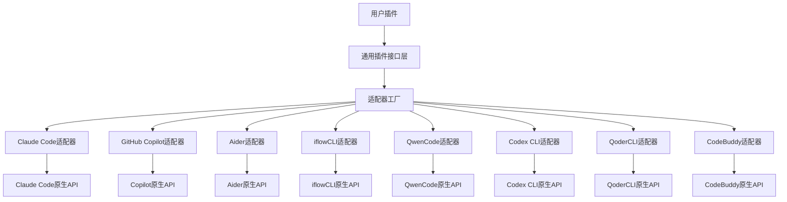

# 通用AI CLI插件架构设计方案

## 🎯 设计目标

设计一个**统一插件接口**，让开发者编写一次插件代码，就能在所有主流AI CLI工具上运行，包括：
- Claude Code CLI
- GitHub Copilot CLI
- Aider CLI
- iflowCLI
- QwenCode CLI
- Codex CLI
- QoderCLI
- CodeBuddy CLI
- 其他AI CLI工具

---

## 🏗️ 核心架构：适配器模式 + 插件接口标准化

### 1. 整体架构图



---

## 🧩 2. 核心组件设计

### 2.1 通用插件接口 (UniversalPlugin Interface)

```python
from abc import ABC, abstractmethod
from typing import Dict, Any, List, Optional, AsyncGenerator
from enum import Enum
from dataclasses import dataclass
import asyncio

class PluginType(Enum):
    COMMAND = "command"
    HOOK = "hook"
    SKILL = "skill"
    PROCESSOR = "processor"
    PROVIDER = "provider"

@dataclass
class PluginContext:
    """插件执行上下文"""
    user_id: str
    session_id: str
    workspace_path: str
    current_file: Optional[str] = None
    language: Optional[str] = None
    metadata: Dict[str, Any] = None

@dataclass
class PluginConfig:
    """插件配置"""
    name: str
    version: str
    description: str
    author: str
    plugin_type: PluginType
    dependencies: List[str]
    config_schema: Dict[str, Any]
    permissions: List[str]

class UniversalPlugin(ABC):
    """通用插件基类"""

    def __init__(self, config: PluginConfig):
        self.config = config
        self._adapter = None

    @abstractmethod
    async def initialize(self, context: PluginContext) -> bool:
        """插件初始化"""
        pass

    @abstractmethod
    async def execute(self,
                     command: str,
                     args: Dict[str, Any],
                     context: PluginContext) -> Any:
        """执行插件功能"""
        pass

    @abstractmethod
    async def cleanup(self) -> None:
        """插件清理"""
        pass

    async def handle_event(self,
                          event_type: str,
                          event_data: Dict[str, Any],
                          context: PluginContext) -> Optional[Dict[str, Any]]:
        """处理事件（可选实现）"""
        return None

    def get_manifest(self) -> PluginConfig:
        """获取插件清单"""
        return self.config
```

### 2.2 适配器接口 (Adapter Interface)

```python
from abc import ABC, abstractmethod

class CLIAdapter(ABC):
    """CLI工具适配器基类"""

    def __init__(self, cli_name: str):
        self.cli_name = cli_name
        self._capabilities = set()

    @abstractmethod
    async def detect_environment(self) -> bool:
        """检测当前CLI环境"""
        pass

    @abstractmethod
    async def install_plugin(self, plugin: UniversalPlugin) -> bool:
        """安装插件到目标CLI"""
        pass

    @abstractmethod
    async def execute_command(self,
                            plugin: UniversalPlugin,
                            command: str,
                            args: Dict[str, Any],
                            context: PluginContext) -> Any:
        """通过目标CLI执行插件命令"""
        pass

    @abstractmethod
    async def register_hook(self,
                          plugin: UniversalPlugin,
                          hook_type: str,
                          handler: callable) -> bool:
        """注册事件钩子"""
        pass

    @abstractmethod
    async def get_native_context(self) -> PluginContext:
        """获取原生CLI上下文"""
        pass

    def get_capabilities(self) -> set:
        """获取适配器能力"""
        return self._capabilities
```

### 2.3 适配器工厂 (Adapter Factory)

```python
class AdapterFactory:
    """适配器工厂"""

    _adapters = {}
    _detected_cli = None

    @classmethod
    def register_adapter(cls, cli_name: str, adapter_class: type):
        """注册适配器"""
        cls._adapters[cli_name] = adapter_class

    @classmethod
    async def detect_cli(cls) -> Optional[str]:
        """自动检测当前CLI环境"""
        if cls._detected_cli:
            return cls._detected_cli

        # 检测顺序和策略
        detection_strategies = [
            ('claude-code', ClaudeCodeAdapter),
            ('github-copilot', GitHubCopilotAdapter),
            ('aider', AiderAdapter),
            ('iflow-cli', IflowCLIAdapter),
            ('qwencode', QwenCodeAdapter),
            ('codex-cli', CodexCLIAdapter),
            ('qoder-cli', QoderCLIAdapter),
            ('codebuddy-cli', CodeBuddyAdapter),
        ]

        for cli_name, adapter_class in detection_strategies:
            adapter = adapter_class()
            if await adapter.detect_environment():
                cls._detected_cli = cli_name
                return cli_name

        return None

    @classmethod
    async def get_adapter(cls, cli_name: str = None) -> Optional[CLIAdapter]:
        """获取适配器实例"""
        if not cli_name:
            cli_name = await cls.detect_cli()

        if cli_name and cli_name in cls._adapters:
            adapter_class = cls._adapters[cli_name]
            return adapter_class()

        return None
```

---

## 🔧 3. 具体适配器实现

### 3.1 Claude Code 适配器

```python
import json
import os
from pathlib import Path

class ClaudeCodeAdapter(CLIAdapter):
    """Claude Code CLI适配器"""

    def __init__(self):
        super().__init__("claude-code")
        self._capabilities = {
            "hooks", "commands", "mcp", "slash_commands", "plugins"
        }

    async def detect_environment(self) -> bool:
        """检测Claude Code环境"""
        # 检查命令行工具
        try:
            result = await self._run_command(["claude", "--version"])
            if result.returncode == 0:
                return True
        except:
            pass

        # 检查配置文件
        claude_config = Path.home() / ".claude"
        return claude_config.exists()

    async def install_plugin(self, plugin: UniversalPlugin) -> bool:
        """安装插件到Claude Code"""
        try:
            # 1. 创建插件目录
            plugin_dir = Path.home() / ".claude" / "plugins" / plugin.config.name
            plugin_dir.mkdir(parents=True, exist_ok=True)

            # 2. 生成Claude Code插件配置
            plugin_config = self._generate_claude_config(plugin)

            # 3. 写入配置文件
            config_file = plugin_dir / "plugin.json"
            with open(config_file, 'w') as f:
                json.dump(plugin_config, f, indent=2)

            # 4. 创建MCP服务器配置（如果需要）
            if plugin.config.plugin_type == PluginType.PROVIDER:
                await self._setup_mcp_server(plugin, plugin_dir)

            # 5. 创建斜杠命令（如果是命令类型）
            if plugin.config.plugin_type == PluginType.COMMAND:
                await self._create_slash_command(plugin, plugin_dir)

            return True
        except Exception as e:
            print(f"Failed to install plugin: {e}")
            return False

    async def execute_command(self,
                            plugin: UniversalPlugin,
                            command: str,
                            args: Dict[str, Any],
                            context: PluginContext) -> Any:
        """通过Claude Code执行命令"""
        # 转换为Claude Code原生调用
        claude_args = self._convert_args_to_claude(args)

        # 使用Claude Code的钩子系统执行
        if plugin.config.plugin_type == PluginType.HOOK:
            return await self._execute_hook(plugin, command, claude_args, context)

        # 使用斜杠命令执行
        return await self._execute_slash_command(plugin, command, claude_args, context)

    def _generate_claude_config(self, plugin: UniversalPlugin) -> Dict[str, Any]:
        """生成Claude Code插件配置"""
        return {
            "name": plugin.config.name,
            "version": plugin.config.version,
            "description": plugin.config.description,
            "author": plugin.config.author,
            "main": "dist/index.js",
            "hooks": self._map_hook_types(plugin),
            "commands": self._map_command_types(plugin),
            "mcpServers": self._map_mcp_servers(plugin),
            "permissions": plugin.config.permissions
        }

    async def _setup_mcp_server(self, plugin: UniversalPlugin, plugin_dir: Path):
        """设置MCP服务器"""
        mcp_config = {
            "name": plugin.config.name,
            "command": "node",
            "args": ["mcp-server.js"],
            "env": {
                "PLUGIN_PATH": str(plugin_dir)
            }
        }

        mcp_config_file = plugin_dir / "mcp-server.json"
        with open(mcp_config_file, 'w') as f:
            json.dump(mcp_config, f, indent=2)
```

### 3.2 GitHub Copilot 适配器

```python
class GitHubCopilotAdapter(CLIAdapter):
    """GitHub Copilot CLI适配器"""

    def __init__(self):
        super().__init__("github-copilot")
        self._capabilities = {
            "vim_commands", "event_handlers", "configuration", "keybindings"
        }

    async def detect_environment(self) -> bool:
        """检测GitHub Copilot环境"""
        # 检查Vim/Neovim环境
        if os.getenv("VIM") or os.getenv("NVIM"):
            # 检查copilot.vim插件
            vim_config = Path.home() / ".vim" / "pack" / "packer" / "start" / "copilot.vim"
            nvim_config = Path.home() / ".local" / "share" / "nvim" / "site" / "pack" / "packer" / "start" / "copilot.vim"
            return vim_config.exists() or nvim_config.exists()
        return False

    async def install_plugin(self, plugin: UniversalPlugin) -> bool:
        """安装插件到GitHub Copilot"""
        try:
            # 1. 生成Vim脚本
            vim_script = self._generate_vim_script(plugin)

            # 2. 创建插件目录
            plugin_dir = Path.home() / ".vim" / "plugins" / plugin.config.name
            plugin_dir.mkdir(parents=True, exist_ok=True)

            # 3. 写入Vim脚本
            script_file = plugin_dir / f"{plugin.config.name}.vim"
            with open(script_file, 'w') as f:
                f.write(vim_script)

            # 4. 生成Vim配置
            config_script = self._generate_vim_config(plugin)
            config_file = plugin_dir / "config.vim"
            with open(config_file, 'w') as f:
                f.write(config_script)

            return True
        except Exception as e:
            print(f"Failed to install plugin: {e}")
            return False

    def _generate_vim_script(self, plugin: UniversalPlugin) -> str:
        """生成Vim脚本"""
        return f"""
" Universal Plugin: {plugin.config.name}
" Version: {plugin.config.version}
" Description: {plugin.config.description}

if exists('g:loaded_{plugin.config.name}')
    finish
endif
let g:loaded_{plugin.config.name} = 1

" Plugin commands
{self._generate_vim_commands(plugin)}

" Event handlers
{self._generate_vim_autocommands(plugin)}

" Configuration
{self._generate_vim_configuration(plugin)}
"""
```

### 3.3 Aider 适配器

```python
class AiderAdapter(CLIAdapter):
    """Aider CLI适配器"""

    def __init__(self):
        super().__init__("aider")
        self._capabilities = {
            "python_plugins", "commands", "config", "hooks"
        }

    async def detect_environment(self) -> bool:
        """检测Aider环境"""
        try:
            result = await self._run_command(["aider", "--version"])
            return result.returncode == 0
        except:
            return False

    async def install_plugin(self, plugin: UniversalPlugin) -> bool:
        """安装插件到Aider"""
        try:
            # 1. 生成Python插件模块
            plugin_module = self._generate_python_module(plugin)

            # 2. 创建插件目录
            plugin_dir = Path.home() / ".aider" / "plugins" / plugin.config.name
            plugin_dir.mkdir(parents=True, exist_ok=True)

            # 3. 写入Python模块
            module_file = plugin_dir / "__init__.py"
            with open(module_file, 'w') as f:
                f.write(plugin_module)

            # 4. 生成配置文件
            config = self._generate_aider_config(plugin)
            config_file = plugin_dir / "config.yml"
            with open(config_file, 'w') as f:
                yaml.dump(config, f, default_flow_style=False)

            return True
        except Exception as e:
            print(f"Failed to install plugin: {e}")
            return False

    def _generate_python_module(self, plugin: UniversalPlugin) -> str:
        """生成Python插件模块"""
        return f'''
"""
Universal Plugin for Aider: {plugin.config.name}
Version: {plugin.config.version}
Description: {plugin.config.description}
"""

from aider.plugins import AiderPlugin
from typing import Dict, Any

class {self._to_pascal_case(plugin.config.name)}Plugin(AiderPlugin):
    """Aider插件实现"""

    def __init__(self):
        super().__init__()
        self.name = "{plugin.config.name}"
        self.version = "{plugin.config.version}"
        self.description = "{plugin.config.description}"

    async def on_init(self, aider_instance):
        """插件初始化"""
        # 调用通用插件的初始化
        await self.universal_plugin.initialize(self.get_context())

    async def on_command(self, command: str, args: Dict[str, Any]):
        """命令处理"""
        return await self.universal_plugin.execute(
            command, args, self.get_context()
        )

    async def on_response(self, response: str):
        """响应处理"""
        # 可选的响应后处理
        pass

# 插件实例
plugin = {self._to_pascal_case(plugin.config.name)}Plugin()
'''
```

---

## 📦 4. 插件开发SDK

### 4.1 开发工具包

```python
class UniversalPluginSDK:
    """通用插件开发SDK"""

    def __init__(self):
        self.adapters = {}
        self.current_adapter = None

    async def initialize(self, auto_detect: bool = True):
        """初始化SDK"""
        if auto_detect:
            self.current_adapter = await AdapterFactory.get_adapter()

        # 注册所有适配器
        await self._register_adapters()

    async def create_plugin(self,
                          config: PluginConfig,
                          plugin_class: type = None) -> UniversalPlugin:
        """创建插件实例"""
        if plugin_class is None:
            plugin_class = UniversalPlugin

        plugin = plugin_class(config)

        # 设置当前适配器
        if self.current_adapter:
            plugin._adapter = self.current_adapter

        return plugin

    async def install_plugin(self, plugin: UniversalPlugin) -> bool:
        """安装插件"""
        if not self.current_adapter:
            raise RuntimeError("No adapter available")

        return await self.current_adapter.install_plugin(plugin)

    async def execute_plugin(self,
                           plugin: UniversalPlugin,
                           command: str,
                           args: Dict[str, Any] = None) -> Any:
        """执行插件"""
        if not self.current_adapter:
            raise RuntimeError("No adapter available")

        context = await self.current_adapter.get_native_context()
        return await self.current_adapter.execute_command(
            plugin, command, args or {}, context
        )

# 装饰器支持
def plugin_command(name: str, description: str = ""):
    """插件命令装饰器"""
    def decorator(func):
        func._plugin_command = {"name": name, "description": description}
        return func
    return decorator

def plugin_hook(event_type: str):
    """插件钩子装饰器"""
    def decorator(func):
        func._plugin_hook = {"event_type": event_type}
        return func
    return decorator
```

### 4.2 插件开发模板

```python
# example_plugin.py
from universal_plugin_sdk import UniversalPlugin, PluginConfig, PluginType
from universal_plugin_sdk.decorators import plugin_command, plugin_hook

class ExamplePlugin(UniversalPlugin):
    """示例插件"""

    def __init__(self):
        config = PluginConfig(
            name="example-plugin",
            version="1.0.0",
            description="一个示例插件",
            author="Your Name",
            plugin_type=PluginType.COMMAND,
            dependencies=[],
            config_schema={
                "api_key": {"type": "string", "required": True},
                "timeout": {"type": "integer", "default": 30}
            },
            permissions=["network", "file_read"]
        )
        super().__init__(config)

    async def initialize(self, context):
        """插件初始化"""
        print(f"Initializing {self.config.name} in {context.workspace_path}")
        return True

    @plugin_command("hello", "向世界问好")
    async def hello_command(self, args, context):
        """Hello命令实现"""
        name = args.get("name", "World")
        return f"Hello, {name}! From {self.config.name}"

    @plugin_command("analyze", "分析代码")
    async def analyze_command(self, args, context):
        """代码分析命令实现"""
        file_path = args.get("file", context.current_file)
        if not file_path:
            return "No file to analyze"

        # 实现代码分析逻辑
        return f"Analysis complete for {file_path}"

    @plugin_hook("before_file_save")
    async def before_save_hook(self, event_data, context):
        """文件保存前钩子"""
        file_path = event_data.get("file_path")
        print(f"About to save {file_path}")
        return None

    async def execute(self, command, args, context):
        """执行命令"""
        # 路由到具体命令方法
        command_method = getattr(self, f"{command}_command", None)
        if command_method:
            return await command_method(args, context)

        return f"Unknown command: {command}"

    async def cleanup(self):
        """插件清理"""
        print(f"Cleaning up {self.config.name}")
```

---

## 🚀 5. 部署和分发系统

### 5.1 插件包格式

```yaml
# plugin.yaml
name: example-plugin
version: 1.0.0
description: 一个示例插件
author: Your Name
license: MIT
repository: https://github.com/yourusername/example-plugin
type: command

# 支持的CLI工具
supported_clis:
  - claude-code
  - aider
  - qwencode

# 依赖
dependencies:
  universal-plugin-sdk: "^1.0.0"
  requests: "^2.25.0"

# 权限
permissions:
  - network
  - file_read
  - file_write

# 配置模式
config_schema:
  api_key:
    type: string
    required: true
    description: API密钥
  timeout:
    type: integer
    default: 30
    description: 请求超时时间

# 入口点
entry_points:
  main: src/main.py
  cli_adapters:
    claude-code: src/adapters/claude_code.py
    aider: src/adapters/aider.py
    qwencode: src/adapters/qwencode.py
```

### 5.2 命令行工具

```bash
# 安装SDK
pip install universal-ai-cli-sdk

# 创建新插件
updk create my-awesome-plugin --type command

# 开发模式运行
updk dev

# 测试插件
updk test --cli claude-code

# 构建插件
updk build

# 发布插件
updk publish

# 安装插件
updk install my-awesome-plugin --target all

# 列出已安装插件
updk list

# 卸载插件
updk uninstall my-awesome-plugin
```

### 5.3 插件市场

```python
class PluginMarketplace:
    """插件市场"""

    def __init__(self):
        self.registry_url = "https://registry.universal-ai-cli.org"

    async def search(self, query: str, cli_filter: str = None) -> List[Dict]:
        """搜索插件"""
        params = {"q": query}
        if cli_filter:
            params["cli"] = cli_filter

        response = await http_get(f"{self.registry_url}/search", params=params)
        return response.json()

    async def install(self, plugin_name: str, target_cli: str = "auto"):
        """安装插件"""
        # 1. 下载插件包
        plugin_data = await self._download_plugin(plugin_name)

        # 2. 验证插件
        await self._validate_plugin(plugin_data)

        # 3. 安装到目标CLI
        sdk = UniversalPluginSDK()
        await sdk.initialize()
        await sdk.install_plugin_data(plugin_data, target_cli)

    async def publish(self, plugin_path: str):
        """发布插件"""
        # 1. 打包插件
        package = await self._package_plugin(plugin_path)

        # 2. 上传到市场
        response = await http_post(f"{self.registry_url}/publish",
                                  files={"package": package})
        return response.json()
```

---

## 📖 6. 使用示例

### 6.1 用户使用流程

```bash
# 1. 安装SDK
pip install universal-ai-cli-sdk

# 2. 检测当前CLI环境
updk detect
# 输出: Detected CLI: Claude Code

# 3. 安装插件
updk install code-reviewer --target auto
# 输出: Installing code-reviewer for Claude Code...

# 4. 使用插件
claude "请使用code-reviewer审查这个文件"
```

### 6.2 开发者开发流程

```bash
# 1. 创建插件项目
updk create my-tool --type command

# 2. 编辑插件代码
cd my-tool
vim src/main.py

# 3. 开发模式测试
updk dev --cli claude-code

# 4. 测试多个CLI
updk test --cli all

# 5. 构建和发布
updk build
updk publish
```

---

## 🎯 7. 实现路线图

### 阶段一：核心架构 (4周)
- [x] 设计通用插件接口
- [x] 实现适配器工厂模式
- [x] 创建基础适配器框架
- [ ] 实现Claude Code适配器
- [ ] 实现Aider适配器

### 阶段二：SDK开发 (3周)
- [ ] 开发Python SDK
- [ ] 创建插件模板和脚手架
- [ ] 实现装饰器系统
- [ ] 添加配置管理

### 阶段三：更多适配器 (6周)
- [ ] GitHub Copilot适配器
- [ ] iflowCLI适配器
- [ ] QwenCode适配器
- [ ] Codex CLI适配器
- [ ] QoderCLI适配器
- [ ] CodeBuddy适配器

### 阶段四：生态系统 (4周)
- [ ] 插件市场开发
- [ ] 命令行工具完善
- [ ] 文档和教程
- [ ] 社区推广

---

## 🔧 8. 技术挑战和解决方案

### 8.1 接口差异处理

**挑战**：不同CLI的API差异很大
**解决方案**：
- 定义最小公共接口
- 适配器模式处理差异
- 功能降级和增强

### 8.2 权限和安全

**挑战**：各CLI的权限模型不同
**解决方案**：
- 统一权限声明格式
- 适配器权限映射
- 沙箱执行环境

### 8.3 配置管理

**挑战**：配置格式和位置各不相同
**解决方案**：
- 统一配置模式定义
- 自动配置转换
- 环境变量支持

### 8.4 版本兼容性

**挑战**：CLI工具版本更新可能导致兼容性问题
**解决方案**：
- 语义化版本控制
- 适配器版本检测
- 向后兼容性保证

---

## 📊 9. 优势和收益

### 9.1 对开发者的优势
- **一次开发，多处运行** - 大幅减少重复工作
- **统一开发体验** - 一套API和工具链
- **更大的用户群体** - 覆盖所有AI CLI用户
- **更容易维护** - 单一代码库

### 9.2 对用户的优势
- **丰富的插件生态** - 更多可用插件
- **一致的体验** - 跨CLI的统一使用方式
- **更低的迁移成本** - 切换CLI工具时无需重新学习
- **社区贡献** - 促进插件开发社区发展

### 9.3 对生态系统的优势
- **标准化** - 推动AI CLI插件标准
- **互操作性** - 提高工具间的协作能力
- **创新促进** - 降低插件开发门槛
- **市场扩大** - 促进商业化插件发展

---

## 🚀 结论

通过**适配器模式 + 统一接口**的设计，我们可以实现一个真正通用的AI CLI插件系统。这个方案的核心优势是：

1. **渐进式实现** - 可以先支持几个主流CLI，逐步扩展
2. **最小侵入性** - 不需要修改现有CLI工具
3. **向后兼容** - 现有插件可以逐步迁移
4. **开发者友好** - 提供完整的SDK和工具链

这个架构将大大促进AI CLI工具的插件生态发展，让开发者能够更容易地为多个平台创建丰富的插件功能。