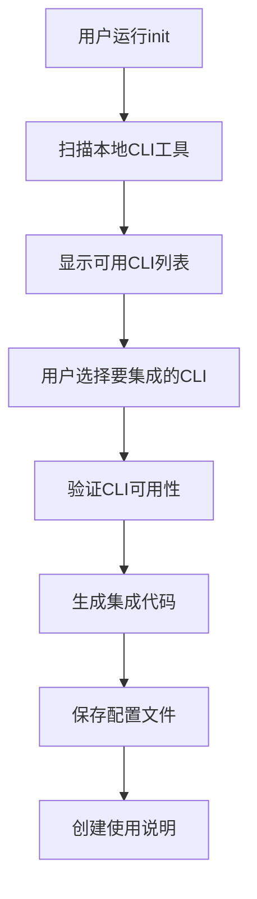
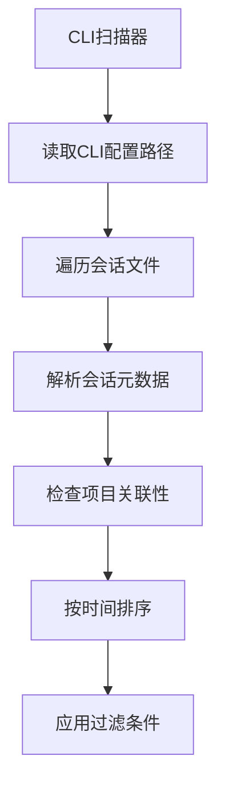
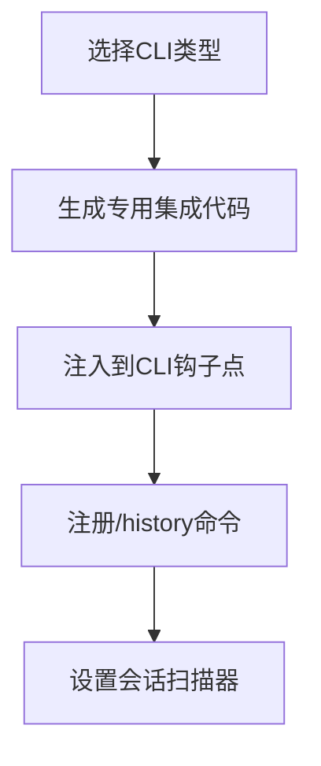

# ResumeSession 技术分析报告

## 📋 支持的指令

### 1. CLI 命令 (resumesession)

| 命令 | 描述 | 选项 | 示例 |
|------|------|------|------|
| `init` | 初始化项目 | `-f, --force` 强制重新初始化 | `resumesession init` |
| `status` | 显示项目状态 | 无 | `resumesession status` |
| `scan` | 扫描可用CLI工具 | `-v, --verbose` 详细输出 | `resumesession scan -v` |
| `--help` | 显示帮助 | 无 | `resumesession --help` |
| `--version` | 显示版本 | 无 | `resumesession --version` |

### 2. 集成到CLI后的指令 (/history)

| 指令 | 描述 | 选项 | 示例 |
|------|------|------|------|
| `/history` | 显示项目会话历史 | 无 | `/history` |
| `/history --cli <tool>` | 显示特定CLI会话 | claude, gemini, qwen等 | `/history --cli claude` |
| `/history --search <keyword>` | 搜索会话内容 | 关键词 | `/history --search "react"` |
| `/history --limit <number>` | 限制显示数量 | 数字 | `/history --limit 10` |
| `/history --format <type>` | 显示格式 | summary, timeline, detailed, context | `/history --format timeline` |
| `/history --today` | 今天会话 | 无 | `/history --today` |
| `/history --week` | 最近7天 | 无 | `/history --week` |
| `/history --month` | 最近30天 | 无 | `/history --month` |

---

## 🔧 工作机制和原理

### 1. 架构设计

```
ResumeSession Core
├── CLI Scanner (扫描CLI工具)
├── Session Scanner (扫描会话文件)
├── Code Generator (生成集成代码)
├── Project Detector (项目感知)
└── Session Parser (会话解析)
```

### 2. 工作流程

#### 阶段1: 初始化 (`resumesession init`)


#### 阶段2: 会话扫描


#### 阶段3: 集成代码生成


### 3. 技术实现

#### CLI工具检测
```typescript
// 支持的CLI工具配置
const supportedCLIs = {
  claude: {
    configPath: '~/.claude',
    sessionsPath: '~/.claude/sessions',
    command: 'claude --version'
  },
  gemini: {
    configPath: '~/.gemini',
    sessionsPath: '~/.gemini/sessions',
    command: 'gemini --version'
  },
  codex: {
    configPath: '~/.codex',
    sessionsPath: '~/.codex/sessions',
    command: 'codex --version', // 安全修复：改为路径检测
    safeMode: true
  }
  // ... 其他CLI
};
```

#### 会话文件解析
```typescript
interface Session {
  metadata: {
    cliType: string;
    sessionId: string;
    title: string;
    updatedAt: Date;
    messageCount: number;
    projectPath?: string;
  };
  messages: Message[];
}

// 项目匹配算法
function isProjectSession(session: Session, projectPath: string): boolean {
  const sessionProject = session.metadata.projectPath || '';
  return sessionProject === projectPath ||
         sessionProject.startsWith(projectPath + path.sep) ||
         projectPath.startsWith(sessionProject + path.sep);
}
```

#### 集成代码模板
```javascript
// Claude CLI 集成示例
async function handleHistoryCommand(input, context) {
  // 解析命令参数
  const options = parseCommand(input);

  // 扫描会话
  const sessions = await scanProjectSessions(options);

  // 格式化响应
  const response = formatResponse(sessions, options);

  return { response, suggestions };
}

// 注册到Claude CLI
if (typeof global.claudeCLI !== 'undefined') {
  global.claudeCLI.addSlashCommand('/history', handleHistoryCommand);
}
```

---

## 🎯 应用场景

### 1. 跨CLI工作流恢复

**场景描述**: 开发者在不同CLI工具间切换工作，需要保持上下文连续性

**使用流程**:
```
Day 1: Claude CLI → 讨论React架构
Day 2: Gemini CLI → 继续昨天的工作
解决方案: /history --format context
```

**价值**:
- 保持工作连续性
- 避免重复解释需求
- 快速恢复讨论上下文

### 2. 项目知识搜索

**场景描述**: 在大型项目中快速找到相关的技术讨论

**使用流程**:
```bash
# 搜索数据库优化相关讨论
/history --search "database optimization"

# 搜索特定技术栈
/history --search "react hooks"
```

**价值**:
- 快速定位技术解决方案
- 避免重复讨论
- 知识复用

### 3. 团队协作场景

**场景描述**: 团队成员使用不同CLI工具，需要了解项目讨论历史

**使用流程**:
```bash
# 按时间线查看所有讨论
/history --format timeline

# 查看今天活跃的讨论
/history --today
```

**价值**:
- 了解团队技术选型
- 跟踪问题解决过程
- 协调开发进度

### 4. 学习和培训

**场景描述**: 新团队成员学习项目历史和技术决策

**使用流程**:
```bash
# 按CLI工具分类查看
/history --cli claude

# 查看详细会话信息
/history --format detailed
```

**价值**:
- 了解项目架构演进
- 学习最佳实践
- 快速上手项目

### 5. 代码审查和质量保证

**场景描述**: 代码审查时了解相关的设计讨论

**使用流程**:
```bash
# 搜索特定功能的讨论
/history --search "authentication"

# 获取设计背景
/history --context
```

**价值**:
- 理解设计意图
- 验证实现方案
- 提高审查效率

---

## 🔍 技术特性

### 安全特性
- ✅ **只读操作**: 只读取会话文件，不修改任何内容
- ✅ **无干扰扫描**: 扫描时不启动任何CLI工具
- ✅ **本地处理**: 所有数据都在本地处理，不上传云端
- ✅ **权限控制**: 遵循系统文件权限

### 性能特性
- ✅ **增量扫描**: 只扫描相关项目目录
- ✅ **智能缓存**: 缓存扫描结果，提高响应速度
- ✅ **懒加载**: 按需加载会话内容
- ✅ **内存优化**: 大文件处理优化

### 兼容性
- ✅ **跨平台**: Windows, macOS, Linux
- ✅ **多CLI**: 支持7种主要AI CLI工具
- ✅ **版本兼容**: 向后兼容会话格式
- ✅ **项目框架**: 不限制项目类型和技术栈

---

## 📊 使用统计

### 支持的CLI工具 (7种)
| CLI工具 | 集成级别 | 会话路径 | 状态 |
|---------|----------|----------|------|
| 🟢 Claude CLI | Native | `~/.claude/sessions` | ✅ |
| 🔵 Gemini CLI | Native | `~/.gemini/sessions` | ✅ |
| 🟡 Qwen CLI | Native | `~/.qwen/sessions` | ✅ |
| 🔴 IFlow CLI | Hook | `~/.iflow/stigmergy/sessions` | ✅ |
| 🟣 CodeBuddy | External | `~/.codebuddy/conversations` | ✅ |
| 🟠 QoderCLI | External | `~/.qodercli/chats` | ✅ |
| 🟪 Codex CLI | External | `~/.codex/sessions` | ✅ |

### 会话过滤选项 (8种)
- 项目关联性过滤
- CLI工具过滤
- 时间范围过滤 (today/week/month)
- 关键词搜索
- 消息数量限制
- 文本匹配
- 正则表达式 (计划中)
- 标签分类 (计划中)

### 显示格式 (4种)
- Summary: 摘要视图，按CLI分组
- Timeline: 时间线视图，按时间排序
- Detailed: 详细视图，显示完整元数据
- Context: 上下文视图，用于恢复讨论

---

## 🚀 核心优势

1. **无缝集成**: 与现有CLI工具深度集成，无需改变使用习惯
2. **智能感知**: 自动识别项目关联，只显示相关会话
3. **安全可靠**: 只读操作，不会影响原有CLI工具功能
4. **简单易用**: 一键初始化，直观的命令行界面
5. **高性能**: 优化的扫描算法，快速响应
6. **扩展性强**: 模块化设计，易于添加新的CLI支持

ResumeSession 是一个真正解决AI CLI工具会话孤岛问题的创新工具！ 🎉