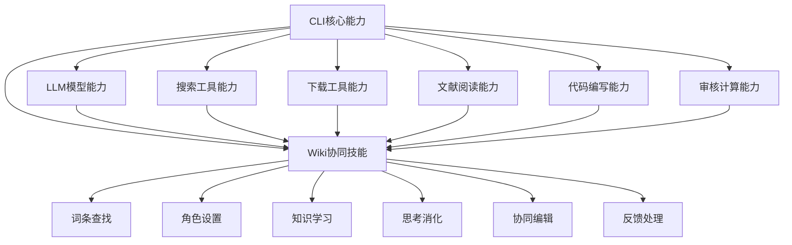

# CLI嵌入式Wiki协同技能架构设计

## 🎯 核心理念
**Wiki技能完全嵌入CLI生态系统**，继承CLI的LLM模型、搜索工具、下载能力、文献阅读、代码编写和审核计算能力。

## 🏗️ CLI嵌入式架构

### 技能继承体系


## 🔧 CLI能力继承机制

### 1. CLI工具集成器
```javascript
class CLIToolIntegrator {
  constructor(cliContext) {
    this.cliContext = cliContext;
    this.llm = cliContext.llm; // 继承LLM模型
    this.searchTool = cliContext.tools.search; // 继承搜索工具
    this.downloadTool = cliContext.tools.download; // 继承下载工具
    this.fileReader = cliContext.tools.fileReader; // 继承文件读取
    this.codeExecutor = cliContext.tools.codeExecutor; // 继承代码执行
    this.calculator = cliContext.tools.calculator; // 继承计算能力
  }
  
  // 继承LLM推理能力
  async llmInference(prompt, options = {}) {
    return await this.llm.generate(prompt, {
      ...options,
      context: 'wiki_collaboration',
      tools: this.getAvailableTools()
    });
  }
  
  // 继承搜索能力
  async enhancedSearch(query, searchOptions = {}) {
    const searchConfig = {
      sources: ['web', 'academic', 'documentation', 'forums'],
      maxResults: 20,
      language: ['zh', 'en'],
      sortBy: 'relevance',
      ...searchOptions
    };
    
    return await this.searchTool.search(query, searchConfig);
  }
  
  // 继承下载和文献处理能力
  async downloadAndProcess(url, processingOptions = {}) {
    // 下载文献
    const downloadedContent = await this.downloadTool.download(url);
    
    // 文献解析和提取
    const processedContent = await this.fileReader.parse(downloadedContent, {
      extractMetadata: true,
      extractReferences: true,
      extractKeyPoints: true,
      ...processingOptions
    });
    
    return processedContent;
  }
  
  // 继承代码编写和执行能力
  async writeAndExecuteCode(codeRequirement, executionOptions = {}) {
    // 使用LLM生成代码
    const generatedCode = await this.llm.generate(`
      基于以下需求编写代码：
      ${codeRequirement}
      
      要求：
      1. 代码要完整可执行
      2. 包含必要的错误处理
      3. 添加详细的注释
      4. 考虑性能优化
    `, {
      language: 'python',
      context: 'code_generation'
    });
    
    // 执行代码
    const executionResult = await this.codeExecutor.execute(generatedCode, {
      timeout: 30000,
      sandbox: true,
      ...executionOptions
    });
    
    return {
      code: generatedCode,
      result: executionResult,
      validation: await this.validateCode(generatedCode)
    };
  }
  
  // 继承计算和审核能力
  async performCalculation(calculationTask, auditOptions = {}) {
    // 使用LLM理解和规划计算
    const calculationPlan = await this.llm.generate(`
      分析以下计算任务并制定执行计划：
      ${calculationTask}
      
      请提供：
      1. 计算步骤
      2. 所需数据
      3. 验证方法
      4. 可能的误差来源
    `, {
      context: 'calculation_planning'
    });
    
    // 执行计算
    const calculationResult = await this.calculator.calculate(calculationPlan);
    
    // 审核计算结果
    const auditResult = await this.auditCalculation(calculationResult, auditOptions);
    
    return {
      plan: calculationPlan,
      result: calculationResult,
      audit: auditResult
    };
  }
}
```

### 2. Wiki协同技能核心
```javascript
class WikiCollaborativeSkill extends CLIToolIntegrator {
  constructor(cliContext) {
    super(cliContext);
    this.knowledgeBase = new KnowledgeBase();
    this.roleManager = new RoleManager(this);
    this.feedbackProcessor = new FeedbackProcessor(this);
  }
  
  async executeWikiTask(taskDescription) {
    try {
      // 1. 使用LLM理解任务
      const taskUnderstanding = await this.understandTask(taskDescription);
      
      // 2. 使用搜索工具查找词条
      const entrySearch = await this.searchWikiEntries(taskUnderstanding);
      
      // 3. 使用LLM设置专业角色
      const professionalRole = await this.establishProfessionalRole(
        taskUnderstanding,
        entrySearch
      );
      
      // 4. 使用搜索和下载工具学习知识
      const knowledgeAcquisition = await this.acquireKnowledge(
        professionalRole,
        entrySearch
      );
      
      // 5. 使用LLM进行深度思考
      const thinkingProcess = await this.deepThinking(
        professionalRole,
        knowledgeAcquisition,
        entrySearch
      );
      
      // 6. 生成编辑提案
      const editProposal = await this.generateEditProposal(
        thinkingProcess,
        entrySearch
      );
      
      // 7. 提交并监控反馈
      const submissionResult = await this.submitAndMonitor(editProposal);
      
      return {
        taskUnderstanding,
        entrySearch,
        professionalRole,
        knowledgeAcquisition,
        thinkingProcess,
        editProposal,
        submissionResult
      };
      
    } catch (error) {
      console.error('Wiki协同任务执行失败:', error);
      throw error;
    }
  }
  
  // 使用LLM理解任务
  async understandTask(taskDescription) {
    const understandingPrompt = `
      分析以下Wiki协同任务：
      任务描述：${taskDescription}
      
      请提供：
      1. 任务核心目标
      2. 涉及的专业领域
      3. 所需的技能和知识
      4. 预期的编辑内容类型
      5. 可能的挑战和解决方案
    `;
    
    const understanding = await this.llmInference(understandingPrompt, {
      temperature: 0.3,
      maxTokens: 1000
    });
    
    return {
      originalTask: taskDescription,
      parsedUnderstanding: understanding.content,
      coreObjectives: this.extractObjectives(understanding.content),
      domain: this.extractDomain(understanding.content),
      requiredSkills: this.extractSkills(understanding.content),
      expectedOutputs: this.extractOutputs(understanding.content)
    };
  }
  
  // 使用搜索工具查找Wiki词条
  async searchWikiEntries(taskUnderstanding) {
    const searchQueries = this.generateSearchQueries(taskUnderstanding);
    
    const searchResults = [];
    for (const query of searchQueries) {
      const results = await this.enhancedSearch(query, {
        sources: ['wiki', 'academic', 'documentation'],
        maxResults: 10
      });
      searchResults.push(...results);
    }
    
    // 使用LLM分析和排序搜索结果
    const analysisPrompt = `
      分析以下Wiki词条搜索结果，按相关性排序：
      搜索结果：${JSON.stringify(searchResults, null, 2)}
      任务目标：${taskUnderstanding.coreObjectives.join(', ')}
      
      请提供：
      1. 最相关的词条（前3个）
      2. 每个词条的相关性评分
      3. 推荐的编辑方向
    `;
    
    const analysis = await this.llmInference(analysisPrompt);
    
    return {
      searchQueries,
      allResults: searchResults,
      relevantEntries: this.extractRelevantEntries(analysis.content),
      recommendations: this.extractRecommendations(analysis.content)
    };
  }
  
  // 使用LLM建立专业角色
  async establishProfessionalRole(taskUnderstanding, entrySearch) {
    const rolePrompt = `
      基于以下信息，建立最适合的专业角色：
      
      任务理解：${JSON.stringify(taskUnderstanding, null, 2)}
      词条信息：${JSON.stringify(entrySearch.relevantEntries, null, 2)}
      
      请设计专业角色，包括：
      1. 角色名称和专业领域
      2. 核心专长和知识背景
      3. 分析视角和方法论
      4. 沟通风格和表达特点
      5. 可能的认知偏见和注意事项
    `;
    
    const roleDesign = await this.llmInference(rolePrompt, {
      temperature: 0.5,
      maxTokens: 1500
    });
    
    return {
      roleDefinition: roleDesign.content,
      persona: this.extractPersona(roleDesign.content),
      expertise: this.extractExpertise(roleDesign.content),
      perspective: this.extractPerspective(roleDesign.content),
      communicationStyle: this.extractCommunicationStyle(roleDesign.content),
      biases: this.extractBiases(roleDesign.content)
    };
  }
  
  // 使用搜索和下载工具获取知识
  async acquireKnowledge(professionalRole, entrySearch) {
    const knowledgePlan = await this.createKnowledgePlan(
      professionalRole,
      entrySearch
    );
    
    const acquiredKnowledge = [];
    
    for (const knowledgeItem of knowledgePlan.items) {
      try {
        // 搜索相关知识
        const searchResults = await this.enhancedSearch(knowledgeItem.query, {
          sources: knowledgeItem.sources,
          maxResults: knowledgeItem.maxResults
        });
        
        // 下载和处理重要文献
        const processedDocuments = [];
        for (const result of searchResults.slice(0, 5)) {
          if (result.url && this.shouldDownload(result)) {
            const processed = await this.downloadAndProcess(result.url, {
              extractKeyPoints: true,
              extractReferences: true
            });
            processedDocuments.push(processed);
          }
        }
        
        // 使用LLM整合知识
        const integrationPrompt = `
          作为${professionalRole.persona.name}，整合以下知识：
          
          搜索结果：${JSON.stringify(searchResults, null, 2)}
          处理的文档：${JSON.stringify(processedDocuments.map(d => d.summary), null, 2)}
          
          请提供：
          1. 核心知识点总结
          2. 关键数据和证据
          3. 不同观点和争议
          4. 知识可靠性评估
          5. 与词条编辑的关联性
        `;
        
        const integratedKnowledge = await this.llmInference(integrationPrompt);
        
        acquiredKnowledge.push({
          topic: knowledgeItem.topic,
          searchResults,
          processedDocuments,
          integratedKnowledge: integratedKnowledge.content,
          reliability: this.assessReliability(integratedKnowledge.content)
        });
        
      } catch (error) {
        console.error(`知识获取失败 - ${knowledgeItem.topic}:`, error);
      }
    }
    
    return {
      plan: knowledgePlan,
      acquiredItems: acquiredKnowledge,
      knowledgeGraph: this.buildKnowledgeGraph(acquiredKnowledge),
      gaps: this.identifyKnowledgeGaps(acquiredKnowledge)
    };
  }
  
  // 使用LLM进行深度思考
  async deepThinking(professionalRole, knowledgeAcquisition, entrySearch) {
    const thinkingPrompt = `
      作为${professionalRole.persona.name}，基于以下信息进行深度思考：
      
      专业角色：${JSON.stringify(professionalRole, null, 2)}
      获取的知识：${JSON.stringify(knowledgeAcquisition.acquiredItems.map(k => k.integratedKnowledge), null, 2)}
      词条信息：${JSON.stringify(entrySearch, null, 2)}
      
      请进行以下思考：
      1. 多角度分析当前词条内容
      2. 识别知识空白和改进机会
      3. 形成专业观点和建议
      4. 考虑不同利益相关者的视角
      5. 提出具体的编辑方案
    `;
    
    const thinkingResult = await this.llmInference(thinkingPrompt, {
      temperature: 0.7,
      maxTokens: 2000
    });
    
    // 使用代码编写能力进行数据分析（如果需要）
    let dataAnalysis = null;
    if (this.requiresDataAnalysis(thinkingResult.content)) {
      dataAnalysis = await this.performDataAnalysis(thinkingResult.content);
    }
    
    return {
      thinkingProcess: thinkingResult.content,
      analysis: this.extractAnalysis(thinkingResult.content),
      viewpoints: this.extractViewpoints(thinkingResult.content),
      recommendations: this.extractRecommendations(thinkingResult.content),
      dataAnalysis,
      confidence: this.assessThinkingConfidence(thinkingResult.content)
    };
  }
  
  // 使用代码编写能力进行数据分析
  async performDataAnalysis(thinkingContent) {
    const analysisRequirement = `
      基于以下思考内容，编写代码进行数据分析：
      ${thinkingContent}
      
      需要分析的数据类型和计算任务请从思考内容中推断。
    `;
    
    return await this.writeAndExecuteCode(analysisRequirement, {
      language: 'python',
      libraries: ['pandas', 'numpy', 'matplotlib', 'scipy']
    });
  }
  
  // 生成编辑提案
  async generateEditProposal(thinkingProcess, entrySearch) {
    const proposalPrompt = `
      基于深度思考结果，生成Wiki词条编辑提案：
      
      思考结果：${JSON.stringify(thinkingProcess, null, 2)}
      词条信息：${JSON.stringify(entrySearch, null, 2)}
      
      请提供详细的编辑提案，包括：
      1. 具体的编辑内容
      2. 编辑理由和依据
      3. 预期的改进效果
      4. 可能的争议和应对
      5. 参考资料和证据
    `;
    
    const proposal = await this.llmInference(proposalPrompt, {
      temperature: 0.4,
      maxTokens: 2500
    });
    
    return {
      proposal: proposal.content,
      editActions: this.extractEditActions(proposal.content),
      rationale: this.extractRationale(proposal.content),
      expectedImpact: this.extractExpectedImpact(proposal.content),
      references: this.extractReferences(proposal.content),
      controversyHandling: this.extractControversyHandling(proposal.content)
    };
  }
  
  // 提交并监控反馈
  async submitAndMonitor(editProposal) {
    // 提交编辑提案
    const submission = await this.submitToWiki(editProposal);
    
    // 启动反馈监控
    const feedbackMonitor = new FeedbackMonitor(submission.editId, this);
    
    feedbackMonitor.on('feedback', async (feedback) => {
      await this.processFeedback(feedback, editProposal);
    });
    
    await feedbackMonitor.start();
    
    return {
      submission,
      monitor: feedbackMonitor,
      status: 'submitted'
    };
  }
  
  // 处理反馈（使用LLM和争辩机制）
  async processFeedback(feedback, originalProposal) {
    const feedbackAnalysis = await this.analyzeFeedback(feedback);
    
    if (feedbackAnalysis.requiresResponse) {
      // 使用LLM生成回应
      const responsePrompt = `
        作为专业编辑者，针对以下反馈制定回应：
        
        原始提案：${JSON.stringify(originalProposal, null, 2)}
        用户反馈：${JSON.stringify(feedback, null, 2)}
        反馈分析：${JSON.stringify(feedbackAnalysis, null, 2)}
        
        请提供：
        1. 对反馈的理解和分析
        2. 专业观点和立场
        3. 具体的回应内容
        4. 提案调整建议
      `;
      
      const response = await this.llmInference(responsePrompt, {
        temperature: 0.6,
        maxTokens: 1500
      });
      
      // 执行争辩和反思过程
      const debateResult = await this.conductDebate(
        originalProposal,
        feedback,
        response.content
      );
      
      return {
        feedbackAnalysis,
        response: response.content,
        debateResult,
        action: this.determineAction(debateResult)
      };
    }
    
    return { feedbackAnalysis, action: 'acknowledged' };
  }
}
```

### 3. CLI技能调用接口
```javascript
// CLI技能注册和调用
class CLISkillRegistry {
  constructor() {
    this.skills = new Map();
    this.registerWikiSkill();
  }
  
  registerWikiSkill() {
    const wikiSkill = {
      name: 'wikiskill',
      description: 'Wiki协同编辑技能',
      version: '1.0.0',
      execute: async (cliContext, args) => {
        const skill = new WikiCollaborativeSkill(cliContext);
        return await skill.executeWikiTask(args.task);
      }
    };
    
    this.skills.set('wikiskill', wikiSkill);
  }
  
  async callSkill(skillName, cliContext, args) {
    const skill = this.skills.get(skillName);
    if (!skill) {
      throw new Error(`技能 ${skillName} 不存在`);
    }
    
    return await skill.execute(cliContext, args);
  }
}
```

## 📋 CLI调用示例

```bash
# 基本调用
stigmergy call wikiskill "参与机器学习词条的编辑，添加深度学习最新发展"

# 使用特定CLI的LLM模型
claude> wikiskill "完善量子计算词条，重点关注量子算法应用"

# 启用深度分析
gemini> wikiskill "编辑人工智能伦理词条" --deep-analysis --data-crunching

# 协同模式
stigmergy call wikiskill "与其他专家协同编辑区块链技术词条" --collaborative --debate

# 指定专业领域和深度
stigmergy call wikiskill "更新自然语言处理词条" --domain nlp --depth expert --enable-calculation
```

## 🎯 关键优势

1. **完全继承CLI能力**：充分利用CLI的LLM模型、搜索、下载、代码执行等能力
2. **深度集成**：不是独立系统，而是CLI生态的有机组成部分
3. **智能学习**：能够自主搜索、下载、阅读文献，并进行深度分析
4. **代码能力**：可以编写代码进行数据分析和计算验证
5. **争辩反思**：基于LLM的智能反馈处理和观点争辩

---

**设计团队**：CLI嵌入式Wiki技能架构团队  
**设计日期**：2025年12月14日  
**版本**：v3.0