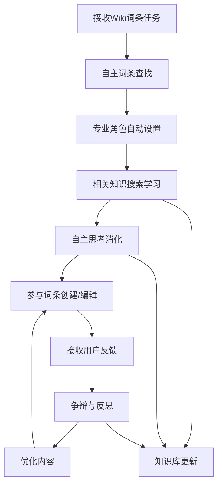

# Wiki协同技能核心架构设计

## 🎯 核心理念
**重点不是Wiki系统，而是智能技能！** CLI技能能够自主查找词条、设置专业角色、搜索学习、思考消化，并基于反馈进行争辩反思，最终参与协同编辑。

## 🧠 智能技能架构

### 技能工作流程


## 🔧 核心技能模块设计

### 1. 自主词条查找模块
```javascript
class WikiEntryFinder {
  constructor() {
    this.searchEngine = new IntelligentSearchEngine();
    this.wikiAPI = new WikiAPIConnector();
    this.contextAnalyzer = new ContextAnalyzer();
  }
  
  async findRelevantEntries(taskDescription) {
    // 1. 任务上下文分析
    const context = await this.contextAnalyzer.analyze(taskDescription);
    
    // 2. 智能搜索策略
    const searchStrategy = this.determineSearchStrategy(context);
    
    // 3. 多源词条查找
    const candidates = await this.searchFromMultipleSources(
      context.keywords,
      searchStrategy
    );
    
    // 4. 相关性评分和排序
    const rankedEntries = await this.rankByRelevance(candidates, context);
    
    // 5. 选择最相关词条
    const selectedEntries = this.selectOptimalEntries(rankedEntries);
    
    return {
      primaryEntry: selectedEntries[0],
      alternativeEntries: selectedEntries.slice(1),
      searchContext: context,
      confidence: this.calculateConfidence(selectedEntries)
    };
  }
  
  determineSearchStrategy(context) {
    return {
      primarySources: this.selectPrimarySources(context.domain),
      searchDepth: this.determineSearchDepth(context.complexity),
      languagePreferences: context.languages,
      timeRange: context.timeRelevance,
      qualityThreshold: this.calculateQualityThreshold(context)
    };
  }
  
  async searchFromMultipleSources(keywords, strategy) {
    const sources = [
      { name: 'internal_wiki', api: this.wikiAPI.internal },
      { name: 'external_wiki', api: this.wikiAPI.external },
      { name: 'academic_db', api: this.wikiAPI.academic },
      { name: 'professional_forums', api: this.wikiAPI.forums }
    ];
    
    const searchPromises = sources.map(source => 
      this.searchSource(source, keywords, strategy)
    );
    
    const results = await Promise.all(searchPromises);
    return this.mergeSearchResults(results);
  }
}
```

### 2. 专业角色自动设置系统
```javascript
class ProfessionalRoleManager {
  constructor() {
    this.roleDatabase = new RoleDatabase();
    this.expertiseMatcher = new ExpertiseMatcher();
    this.contextEvaluator = new ContextEvaluator();
  }
  
  async setProfessionalRole(entryContext, taskDescription) {
    // 1. 分析词条领域和专业要求
    const domainAnalysis = await this.analyzeDomain(entryContext);
    
    // 2. 识别所需专业能力
    const requiredExpertise = await this.identifyRequiredExpertise(
      domainAnalysis,
      taskDescription
    );
    
    // 3. 匹配最适合的专业角色
    const candidateRoles = await this.findCandidateRoles(requiredExpertise);
    
    // 4. 角色适应性评估
    const roleAssessment = await this.assessRoleSuitability(
      candidateRoles,
      entryContext
    );
    
    // 5. 选择并配置专业角色
    const selectedRole = await this.selectAndConfigureRole(roleAssessment);
    
    return {
      role: selectedRole,
      expertise: requiredExpertise,
      confidence: roleAssessment.confidence,
      adaptationStrategy: this.createAdaptationStrategy(selectedRole)
    };
  }
  
  async analyzeDomain(entryContext) {
    return {
      primaryDomain: this.identifyPrimaryDomain(entryContent),
      subDomains: this.identifySubDomains(entryContent),
      interdisciplinaryConnections: this.findConnections(entryContent),
      complexityLevel: this.assessComplexity(entryContent),
      requiredKnowledgeDepth: this.determineKnowledgeDepth(entryContent)
    };
  }
  
  async selectAndConfigureRole(roleAssessment) {
    const bestRole = roleAssessment.candidates[0];
    
    // 配置角色参数
    const configuredRole = {
      ...bestRole,
      perspective: this.determinePerspective(bestRole, roleAssessment.context),
      communicationStyle: this.selectCommunicationStyle(bestRole),
      expertiseLevel: this.adjustExpertiseLevel(bestRole, roleAssessment),
      biasAwareness: this.enableBiasAwareness(bestRole),
      learningMode: this.setLearningMode(bestRole)
    };
    
    return configuredRole;
  }
}
```

### 3. 知识搜索学习机制
```javascript
class KnowledgeSearchLearner {
  constructor() {
    this.searchOrchestrator = new SearchOrchestrator();
    this.knowledgeIntegrator = new KnowledgeIntegrator();
    this.learningEngine = new LearningEngine();
    this.qualityAssessor = new KnowledgeQualityAssessor();
  }
  
  async searchAndLearn(role, entryContext) {
    // 1. 制定学习策略
    const learningStrategy = await this.createLearningStrategy(role, entryContext);
    
    // 2. 多维知识搜索
    const knowledgeSources = await this.searchKnowledge(learningStrategy);
    
    // 3. 知识质量评估
    const assessedKnowledge = await this.assessKnowledgeQuality(knowledgeSources);
    
    // 4. 知识整合与消化
    const integratedKnowledge = await this.integrateKnowledge(assessedKnowledge);
    
    // 5. 构建专业知识图谱
    const knowledgeGraph = await this.buildKnowledgeGraph(integratedKnowledge);
    
    // 6. 更新角色知识库
    await this.updateRoleKnowledge(role, knowledgeGraph);
    
    return {
      knowledgeGraph,
      learningOutcomes: this.extractLearningOutcomes(knowledgeGraph),
      confidenceLevel: this.calculateLearningConfidence(integratedKnowledge),
      knowledgeGaps: this.identifyKnowledgeGaps(knowledgeGraph)
    };
  }
  
  async createLearningStrategy(role, entryContext) {
    return {
      searchQueries: this.generateSearchQueries(role, entryContext),
      sourceTypes: this.selectRelevantSources(role.expertise),
      learningDepth: this.determineLearningDepth(role, entryContext),
      timeAllocation: this.allocateLearningTime(role, entryContext),
      qualityFilters: this.setQualityFilters(role),
      learningObjectives: this.defineLearningObjectives(role, entryContext)
    };
  }
  
  async searchKnowledge(strategy) {
    const searchTasks = strategy.searchQueries.map(query => ({
      query,
      sources: strategy.sourceTypes,
      filters: strategy.qualityFilters,
      depth: strategy.learningDepth
    }));
    
    const searchResults = await Promise.all(
      searchTasks.map(task => this.searchOrchestrator.execute(task))
    );
    
    return this.consolidateSearchResults(searchResults);
  }
  
  async integrateKnowledge(knowledgeSources) {
    // 1. 知识去重和合并
    const deduplicatedKnowledge = await this.deduplicateKnowledge(knowledgeSources);
    
    // 2. 知识验证和交叉引用
    const validatedKnowledge = await this.validateKnowledge(deduplicatedKnowledge);
    
    // 3. 知识结构化组织
    const structuredKnowledge = await this.structureKnowledge(validatedKnowledge);
    
    // 4. 知识关联性分析
    const connectedKnowledge = await this.analyzeConnections(structuredKnowledge);
    
    return connectedKnowledge;
  }
}
```

### 4. 自主思考消化系统
```javascript
class AutonomousThinkingSystem {
  constructor() {
    this.cognitiveProcessor = new CognitiveProcessor();
    self.reflectionEngine = new ReflectionEngine();
    this.perspectiveSynthesizer = new PerspectiveSynthesizer();
    this.criticalThinker = new CriticalThinker();
  }
  
  async thinkAndDigest(role, knowledgeGraph, entryContext) {
    // 1. 多角度思考
    const perspectives = await this.generateMultiplePerspectives(
      role,
      knowledgeGraph,
      entryContext
    );
    
    // 2. 批判性分析
    const criticalAnalysis = await this.performCriticalAnalysis(
      perspectives,
      knowledgeGraph
    );
    
    // 3. 知识内化
    const internalizedKnowledge = await this.internalizeKnowledge(
      criticalAnalysis,
      role
    );
    
    // 4. 观点形成
    const formedOpinions = await this.formOpinions(
      internalizedKnowledge,
      entryContext
    );
    
    // 5. 自我反思
    const reflectionResults = await this.selfReflect(
      formedOpinions,
      role,
      knowledgeGraph
    );
    
    return {
      perspectives,
      criticalAnalysis,
      internalizedKnowledge,
      formedOpinions,
      reflectionResults,
      confidenceLevel: this.calculateThinkingConfidence(reflectionResults),
      reasoningChain: this.extractReasoningChain(reflectionResults)
    };
  }
  
  async generateMultiplePerspectives(role, knowledgeGraph, entryContext) {
    const perspectiveTypes = [
      'technical',
      'practical', 
      'theoretical',
      'historical',
      'future-oriented',
      'interdisciplinary'
    ];
    
    const perspectives = {};
    
    for (const type of perspectiveTypes) {
      perspectives[type] = await this.generatePerspective(
        type,
        role,
        knowledgeGraph,
        entryContext
      );
    }
    
    return perspectives;
  }
  
  async performCriticalAnalysis(perspectives, knowledgeGraph) {
    const analysis = {
      consistencyCheck: await this.checkConsistency(perspectives),
      biasDetection: await this.detectBiases(perspectives),
      evidenceEvaluation: await this.evaluateEvidence(perspectives, knowledgeGraph),
      logicalValidation: await this.validateLogic(perspectives),
      gapIdentification: await this.identifyGaps(perspectives)
    };
    
    return analysis;
  }
  
  async selfReflection(opinions, role, knowledgeGraph) {
    const reflection = {
      selfAwareness: await this.assessSelfAwareness(opinions, role),
      knowledgeLimitations: await this.identifyKnowledgeLimitations(opinions, knowledgeGraph),
      perspectiveBlindspots: await this.identifyBlindspots(opinions),
      reasoningQuality: await this.evaluateReasoningQuality(opinions),
      improvementAreas: await this.identifyImprovementAreas(opinions, role)
    };
    
    return reflection;
  }
}
```

### 5. 反馈争辩反思机制
```javascript
class FeedbackDebateReflectionSystem {
  constructor() {
    this.feedbackAnalyzer = new FeedbackAnalyzer();
    this.debateEngine = new DebateEngine();
    this.reflectionProcessor = new ReflectionProcessor();
    this.consensusBuilder = new ConsensusBuilder();
  }
  
  async processFeedback(debatedContent, userFeedbacks, role) {
    // 1. 反馈分析和分类
    const analyzedFeedback = await this.analyzeFeedback(userFeedbacks);
    
    // 2. 争辩策略制定
    const debateStrategy = await this.createDebateStrategy(
      analyzedFeedback,
      debatedContent,
      role
    );
    
    // 3. 执行智能争辩
    const debateResults = await this.executeDebate(debateStrategy);
    
    // 4. 深度反思
    const reflectionOutcomes = await this.deepReflection(
      debateResults,
      role,
      debatedContent
    );
    
    // 5. 优化决策
    const optimizationPlan = await this.createOptimizationPlan(
      reflectionOutcomes,
      debatedContent
    );
    
    return {
      analyzedFeedback,
      debateResults,
      reflectionOutcomes,
      optimizationPlan,
      consensusLevel: this.calculateConsensusLevel(debateResults),
      adaptationStrategy: this.createAdaptationStrategy(reflectionOutcomes)
    };
  }
  
  async analyzeFeedback(userFeedbacks) {
    const analysis = {
      feedbackTypes: this.classifyFeedback(userFeedbacks),
      sentimentAnalysis: await this.analyzeSentiment(userFeedbacks),
      argumentQuality: await this.assessArgumentQuality(userFeedbacks),
      consensusIndicators: await this.identifyConsensusIndicators(userFeedbacks),
      conflictPoints: await this.identifyConflictPoints(userFeedbacks),
      suggestionPatterns: await this.identifySuggestionPatterns(userFeedbacks)
    };
    
    return analysis;
  }
  
  async executeDebate(debateStrategy) {
    const debate = {
      rounds: [],
      positions: {},
      evidence: {},
      reasoning: []
    };
    
    // 多轮争辩
    for (let round = 1; round <= debateStrategy.maxRounds; round++) {
      const roundResult = await this.conductDebateRound(
        debate,
        debateStrategy,
        round
      );
      
      debate.rounds.push(roundResult);
      
      // 检查是否达成共识
      if (await this.checkConsensus(debate)) {
        break;
      }
    }
    
    // 综合争辩结果
    const debateResults = await this.synthesizeDebateResults(debate);
    
    return debateResults;
  }
  
  async conductDebateRound(currentDebate, strategy, roundNumber) {
    const round = {
      roundNumber,
      arguments: [],
      counterArguments: [],
      evidencePresented: [],
      reasoningSteps: []
    };
    
    // 生成主要论点
    const mainArguments = await this.generateArguments(
      currentDebate,
      strategy,
      roundNumber
    );
    round.arguments = mainArguments;
    
    // 生成反驳论点
    const counterArguments = await this.generateCounterArguments(
      mainArguments,
      strategy
    );
    round.counterArguments = counterArguments;
    
    // 收集和评估证据
    const evidence = await this.collectAndEvaluateEvidence(
      mainArguments,
      counterArguments
    );
    round.evidencePresented = evidence;
    
    // 推理过程
    const reasoning = await this.performReasoning(
      mainArguments,
      counterArguments,
      evidence
    );
    round.reasoningSteps = reasoning;
    
    return round;
  }
  
  async deepReflection(debateResults, role, originalContent) {
    const reflection = {
      selfAssessment: await this.assessOwnPosition(debateResults, role),
      perspectiveShift: await this.identifyPerspectiveShift(debateResults),
      learningOutcomes: await this.extractLearningOutcomes(debateResults),
      knowledgeUpdate: await this.planKnowledgeUpdate(debateResults, role),
      strategyAdjustment: await this.planStrategyAdjustment(debateResults)
    };
    
    return reflection;
  }
}
```

## 🚀 智能技能CLI接口

### 技能调用接口
```javascript
class WikiCollaborativeSkill {
  constructor() {
    this.entryFinder = new WikiEntryFinder();
    this.roleManager = new ProfessionalRoleManager();
    this.knowledgeLearner = new KnowledgeSearchLearner();
    this.thinkingSystem = new AutonomousThinkingSystem();
    this.feedbackProcessor = new FeedbackDebateReflectionSystem();
  }
  
  async execute(taskDescription, options = {}) {
    try {
      // 1. 查找相关词条
      const entryResult = await this.entryFinder.findRelevantEntries(taskDescription);
      
      // 2. 设置专业角色
      const role = await this.roleManager.setProfessionalRole(
        entryResult.primaryEntry,
        taskDescription
      );
      
      // 3. 知识搜索学习
      const learningResult = await this.knowledgeLearner.searchAndLearn(
        role,
        entryResult.primaryEntry
      );
      
      // 4. 自主思考消化
      const thinkingResult = await this.thinkingSystem.thinkAndDigest(
        role,
        learningResult.knowledgeGraph,
        entryResult.primaryEntry
      );
      
      // 5. 生成编辑内容
      const editProposal = await this.generateEditProposal(
        thinkingResult,
        entryResult.primaryEntry
      );
      
      // 6. 提交编辑并监听反馈
      const submissionResult = await this.submitEdit(editProposal);
      
      // 7. 处理反馈循环（如果有）
      if (options.enableFeedbackLoop) {
        await this.startFeedbackLoop(submissionResult);
      }
      
      return {
        entry: entryResult.primaryEntry,
        role: role,
        learningOutcomes: learningResult,
        thinkingProcess: thinkingResult,
        editProposal: editProposal,
        submissionResult: submissionResult
      };
      
    } catch (error) {
      console.error('Wiki协同技能执行失败:', error);
      throw error;
    }
  }
  
  async startFeedbackLoop(submissionResult) {
    const feedbackMonitor = new FeedbackMonitor(submissionResult.editId);
    
    feedbackMonitor.on('feedback', async (feedback) => {
      const processingResult = await this.feedbackProcessor.processFeedback(
        submissionResult.content,
        feedback,
        this.currentRole
      );
      
      if (processingResult.optimizationPlan.needsUpdate) {
        await this.applyOptimizations(processingResult.optimizationPlan);
      }
    });
    
    await feedbackMonitor.start();
  }
}
```

## 📋 CLI调用示例

```bash
# 基本调用
stigmergy call wikiskill "参与机器学习词条的编辑，添加深度学习最新发展"

# 高级调用（启用反馈循环）
stigmergy call wikiskill "完善量子计算词条，重点关注量子算法应用" --enable-feedback-loop

# 指定专业领域
stigmergy call wikiskill "编辑人工智能伦理词条" --domain ethics --depth expert

# 协同模式
stigmergy call wikiskill "与其他专家协同编辑区块链技术词条" --collaborative --debate-enabled
```

---

**设计团队**：Wiki协同技能核心架构团队  
**设计日期**：2025年12月14日  
**版本**：v2.0