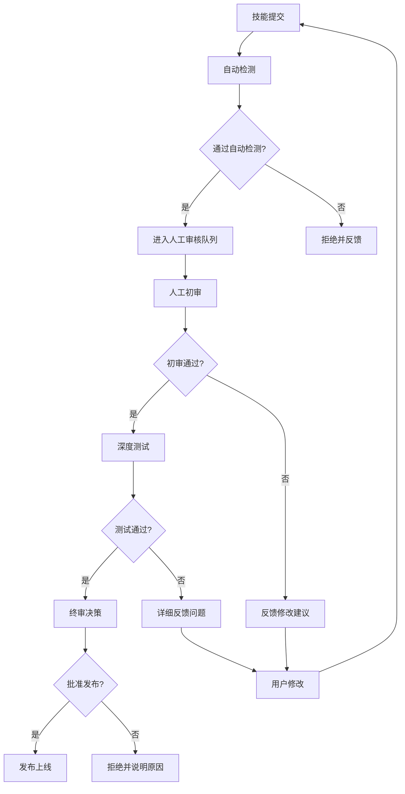

# 平台审核发布机制设计

## 🎯 机制概述
确保技能质量、安全性和可用性的完整审核发布流程，从用户提交到最终上线。

## 🔄 审核流程架构

### 审核阶段划分
```
用户提交 → 自动检测 → 人工审核 → 测试验证 → 发布决策 → 上线监控
```

### 审核决策树


## 🔍 自动检测系统

### 1. 代码质量检测
```javascript
class CodeQualityChecker {
  constructor() {
    this.linters = {
      javascript: new ESLintChecker(),
      python: new PylintChecker(),
      typescript: new TSLintChecker()
    };
    this.analyzers = {
      complexity: new ComplexityAnalyzer(),
      maintainability: new MaintainabilityAnalyzer(),
      duplication: new DuplicationAnalyzer()
    };
  }
  
  async checkCodeQuality(skillCode, language) {
    const results = {
      overall: 0,
      details: {},
      issues: [],
      suggestions: []
    };
    
    try {
      // 1. 代码规范检查
      const linter = this.linters[language];
      if (linter) {
        const lintResult = await linter.check(skillCode);
        results.details.linting = lintResult;
        results.issues.push(...lintResult.errors);
        results.suggestions.push(...lintResult.warnings);
      }
      
      // 2. 复杂度分析
      const complexityResult = await this.analyzers.complexity.analyze(skillCode);
      results.details.complexity = complexityResult;
      
      if (complexityResult.score < 0.7) {
        results.issues.push({
          type: 'complexity',
          message: '代码复杂度过高，建议重构',
          details: complexityResult
        });
      }
      
      // 3. 可维护性分析
      const maintainabilityResult = await this.analyzers.maintainability.analyze(skillCode);
      results.details.maintainability = maintainabilityResult;
      
      // 4. 重复代码检测
      const duplicationResult = await this.analyzers.duplication.analyze(skillCode);
      results.details.duplication = duplicationResult;
      
      if (duplicationResult.ratio > 0.3) {
        results.suggestions.push({
          type: 'duplication',
          message: '存在重复代码，建议提取公共函数',
          details: duplicationResult
        });
      }
      
      // 计算总体评分
      results.overall = this.calculateOverallScore(results);
      
      return results;
      
    } catch (error) {
      console.error('代码质量检测失败:', error);
      throw new Error('代码质量检测过程出错');
    }
  }
  
  calculateOverallScore(results) {
    const weights = {
      linting: 0.3,
      complexity: 0.3,
      maintainability: 0.2,
      duplication: 0.2
    };
    
    let totalScore = 0;
    let totalWeight = 0;
    
    for (const [category, weight] of Object.entries(weights)) {
      if (results.details[category]) {
        const score = results.details[category].score || 0;
        totalScore += score * weight;
        totalWeight += weight;
      }
    }
    
    return totalWeight > 0 ? totalScore / totalWeight : 0;
  }
}
```

### 2. 安全扫描系统
```javascript
class SecurityScanner {
  constructor() {
    this.vulnerabilityScanner = new VulnerabilityScanner();
    this.dependencyChecker = new DependencyChecker();
    this.codeAnalyzer = new SecurityCodeAnalyzer();
  }
  
  async scanSecurity(skillCode, dependencies = []) {
    const scanResult = {
      overall: 0,
      criticalIssues: [],
      warnings: [],
      recommendations: [],
      details: {}
    };
    
    try {
      // 1. 代码安全分析
      const codeAnalysis = await this.codeAnalyzer.analyze(skillCode);
      scanResult.details.codeAnalysis = codeAnalysis;
      
      // 检查常见安全问题
      const securityIssues = this.detectSecurityIssues(skillCode);
      scanResult.criticalIssues.push(...securityIssues.critical);
      scanResult.warnings.push(...securityIssues.warnings);
      
      // 2. 依赖漏洞扫描
      if (dependencies.length > 0) {
        const dependencyScan = await this.dependencyChecker.check(dependencies);
        scanResult.details.dependencies = dependencyScan;
        
        if (dependencyScan.vulnerabilities.length > 0) {
          scanResult.criticalIssues.push(...dependencyScan.vulnerabilities.filter(v => v.severity === 'high'));
          scanResult.warnings.push(...dependencyScan.vulnerabilities.filter(v => v.severity === 'medium'));
        }
      }
      
      // 3. 恶意代码检测
      const malwareScan = await this.vulnerabilityScanner.scanForMalware(skillCode);
      scanResult.details.malwareScan = malwareScan;
      
      if (malwareScan.suspicious) {
        scanResult.criticalIssues.push({
          type: 'malware',
          message: '检测到可疑代码模式',
          details: malwareScan
        });
      }
      
      // 计算安全评分
      scanResult.overall = this.calculateSecurityScore(scanResult);
      
      return scanResult;
      
    } catch (error) {
      console.error('安全扫描失败:', error);
      throw new Error('安全扫描过程出错');
    }
  }
  
  detectSecurityIssues(code) {
    const issues = {
      critical: [],
      warnings: []
    };
    
    // 危险函数检测
    const dangerousFunctions = [
      'eval', 'Function', 'setTimeout', 'setInterval',
      'require', 'import', 'exec', 'spawn'
    ];
    
    dangerousFunctions.forEach(func => {
      const regex = new RegExp(`\\b${func}\\s*\\(`, 'g');
      if (regex.test(code)) {
        issues.warnings.push({
          type: 'dangerous_function',
          message: `使用了危险函数: ${func}`,
          suggestion: '请考虑使用更安全的替代方案'
        });
      }
    });
    
    // 硬编码敏感信息检测
    const sensitivePatterns = [
      /password\s*=\s*['"][^'"]+['"]/gi,
      /api[_ -]?key\s*=\s*['"][^'"]+['"]/gi,
      /secret\s*=\s*['"][^'"]+['"]/gi
    ];
    
    sensitivePatterns.forEach(pattern => {
      if (pattern.test(code)) {
        issues.critical.push({
          type: 'hardcoded_secrets',
          message: '检测到硬编码的敏感信息',
          suggestion: '请使用环境变量或配置文件存储敏感信息'
        });
      }
    });
    
    return issues;
  }
  
  calculateSecurityScore(scanResult) {
    const criticalPenalty = scanResult.criticalIssues.length * 20;
    const warningPenalty = scanResult.warnings.length * 5;
    
    return Math.max(0, 100 - criticalPenalty - warningPenalty);
  }
}
```

### 3. 性能评估系统
```javascript
class PerformanceEvaluator {
  constructor() {
    this.benchmarkRunner = new BenchmarkRunner();
    this.resourceMonitor = new ResourceMonitor();
    this.scalabilityTester = new ScalabilityTester();
  }
  
  async evaluatePerformance(skillCode, testCases) {
    const evaluation = {
      overall: 0,
      metrics: {},
      benchmarks: {},
      issues: [],
      recommendations: []
    };
    
    try {
      // 1. 基准性能测试
      const benchmarks = await this.benchmarkRunner.run(skillCode, testCases);
      evaluation.benchmarks = benchmarks;
      
      // 2. 资源使用监控
      const resourceUsage = await this.resourceMonitor.monitor(skillCode, testCases);
      evaluation.metrics.resourceUsage = resourceUsage;
      
      // 3. 可扩展性测试
      const scalability = await this.scalabilityTester.test(skillCode);
      evaluation.metrics.scalability = scalability;
      
      // 4. 性能问题检测
      const performanceIssues = this.detectPerformanceIssues(benchmarks, resourceUsage);
      evaluation.issues.push(...performanceIssues);
      
      // 5. 生成优化建议
      const recommendations = this.generateOptimizationRecommendations(evaluation);
      evaluation.recommendations.push(...recommendations);
      
      // 计算总体评分
      evaluation.overall = this.calculatePerformanceScore(evaluation);
      
      return evaluation;
      
    } catch (error) {
      console.error('性能评估失败:', error);
      throw new Error('性能评估过程出错');
    }
  }
  
  detectPerformanceIssues(benchmarks, resourceUsage) {
    const issues = [];
    
    // 检查执行时间
    if (benchmarks.averageExecutionTime > 5000) {
      issues.push({
        type: 'slow_execution',
        message: '平均执行时间过长',
        details: `平均执行时间: ${benchmarks.averageExecutionTime}ms`,
        suggestion: '考虑优化算法或使用缓存'
      });
    }
    
    // 检查内存使用
    if (resourceUsage.peakMemoryUsage > 100) {
      issues.push({
        type: 'high_memory_usage',
        message: '内存使用量过高',
        details: `峰值内存使用: ${resourceUsage.peakMemoryUsage}MB`,
        suggestion: '优化内存管理，避免内存泄漏'
      });
    }
    
    // 检查CPU使用率
    if (resourceUsage.peakCpuUsage > 80) {
      issues.push({
        type: 'high_cpu_usage',
        message: 'CPU使用率过高',
        details: `峰值CPU使用率: ${resourceUsage.peakCpuUsage}%`,
        suggestion: '优化计算密集型操作'
      });
    }
    
    return issues;
  }
  
  calculatePerformanceScore(evaluation) {
    const weights = {
      executionTime: 0.4,
      memoryUsage: 0.3,
      cpuUsage: 0.2,
      scalability: 0.1
    };
    
    let totalScore = 0;
    
    // 执行时间评分 (0-100)
    const timeScore = Math.max(0, 100 - (evaluation.benchmarks.averageExecutionTime / 100));
    totalScore += timeScore * weights.executionTime;
    
    // 内存使用评分 (0-100)
    const memoryScore = Math.max(0, 100 - evaluation.metrics.resourceUsage.peakMemoryUsage);
    totalScore += memoryScore * weights.memoryUsage;
    
    // CPU使用评分 (0-100)
    const cpuScore = Math.max(0, 100 - evaluation.metrics.resourceUsage.peakCpuUsage);
    totalScore += cpuScore * weights.cpuUsage;
    
    // 可扩展性评分 (0-100)
    const scalabilityScore = evaluation.metrics.scalability.score || 50;
    totalScore += scalabilityScore * weights.scalability;
    
    return Math.round(totalScore);
  }
}
```

## 👥 人工审核系统

### 1. 审核工作台
```html
<div class="review-dashboard">
  <!-- 审核队列 -->
  <div class="review-queue">
    <h2>待审核技能</h2>
    <div class="queue-filters">
      <select v-model="filterStatus">
        <option value="pending">待审核</option>
        <option value="in_review">审核中</option>
        <option value="approved">已通过</option>
        <option value="rejected">已拒绝</option>
      </select>
      
      <input 
        type="text" 
        v-model="searchQuery" 
        placeholder="搜索技能名称或作者..."
      >
    </div>
    
    <div class="queue-list">
      <div 
        v-for="skill in filteredSkills" 
        :key="skill.id"
        class="queue-item"
        :class="{ 'selected': selectedSkill?.id === skill.id }"
        @click="selectSkill(skill)"
      >
        <div class="skill-info">
          <h4>{{ skill.name }}</h4>
          <p class="skill-author">作者: {{ skill.author }}</p>
          <p class="skill-date">提交时间: {{ formatDate(skill.submittedAt) }}</p>
        </div>
        
        <div class="skill-status">
          <span class="status-badge" :class="skill.status">
            {{ getStatusText(skill.status) }}
          </span>
        </div>
        
        <div class="skill-priority">
          <span class="priority-badge" :class="skill.priority">
            {{ getPriorityText(skill.priority) }}
          </span>
        </div>
      </div>
    </div>
  </div>
  
  <!-- 审核详情 -->
  <div class="review-details" v-if="selectedSkill">
    <div class="review-header">
      <h2>{{ selectedSkill.name }}</h2>
      <div class="review-actions">
        <button @click="approveSkill" class="btn-approve">批准</button>
        <button @click="rejectSkill" class="btn-reject">拒绝</button>
        <button @click="requestChanges" class="btn-changes">要求修改</button>
        <button @click="assignReviewer" class="btn-assign">指派审核员</button>
      </div>
    </div>
    
    <!-- 自动检测结果 -->
    <div class="auto-review-results">
      <h3>自动检测结果</h3>
      
      <div class="result-section">
        <h4>代码质量</h4>
        <div class="score-display">
          <div class="score-circle" :style="{ 'border-color': getScoreColor(autoResults.codeQuality.overall) }">
            {{ Math.round(autoResults.codeQuality.overall) }}%
          </div>
        </div>
        <div class="issues-list">
          <div v-for="issue in autoResults.codeQuality.issues" :key="issue.id" class="issue-item">
            <span class="issue-type">{{ issue.type }}</span>
            <span class="issue-message">{{ issue.message }}</span>
          </div>
        </div>
      </div>
      
      <div class="result-section">
        <h4>安全扫描</h4>
        <div class="score-display">
          <div class="score-circle" :style="{ 'border-color': getScoreColor(autoResults.security.overall) }">
            {{ Math.round(autoResults.security.overall) }}%
          </div>
        </div>
        <div class="security-issues">
          <div v-for="issue in autoResults.security.criticalIssues" :key="issue.id" class="critical-issue">
            <span class="issue-type">🚨 {{ issue.type }}</span>
            <span class="issue-message">{{ issue.message }}</span>
          </div>
        </div>
      </div>
      
      <div class="result-section">
        <h4>性能评估</h4>
        <div class="score-display">
          <div class="score-circle" :style="{ 'border-color': getScoreColor(autoResults.performance.overall) }">
            {{ Math.round(autoResults.performance.overall) }}%
          </div>
        </div>
        <div class="performance-metrics">
          <div class="metric">
            <span class="metric-label">执行时间:</span>
            <span class="metric-value">{{ autoResults.performance.benchmarks.averageExecutionTime }}ms</span>
          </div>
          <div class="metric">
            <span class="metric-label">内存使用:</span>
            <span class="metric-value">{{ autoResults.performance.metrics.resourceUsage.peakMemoryUsage }}MB</span>
          </div>
        </div>
      </div>
    </div>
    
    <!-- 代码预览 -->
    <div class="code-preview">
      <h3>代码预览</h3>
      <div class="code-tabs">
        <button 
          v-for="lang in ['stigmergy', 'claude']" 
          :key="lang"
          @click="activeCodeTab = lang"
          :class="{ 'active': activeCodeTab === lang }"
        >
          {{ lang }}
        </button>
      </div>
      
      <div class="code-content">
        <pre><code>{{ selectedSkill.code[activeCodeTab] }}</code></pre>
      </div>
    </div>
    
    <!-- 人工审核意见 -->
    <div class="human-review">
      <h3>人工审核意见</h3>
      <textarea 
        v-model="reviewComments"
        placeholder="请输入审核意见..."
        rows="6"
      ></textarea>
      
      <div class="review-checklist">
        <h4>审核检查清单</h4>
        <label v-for="item in reviewChecklist" :key="item.id">
          <input 
            type="checkbox" 
            v-model="item.checked"
            @change="updateChecklistProgress"
          >
          {{ item.text }}
        </label>
      </div>
      
      <div class="review-rating">
        <h4>综合评分</h4>
        <div class="rating-stars">
          <span 
            v-for="star in 5" 
            :key="star"
            @click="setRating(star)"
            :class="{ 'active': star <= overallRating }"
          >
            ⭐
          </span>
        </div>
      </div>
    </div>
  </div>
</div>
```

### 2. 审核流程管理
```javascript
class ReviewProcessManager {
  constructor() {
    this.reviewQueue = new ReviewQueue();
    this.notificationService = new NotificationService();
    this.escalationManager = new EscalationManager();
  }
  
  async submitForReview(skillSubmission) {
    try {
      // 1. 创建审核记录
      const reviewRecord = {
        skillId: skillSubmission.id,
        status: 'pending',
        submittedAt: new Date(),
        submitter: skillSubmission.author,
        autoResults: skillSubmission.autoResults,
        assignedReviewer: null,
        reviewHistory: []
      };
      
      // 2. 加入审核队列
      await this.reviewQueue.enqueue(reviewRecord);
      
      // 3. 自动分配审核员
      const reviewer = await this.assignReviewer(reviewRecord);
      
      // 4. 通知审核员
      await this.notificationService.notifyReviewer(reviewer, reviewRecord);
      
      // 5. 设置审核超时
      this.setReviewTimeout(reviewRecord);
      
      return reviewRecord;
      
    } catch (error) {
      console.error('提交审核失败:', error);
      throw new Error('无法将技能提交审核');
    }
  }
  
  async assignReviewer(reviewRecord) {
    // 根据技能类型和审核员专长匹配
    const availableReviewers = await this.getAvailableReviewers();
    
    const bestReviewer = this.selectBestReviewer(
      availableReviewers,
      reviewRecord.skillType,
      reviewRecord.priority
    );
    
    if (bestReviewer) {
      reviewRecord.assignedReviewer = bestReviewer.id;
      reviewRecord.status = 'in_review';
      reviewRecord.assignedAt = new Date();
      
      await this.updateReviewRecord(reviewRecord);
      
      return bestReviewer;
    } else {
      // 没有可用的审核员，加入等待队列
      await this.escalationManager.addToWaitingList(reviewRecord);
      return null;
    }
  }
  
  async completeReview(reviewId, reviewResult) {
    try {
      const reviewRecord = await this.getReviewRecord(reviewId);
      
      // 更新审核记录
      reviewRecord.reviewHistory.push({
        reviewer: reviewRecord.assignedReviewer,
        result: reviewResult,
        completedAt: new Date()
      });
      
      reviewRecord.status = reviewResult.decision;
      reviewRecord.completedAt = new Date();
      
      // 根据审核结果处理
      switch (reviewResult.decision) {
        case 'approved':
          await this.approveSkill(reviewRecord);
          break;
        case 'rejected':
          await this.rejectSkill(reviewRecord, reviewResult.reasons);
          break;
        case 'needs_revision':
          await this.requestRevision(reviewRecord, reviewResult.feedback);
          break;
      }
      
      // 通知提交者
      await this.notificationService.notifySubmitter(reviewRecord);
      
      // 释放审核员
      await this.releaseReviewer(reviewRecord.assignedReviewer);
      
      return reviewRecord;
      
    } catch (error) {
      console.error('完成审核失败:', error);
      throw new Error('审核完成处理失败');
    }
  }
  
  async approveSkill(reviewRecord) {
    // 更新技能状态
    await SkillModel.findByIdAndUpdate(reviewRecord.skillId, {
      status: 'approved',
      approvedAt: new Date(),
      approvedBy: reviewRecord.assignedReviewer
    });
    
    // 创建发布任务
    const publicationTask = {
      skillId: reviewRecord.skillId,
      scheduledAt: new Date(),
      status: 'scheduled'
    };
    
    await this.schedulePublication(publicationTask);
  }
  
  async rejectSkill(reviewRecord, reasons) {
    // 更新技能状态
    await SkillModel.findByIdAndUpdate(reviewRecord.skillId, {
      status: 'rejected',
      rejectedAt: new Date(),
      rejectedBy: reviewRecord.assignedReviewer,
      rejectionReasons: reasons
    });
    
    // 记录拒绝统计
    await this.recordRejectionStats(reviewRecord, reasons);
  }
  
  async requestRevision(reviewRecord, feedback) {
    // 更新技能状态
    await SkillModel.findByIdAndUpdate(reviewRecord.skillId, {
      status: 'needs_revision',
      revisionRequestedAt: new Date(),
      revisionFeedback: feedback
    });
    
    // 设置修改期限
    const revisionDeadline = new Date();
    revisionDeadline.setDate(revisionDeadline.getDate() + 7); // 7天期限
    
    await SkillModel.findByIdAndUpdate(reviewRecord.skillId, {
      revisionDeadline
    });
    
    // 设置修改提醒
    this.scheduleRevisionReminder(reviewRecord.skillId, revisionDeadline);
  }
}
```

## 📊 发布管理系统

### 1. 发布调度器
```javascript
class PublicationScheduler {
  constructor() {
    this.publicationQueue = new PublicationQueue();
    this.deploymentManager = new DeploymentManager();
    this.monitoringService = new MonitoringService();
  }
  
  async schedulePublication(skillId, scheduledTime = new Date()) {
    const publicationTask = {
      skillId,
      scheduledTime,
      status: 'scheduled',
      createdAt: new Date(),
      retryCount: 0,
      maxRetries: 3
    };
    
    await this.publicationQueue.enqueue(publicationTask);
    
    // 设置发布提醒
    this.schedulePublicationReminder(publicationTask);
    
    return publicationTask;
  }
  
  async executePublication(taskId) {
    const task = await this.publicationQueue.getTask(taskId);
    
    try {
      // 1. 预发布检查
      const prePublicationCheck = await this.performPrePublicationCheck(task.skillId);
      
      if (!prePublicationCheck.passed) {
        throw new Error(`预发布检查失败: ${prePublicationCheck.issues.join(', ')}`);
      }
      
      // 2. 创建发布版本
      const releaseVersion = await this.createReleaseVersion(task.skillId);
      
      // 3. 部署到生产环境
      const deploymentResult = await this.deploymentManager.deploy(
        task.skillId,
        releaseVersion
      );
      
      if (!deploymentResult.success) {
        throw new Error(`部署失败: ${deploymentResult.error}`);
      }
      
      // 4. 更新技能状态
      await this.updateSkillStatus(task.skillId, 'published', {
        publishedAt: new Date(),
        version: releaseVersion,
        deploymentId: deploymentResult.deploymentId
      });
      
      // 5. 启动监控
      await this.monitoringService.startMonitoring(task.skillId);
      
      // 6. 标记任务完成
      task.status = 'completed';
      task.completedAt = new Date();
      
      await this.publicationQueue.updateTask(task);
      
      // 7. 发送发布通知
      await this.sendPublicationNotification(task.skillId, releaseVersion);
      
      return {
        success: true,
        skillId: task.skillId,
        version: releaseVersion,
        publishedAt: new Date()
      };
      
    } catch (error) {
      console.error('发布失败:', error);
      
      // 处理发布失败
      await this.handlePublicationFailure(task, error);
      
      throw error;
    }
  }
  
  async handlePublicationFailure(task, error) {
    task.retryCount++;
    
    if (task.retryCount <= task.maxRetries) {
      // 重试发布
      task.status = 'retrying';
      task.nextRetryAt = new Date(Date.now() + 5 * 60 * 1000); // 5分钟后重试
      
      await this.publicationQueue.updateTask(task);
      
      // 发送失败通知
      await this.sendFailureNotification(task, error);
      
    } else {
      // 发布失败，标记为失败
      task.status = 'failed';
      task.failedAt = new Date();
      task.error = error.message;
      
      await this.publicationQueue.updateTask(task);
      
      // 通知管理员
      await this.notifyAdmin(task, error);
    }
  }
  
  async performPrePublicationCheck(skillId) {
    const check = {
      passed: true,
      issues: []
    };
    
    // 1. 检查技能状态
    const skill = await SkillModel.findById(skillId);
    
    if (skill.status !== 'approved') {
      check.passed = false;
      check.issues.push('技能状态不是已批准');
    }
    
    // 2. 检查依赖项
    const dependencyCheck = await this.checkDependencies(skill);
    if (!dependencyCheck.available) {
      check.passed = false;
      check.issues.push('依赖项不可用');
    }
    
    // 3. 检查资源配额
    const quotaCheck = await this.checkResourceQuota(skill.author);
    if (!quotaCheck.sufficient) {
      check.passed = false;
      check.issues.push('资源配额不足');
    }
    
    // 4. 检查发布窗口
    const windowCheck = this.checkPublicationWindow();
    if (!windowCheck.allowed) {
      check.passed = false;
      check.issues.push('不在发布时间窗口内');
    }
    
    return check;
  }
}
```

### 2. 监控与回滚机制
```javascript
class PostPublicationMonitor {
  constructor() {
    this.metricsCollector = new MetricsCollector();
    this.alertManager = new AlertManager();
    this.rollbackManager = new RollbackManager();
  }
  
  async startMonitoring(skillId) {
    const monitoringConfig = {
      skillId,
      startTime: new Date(),
      metrics: {
        errorRate: { threshold: 0.05, window: '5m' },
        responseTime: { threshold: 2000, window: '5m' },
        memoryUsage: { threshold: 80, window: '1m' },
        cpuUsage: { threshold: 70, window: '1m' }
      },
      alerts: [],
      status: 'monitoring'
    };
    
    // 启动指标收集
    await this.metricsCollector.startCollection(skillId, monitoringConfig.metrics);
    
    // 设置监控检查
    this.monitoringInterval = setInterval(() => {
      this.checkSkillHealth(skillId, monitoringConfig);
    }, 30000); // 每30秒检查一次
    
    return monitoringConfig;
  }
  
  async checkSkillHealth(skillId, config) {
    try {
      const metrics = await this.metricsCollector.getMetrics(skillId);
      const issues = [];
      
      // 检查错误率
      if (metrics.errorRate > config.metrics.errorRate.threshold) {
        issues.push({
          type: 'high_error_rate',
          current: metrics.errorRate,
          threshold: config.metrics.errorRate.threshold,
          severity: 'critical'
        });
      }
      
      // 检查响应时间
      if (metrics.responseTime > config.metrics.responseTime.threshold) {
        issues.push({
          type: 'slow_response',
          current: metrics.responseTime,
          threshold: config.metrics.responseTime.threshold,
          severity: 'warning'
        });
      }
      
      // 检查资源使用
      if (metrics.memoryUsage > config.metrics.memoryUsage.threshold) {
        issues.push({
          type: 'high_memory_usage',
          current: metrics.memoryUsage,
          threshold: config.metrics.memoryUsage.threshold,
          severity: 'warning'
        });
      }
      
      // 处理发现的问题
      if (issues.length > 0) {
        await this.handleHealthIssues(skillId, issues);
      }
      
    } catch (error) {
      console.error('健康检查失败:', error);
      await this.alertManager.sendAlert({
        type: 'monitoring_failure',
        skillId,
        error: error.message,
        severity: 'warning'
      });
    }
  }
  
  async handleHealthIssues(skillId, issues) {
    const criticalIssues = issues.filter(i => i.severity === 'critical');
    
    if (criticalIssues.length > 0) {
      // 有关键问题，考虑自动回滚
      const shouldRollback = await this.evaluateRollbackDecision(skillId, criticalIssues);
      
      if (shouldRollback) {
        await this.initiateRollback(skillId, criticalIssues);
      } else {
        // 发送紧急警报
        await this.alertManager.sendAlert({
          type: 'critical_health_issues',
          skillId,
          issues: criticalIssues,
          severity: 'critical'
        });
      }
    }
    
    // 发送一般警报
    const warningIssues = issues.filter(i => i.severity === 'warning');
    if (warningIssues.length > 0) {
      await this.alertManager.sendAlert({
        type: 'health_warnings',
        skillId,
        issues: warningIssues,
        severity: 'warning'
      });
    }
  }
  
  async initiateRollback(skillId, reasons) {
    try {
      // 1. 记录回滚原因
      await this.recordRollbackReason(skillId, reasons);
      
      // 2. 执行回滚
      const rollbackResult = await this.rollbackManager.rollback(skillId);
      
      if (rollbackResult.success) {
        // 3. 更新技能状态
        await SkillModel.findByIdAndUpdate(skillId, {
          status: 'rolled_back',
          rolledBackAt: new Date(),
          rollbackReasons: reasons
        });
        
        // 4. 停止监控
        await this.stopMonitoring(skillId);
        
        // 5. 发送回滚通知
        await this.sendRollbackNotification(skillId, reasons);
        
      } else {
        throw new Error(`回滚失败: ${rollbackResult.error}`);
      }
      
    } catch (error) {
      console.error('回滚处理失败:', error);
      await this.alertManager.sendAlert({
        type: 'rollback_failure',
        skillId,
        error: error.message,
        severity: 'critical'
      });
    }
  }
}
```

## 📈 审核统计与分析

### 1. 审核效率分析
```javascript
class ReviewAnalytics {
  constructor() {
    this.metricsStore = new MetricsStore();
    this.reportGenerator = new ReportGenerator();
  }
  
  async generateReviewReport(timeRange) {
    const report = {
      period: timeRange,
      summary: {},
      details: {},
      trends: {}
    };
    
    try {
      // 1. 基础统计
      const basicStats = await this.getBasicStats(timeRange);
      report.summary = basicStats;
      
      // 2. 审核效率分析
      const efficiencyAnalysis = await this.analyzeEfficiency(timeRange);
      report.details.efficiency = efficiencyAnalysis;
      
      // 3. 质量趋势分析
      const qualityTrends = await this.analyzeQualityTrends(timeRange);
      report.trends.quality = qualityTrends;
      
      // 4. 审核员表现
      const reviewerPerformance = await this.analyzeReviewerPerformance(timeRange);
      report.details.reviewers = reviewerPerformance;
      
      // 5. 技能类型分析
      const skillTypeAnalysis = await this.analyzeSkillTypes(timeRange);
      report.details.skillTypes = skillTypeAnalysis;
      
      return report;
      
    } catch (error) {
      console.error('生成审核报告失败:', error);
      throw new Error('无法生成审核报告');
    }
  }
  
  async analyzeEfficiency(timeRange) {
    const efficiency = {
      averageReviewTime: 0,
      reviewThroughput: 0,
      backlogTrend: [],
      bottlenecks: []
    };
    
    // 计算平均审核时间
    const reviewTimes = await this.getReviewTimes(timeRange);
    efficiency.averageReviewTime = reviewTimes.reduce((a, b) => a + b, 0) / reviewTimes.length;
    
    // 计算审核吞吐量
    const completedReviews = await this.getCompletedReviews(timeRange);
    efficiency.reviewThroughput = completedReviews.length / this.getDaysInRange(timeRange);
    
    // 分析积压趋势
    const backlogData = await this.getBacklogData(timeRange);
    efficiency.backlogTrend = backlogData;
    
    // 识别瓶颈
    efficiency.bottlenecks = await this.identifyBottlenecks(timeRange);
    
    return efficiency;
  }
  
  async analyzeQualityTrends(timeRange) {
    const trends = {
      codeQualityScore: [],
      securityScore: [],
      performanceScore: [],
      approvalRate: []
    };
    
    // 按周分析趋势
    const weeks = this.getWeeksInRange(timeRange);
    
    for (const week of weeks) {
      const weekData = await this.getWeekReviewData(week);
      
      trends.codeQualityScore.push({
        week: week.start,
        score: weekData.averageCodeQuality
      });
      
      trends.securityScore.push({
        week: week.start,
        score: weekData.averageSecurityScore
      });
      
      trends.performanceScore.push({
        week: week.start,
        score: weekData.averagePerformanceScore
      });
      
      trends.approvalRate.push({
        week: week.start,
        rate: weekData.approvalRate
      });
    }
    
    return trends;
  }
}
```

---

**设计团队**：平台审核发布机制设计团队  
**设计日期**：2025年12月14日  
**版本**：v1.0